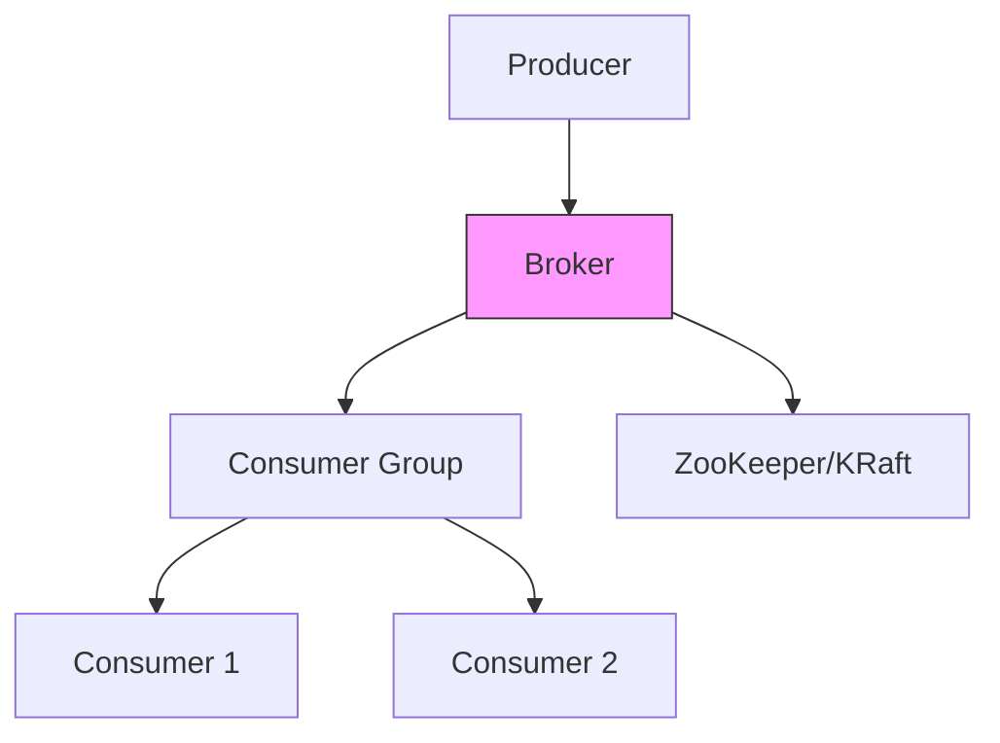
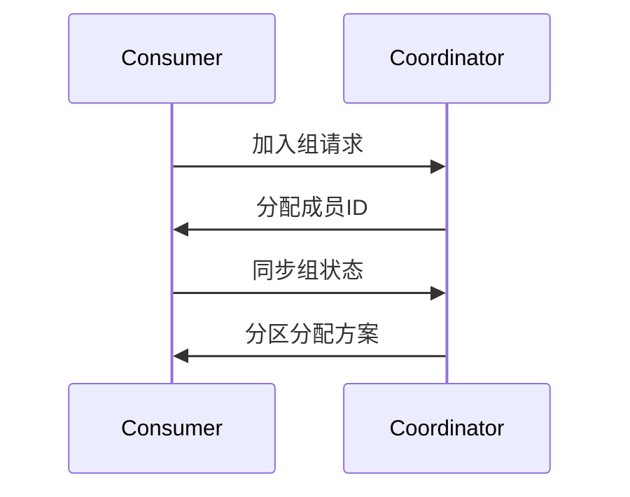
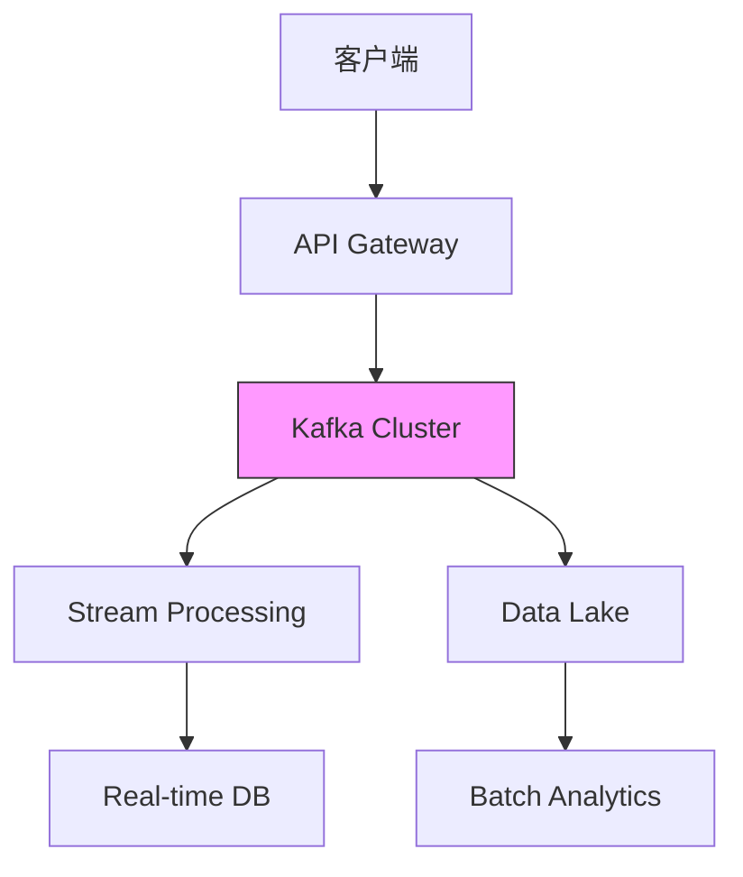

# Kafka Lead Engineer 必备知识体系

作为Kafka Lead Engineer候选人，您需要掌握从核心原理到大规模集群管理的全方位知识。以下是系统化的知识框架和面试准备指南。

## 一、核心架构与原理

### 1. Kafka架构组件


**核心组件**：
- **Broker**：消息存储和转发的服务节点
- **Topic**：逻辑消息分类单位
- **Partition**：Topic的物理分片
- **Producer**：消息发布客户端
- **Consumer**：消息消费客户端
- **Consumer Group**：协同消费的消费者集合

### 2. 消息存储原理
**分区文件结构**：
```
topic-partition/
    ├── 00000000000000000000.index
    ├── 00000000000000000000.log
    ├── 00000000000000000000.timeindex
    └── ...
```

**关键机制**：
- **分段存储**：按大小或时间切分日志文件
- **索引加速**：`.index`文件提供消息偏移量快速定位
- **零拷贝**：`sendfile`系统调用减少数据拷贝

## 二、高级特性与优化

### 3. 生产者设计
**关键参数**：
```java
// 生产者配置示例
props.put("acks", "all"); // 消息确认级别
props.put("retries", 3);  // 重试次数
props.put("batch.size", 16384); // 批次大小
props.put("linger.ms", 5); // 等待时间
```

**消息分发策略**：
- **Round Robin**：默认无key情况
- **Key Hashing**：相同key发往同一分区
- **自定义Partitioner**：实现`Partitioner`接口

### 4. 消费者设计
**消费组协调**：


**关键参数**：
```properties
enable.auto.commit=false // 关闭自动提交
auto.offset.reset=latest // 无偏移量时策略
max.poll.records=500    // 单次拉取最大消息数
```

## 三、集群管理与运维

### 5. 集群部署方案
**容量规划**：
- **磁盘**：预留20%空间用于 compaction
- **网络**：建议10Gbps+网络
- **Broker数**：至少3个形成高可用

**关键配置**：
```properties
num.network.threads=8      # 网络线程数
num.io.threads=16          # IO线程数
log.retention.hours=168    # 保留7天
```

### 6. 监控指标
**关键指标**：
- **Broker**：`UnderReplicatedPartitions`, `RequestHandlerAvgIdlePercent`
- **Topic**：`MessagesInPerSec`, `BytesOutPerSec`
- **Consumer**：`Lag`, `MaxLag`

**监控工具**：
```bash
kafka-consumer-groups --bootstrap-server localhost:9092 --describe --group my-group
```

## 四、安全与可靠性

### 7. 安全机制
**认证方式**：
- **SSL**：加密通信
- **SASL**：支持PLAIN/SCRAM/GSSAPI

**授权控制**：
```bash
# 创建ACL规则
kafka-acls --add --allow-principal User:Alice \
--operation Read --topic test-topic
```

### 8. 数据可靠性
**保障措施**：
- **ISR机制**：In-Sync Replicas集合
- **ACKS配置**：
  - `0`：不等待确认
  - `1`：Leader确认
  - `all`：所有ISR确认

## 五、面试题与答案

### 题目1：Kafka如何保证消息顺序？
**答案**：
1. **分区内有序**：单个分区内消息FIFO顺序
2. **实现方案**：
   - 生产者设置`max.in.flight.requests.per.connection=1`
   - 确保相同key的消息发往同一分区
3. **全局有序限制**：
   - 需要单分区Topic
   - 严重影响吞吐量

### 题目2：解释Kafka的副本同步机制
**答案**：
1. **ISR模型**：
   - Leader处理所有读写请求
   - Follower定期从Leader拉取数据
   - 滞后副本会被移出ISR

2. **同步条件**：
   ```java
   // 副本同步判断
   replica.lag.time.max.ms=10000  // 最大滞后时间
   replica.lag.max.messages=4000  // 最大滞后消息数(已弃用)
   ```

3. **选举流程**：
   - 通过ZooKeeper/KRaft选举新Leader
   - 优先从ISR中选择

### 题目3：如何优化Kafka吞吐量？
**优化方案**：
```properties
# 生产者端
batch.size=65536       // 增大批次
linger.ms=10           // 适当增加等待
compression.type=lz4   // 启用压缩

# Broker端
num.replica.fetchers=4  // 增加副本同步线程
socket.send.buffer.bytes=1024000 // 调大缓冲区

# 消费者端
fetch.min.bytes=65536   // 最小拉取量
max.poll.records=1000   // 单次拉取更多记录
```

### 题目4：处理消费者延迟(Lag)的方案
**解决步骤**：
1. **诊断原因**：
   ```bash
   kafka-consumer-groups --describe --group my-group
   ```
2. **扩容方案**：
   - 增加消费者实例数(不超过分区数)
   - 调整`fetch.min.bytes`减少网络往返
3. **紧急处理**：
   ```bash
   # 重置offset到最新位置
   kafka-consumer-groups --reset-offsets --to-latest --execute
   ```

### 题目5：Kafka与RabbitMQ的架构差异
**对比分析**：
| 维度           | Kafka                          | RabbitMQ                     |
|----------------|--------------------------------|------------------------------|
| **消息模型**    | 发布-订阅                      | 队列/Exchange                |
| **消息存储**    | 持久化日志                     | 内存+可选持久化              |
| **吞吐量**      | 高(百万级/秒)                  | 中(万级/秒)                  |
| **延迟**        | 毫秒级                         | 微秒级                       |
| **适用场景**    | 流数据处理/日志收集             | 任务队列/RPC                 |

## 六、集群设计案例

### 千万级日活系统架构


**配置参数**：
- **集群规模**：6台Broker(32核/64GB/10TB NVMe)
- **Topic规划**：
  - `user_events`: 100分区/3副本
  - `payment_txns`: 50分区/3副本
- **监控**：Prometheus + Grafana Dashboard

## 七、故障处理手册

### 常见故障处理
1. **Leader不平衡**：
   ```bash
   kafka-leader-election --bootstrap-server broker:9092 \
   --election-type preferred --all-topic-partitions
   ```
2. **磁盘爆满**：
   ```properties
   log.retention.bytes=1073741824  // 限制分区大小
   log.segment.bytes=1073741824    // 控制段文件大小
   ```
3. **消费者卡住**：
   ```java
   // 检查是否长时间未poll()
   max.poll.interval.ms=300000  // 适当调大
   ```

作为Kafka Lead Engineer，除了技术深度外，还需展示：
- 容量规划能力（消息量/存储/网络估算）
- 故障场景的应急方案设计
- 与上下游系统的集成经验
- 性能调优的方法论
- 团队知识传承机制