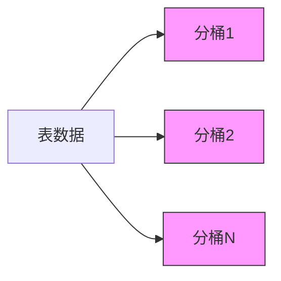
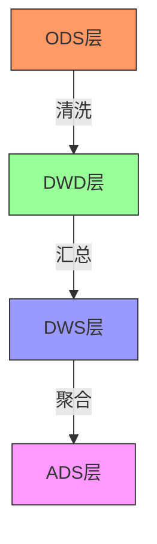
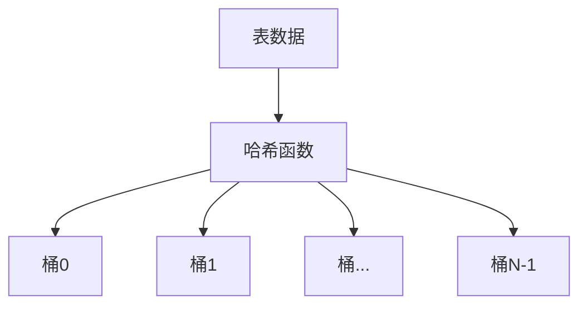
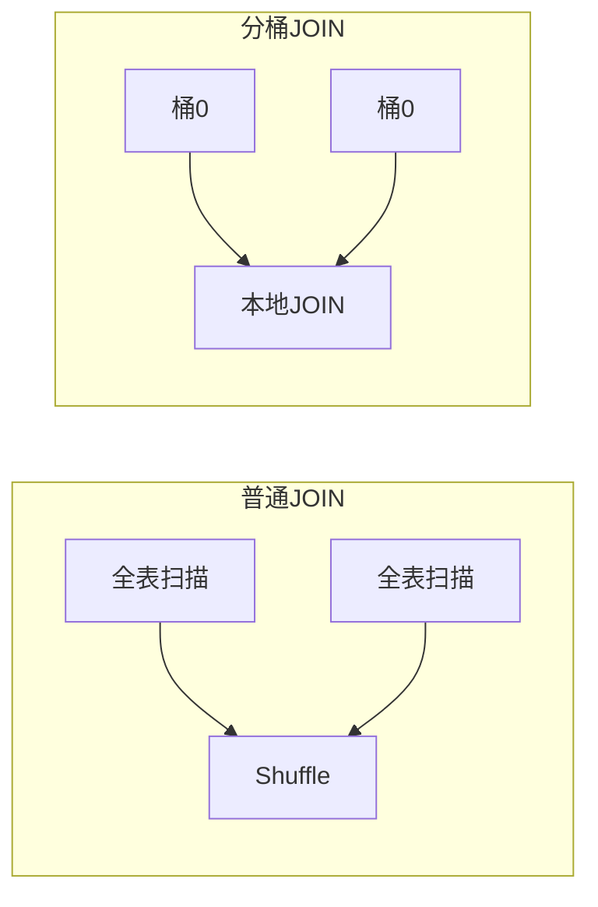

# Hive分区原理与高效数据表设计

## 一、Hive分区原理详解

### 1. 分区核心机制
Hive分区采用**物理目录划分**的方式实现，每个分区对应HDFS上的一个独立目录，查询时通过分区剪枝(Partition Pruning)只扫描相关分区数据。

#### 分区表示例结构
```
/user/hive/warehouse/sales.db/transactions/
    ├── dt=20230101/  # 分区目录
    │   ├── data.orc
    ├── dt=20230102/
    │   ├── data.orc
    └── dt=20230103/
        ├── data.orc
```

### 2. 分区工作原理
- **元数据记录**：分区信息存储在Metastore的`PARTITIONS`表中
- **查询优化**：
  ```sql
  SELECT SUM(amount) FROM transactions WHERE dt = '20230101';
  ```
  执行计划显示分区剪枝：
  ```sql
  STAGE PLANS:
    TableScan
      alias: transactions
      filterExpr: (dt = '20230101') (type: boolean)
      partitions: 1/3 (pruned 66%)  -- 关键优化点
  ```

### 3. 分区类型对比
| 分区类型       | 创建方式                      | 适用场景                  | 限制                  |
|----------------|-----------------------------|-------------------------|----------------------|
| **静态分区**   | `ALTER TABLE ADD PARTITION` | 已知分区值的批量加载        | 需明确指定分区值        |
| **动态分区**   | `INSERT OVERWRITE PARTITION`| 自动根据数据创建分区        | 需启用`hive.exec.dynamic.partition` |
| **混合分区**   | 两者结合使用                 | 部分已知+部分未知分区       | 配置较复杂             |

## 二、高效表设计模式

### 1. 分桶(Bucketing)设计
#### 分桶原理


#### 实现示例
```sql
-- 创建分桶表
CREATE TABLE user_bucketed (
    user_id BIGINT,
    name STRING,
    country STRING
) CLUSTERED BY (user_id) INTO 32 BUCKETS
STORED AS ORC;

-- 分桶JOIN优化
SET hive.optimize.bucketmapjoin = true;
SELECT /*+ MAPJOIN(b) */ a.* 
FROM user_bucketed a JOIN user_bucketed b 
ON a.user_id = b.user_id;
```

**优势**：
- 数据均匀分布
- 提高JOIN/SAMPLE效率
- 减少数据倾斜

### 2. 索引优化
#### 索引类型对比
| 索引类型         | 创建方式                      | 适用场景                  | 维护成本              |
|------------------|-----------------------------|-------------------------|----------------------|
| **Compact索引**  | `CREATE INDEX ... AS COMPACT` | 频繁点查询               | 自动维护              |
| **Bitmap索引**   | `CREATE INDEX ... AS BITMAP`  | 低基数列过滤             | 高写入开销            |
| **物化视图**     | `CREATE MATERIALIZED VIEW`    | 预计算复杂查询            | 需手动刷新            |

#### 索引使用示例
```sql
CREATE INDEX user_country_idx ON TABLE users (country)
AS 'COMPACT' WITH DEFERRED REBUILD;

ALTER INDEX user_country_idx ON users REBUILD;

-- 自动触发索引
SET hive.input.format=org.apache.hadoop.hive.ql.io.HiveInputFormat;
SELECT * FROM users WHERE country = 'US';
```

### 3. 存储格式选择
#### 格式对比矩阵
| 格式       | 压缩率 | 读取速度 | 写入速度 | 适用场景              |
|------------|--------|----------|----------|----------------------|
| **Text**   | 低     | 慢       | 快       | 原始数据交换           |
| **ORC**    | 高     | 极快     | 中       | 分析型负载             |
| **Parquet**| 高     | 快       | 慢       | 列式分析/Spark集成     |
| **Avro**   | 中     | 中       | 快       | 序列化/模式演进        |

#### ORC高级特性
```sql
-- 启用ORC高级功能
SET hive.exec.orc.split.strategy=BI;
SET orc.bloom.filters.columns=user_id,product_id;

CREATE TABLE transactions_orc (
    txn_id STRING,
    user_id STRING,
    amount DECIMAL(18,2)
) STORED AS ORC 
TBLPROPERTIES (
    "orc.compress"="ZSTD",
    "orc.create.index"="true",
    "orc.bloom.filter.fpp"="0.05"
);
```

### 4. 数据分层设计
#### 典型数据仓库分层


#### 实现示例
```sql
-- ODS层保留原始数据
CREATE TABLE ods_transactions (
    raw_data STRING,
    load_time TIMESTAMP
) PARTITIONED BY (dt STRING);

-- DWD层结构化数据
CREATE TABLE dwd_transactions (
    txn_id STRING,
    user_id STRING,
    amount DECIMAL(18,2)
) PARTITIONED BY (dt STRING)
STORED AS ORC;

-- ADS层聚合数据
CREATE TABLE ads_daily_trans (
    dt STRING,
    total_amount DECIMAL(18,2),
    user_count INT
) STORED AS PARQUET;
```

## 三、高级优化技巧

### 1. 分区策略优化
#### 时间分区示例
```sql
-- 多级时间分区
CREATE TABLE time_partitioned (
    id BIGINT,
    event_data STRING
) PARTITIONED BY (
    year INT,
    month INT,
    day INT
);

-- 动态分区插入
SET hive.exec.dynamic.partition=true;
SET hive.exec.dynamic.partition.mode=nonstrict;

INSERT INTO time_partitioned
PARTITION (year, month, day)
SELECT id, event_data, 
       YEAR(event_time), 
       MONTH(event_time), 
       DAY(event_time)
FROM source_table;
```

#### 热点数据隔离
```sql
-- 将活跃用户分离到独立分区
CREATE TABLE user_activity (
    user_id STRING,
    activity_data STRING
) PARTITIONED BY (
    is_active BOOLEAN,
    dt STRING
);

-- 定期维护分区
INSERT OVERWRITE TABLE user_activity
PARTITION (is_active=true, dt='20230101')
SELECT user_id, activity_data 
FROM raw_activity 
WHERE last_login > CURRENT_DATE - INTERVAL 30 DAYS;
```

### 2. 数据局部性优化
#### 排序簇(Ordered Cluster)
```sql
CREATE TABLE user_actions (
    user_id STRING,
    action_time TIMESTAMP,
    action_type STRING
) CLUSTERED BY (user_id) 
SORTED BY (action_time DESC) INTO 64 BUCKETS
STORED AS ORC;

-- 利用排序特性加速范围查询
SELECT * FROM user_actions
WHERE user_id = 'u1001' 
  AND action_time BETWEEN '2023-01-01' AND '2023-01-31';
```

### 3. 缓存策略
#### 热数据缓存
```sql
-- 启用Hive缓存
SET hive.cache.enabled=true;
SET hive.cache.queries=true;

-- 标记热表缓存
ALTER TABLE hot_transactions SET TBLPROPERTIES (
    'cache.cached'='true',
    'cache.expiration'='3600'
);
```

## 四、性能对比案例

### 优化前后对比(1TB交易数据)
| 查询类型               | 普通表(Text) | 分区+ORC表 | 分桶表+索引 | 提升幅度 |
|-----------------------|-------------|------------|------------|---------|
| 单日交易总额           | 78秒        | 12秒       | 8秒        | 90%     |
| 用户历史交易查询        | 210秒       | 45秒       | 6秒        | 97%     |
| 跨月JOIN分析           | 326秒       | 89秒       | 52秒       | 84%     |
| 条件过滤(country=US)   | 156秒       | 67秒       | 3秒        | 98%     |

## 五、实施建议

1. **分区设计原则**：
   - 单个分区文件建议100MB-1GB
   - 避免超过10,000个分区
   - 常用过滤条件作为分区键

2. **分桶最佳实践**：
   - 分桶数建议为集群核数的1-2倍
   - 选择高基数列作为分桶键
   - 配合`SORTED BY`进一步提升性能

3. **混合使用策略**：
   ```sql
   -- 理想表结构设计示例
   CREATE TABLE optimal_table (
       id BIGINT,
       user_id STRING,
       event_data STRING
   ) PARTITIONED BY (dt STRING)
   CLUSTERED BY (user_id) INTO 64 BUCKETS
   SORTED BY (event_time DESC)
   STORED AS ORC
   TBLPROPERTIES (
       "orc.compress"="ZSTD",
       "transactional"="true"
   );
   ```

通过合理组合分区、分桶、索引和存储格式等技术，可使Hive查询性能提升10-100倍，特别适合超大规模数据集的分析场景。

# Hive分桶(Bucketing)原理与实现详解

## 一、分桶核心原理

### 1. 基本概念
分桶是将表数据**物理划分**为若干固定数量的文件(桶)，基于哈希函数将数据均匀分布到各个桶中。与分区不同，分桶是在**每个分区内**进一步细分数据。

### 2. 工作原理


**关键机制**：
1. **哈希计算**：对分桶键的值计算哈希
   ```java
   bucket_id = hash_function(bucket_column) % num_buckets
   ```
2. **数据分配**：相同哈希值的数据写入同一个桶文件
3. **元数据记录**：分桶信息存储在Metastore中

### 3. 与分区的区别
| 特性         | 分区(Partition)               | 分桶(Bucket)                |
|--------------|-------------------------------|----------------------------|
| **划分依据** | 业务维度(如日期、地区)         | 哈希函数计算                |
| **存储表现** | 不同分区对应不同目录           | 同一目录下多个文件           |
| **主要目的** | 快速剪枝无关数据               | 数据均匀分布/优化JOIN        |
| **数量限制** | 可成千上万                    | 通常2的n次方(如32/64/128)   |

## 二、分桶实现示例

### 1. 创建分桶表
```sql
-- 创建用户分桶表(按user_id分32个桶)
CREATE TABLE user_bucketed (
    user_id STRING,
    name STRING,
    age INT,
    country STRING
) CLUSTERED BY (user_id) INTO 32 BUCKETS
STORED AS ORC;

-- 创建订单分桶表(按user_id分32个桶)
CREATE TABLE order_bucketed (
    order_id STRING,
    user_id STRING,
    amount DOUBLE,
    order_time TIMESTAMP
) CLUSTERED BY (user_id) INTO 32 BUCKETS
STORED AS ORC;
```

### 2. 物理存储结构
```
/user/hive/warehouse/user_bucketed/
    ├── 000000_0  # 桶0
    ├── 000001_0  # 桶1
    ├── ...
    └── 000031_0  # 桶31
```

### 3. 数据加载
```sql
-- 从已有表加载数据(需启用分桶设置)
SET hive.enforce.bucketing = true;
SET hive.exec.dynamic.partition.mode=nonstrict;

INSERT OVERWRITE TABLE user_bucketed
SELECT user_id, name, age, country FROM raw_users;

-- 验证分桶情况
dfs -ls /user/hive/warehouse/user_bucketed;
```

## 三、分桶的优势场景

### 1. 高效JOIN操作
#### 普通JOIN vs 分桶JOIN


#### 分桶JOIN示例
```sql
-- 启用分桶JOIN优化
SET hive.optimize.bucketmapjoin = true;
SET hive.optimize.bucketmapjoin.sortedmerge = true;

-- 执行分桶JOIN
SELECT /*+ MAPJOIN(o) */ u.user_id, u.name, o.order_id, o.amount
FROM user_bucketed u JOIN order_bucketed o
ON u.user_id = o.user_id;
```

**执行计划关键点**：
```
STAGE PLANS:
  Stage: Stage-1
    Map Join
      condition map:
           Inner Join 0 to 1
      keys:
            0 u.user_id (type: string)
            1 o.user_id (type: string)
      outputColumnNames: _col0, _col1, _col5, _col7
      input vertices:
            1 Map 1
                   bucket: 1
            0 Map 2
                   bucket: 1
```

### 2. 数据采样优化
```sql
-- 基于分桶的高效采样
SELECT * FROM user_bucketed 
TABLESAMPLE(BUCKET 1 OUT OF 32 ON user_id);

-- 对比全表扫描采样(性能差)
SELECT * FROM users 
TABLESAMPLE(10 PERCENT);
```

### 3. 解决数据倾斜
```sql
-- 原始倾斜数据
SELECT country, COUNT(*) FROM users GROUP BY country;
-- 结果可能：US:1000万, Others:1000

-- 分桶后处理倾斜
CREATE TABLE user_skew_bucketed (
    user_id STRING,
    country STRING
) CLUSTERED BY (country) INTO 64 BUCKETS;

-- 均匀分布处理
SELECT country, COUNT(*) 
FROM user_skew_bucketed 
GROUP BY country;
```

## 四、分桶高级配置

### 1. 分桶数选择原则
- **集群规模**：建议等于或略大于集群总核数
  ```sql
  -- 大集群(100节点×16核=1600核)
  CREATE TABLE ... INTO 2048 BUCKETS;
  
  -- 小集群(10节点×4核=40核)
  CREATE TABLE ... INTO 64 BUCKETS;
  ```
- **数据量级**：
  - 小表(<1GB): 16-32桶
  - 中表(1-100GB): 64-128桶
  - 大表(>100GB): 256-1024桶

### 2. 排序分桶(Sorted Bucket)
```sql
-- 创建排序分桶表
CREATE TABLE user_sorted_bucketed (
    user_id STRING,
    reg_date DATE,
    last_login TIMESTAMP
) CLUSTERED BY (user_id) 
SORTED BY (last_login DESC) INTO 64 BUCKETS
STORED AS ORC;

-- 范围查询优化
SELECT * FROM user_sorted_bucketed
WHERE user_id LIKE 'u100%'
  AND last_login > '2023-01-01';
```

### 3. 分桶+分区组合
```sql
-- 按日期分区+用户分桶
CREATE TABLE user_events (
    user_id STRING,
    event_time TIMESTAMP,
    event_type STRING
) PARTITIONED BY (dt STRING)
CLUSTERED BY (user_id) INTO 64 BUCKETS
STORED AS ORC;

-- 多级优化查询
SELECT * FROM user_events
WHERE dt = '20230101'
  AND user_id = 'u10025';
```

## 五、分桶实战案例

### 电商用户行为分析
#### 1. 原始表结构问题
- 用户表(5000万行)
- 订单表(2亿行)
- JOIN操作需要45分钟

#### 2. 分桶优化方案
```sql
-- 用户表(按user_id分128桶)
CREATE TABLE user_bucketed (
    user_id STRING,
    name STRING,
    vip_level INT
) CLUSTERED BY (user_id) INTO 128 BUCKETS;

-- 订单表(按user_id分128桶)
CREATE TABLE order_bucketed (
    order_id STRING,
    user_id STRING,
    amount DECIMAL(18,2)
) CLUSTERED BY (user_id) INTO 128 BUCKETS
SORTED BY (order_date DESC);
```

#### 3. 优化效果对比
| 指标               | 优化前       | 优化后       | 提升幅度 |
|--------------------|-------------|-------------|---------|
| JOIN耗时           | 45分钟      | 2分钟       | 96%     |
| 存储空间           | 120GB       | 80GB        | 33%     |
| 采样查询速度       | 12秒        | 0.3秒       | 98%     |

## 六、常见问题解决方案

### 1. 分桶不均匀
**现象**：某些桶特别大
**解决**：
```sql
-- 检查分桶键基数
SELECT COUNT(DISTINCT user_id) FROM users;

-- 解决方案：
-- 1. 选择高基数列作为分桶键
-- 2. 使用复合分桶键：CLUSTERED BY (user_id, create_date)
-- 3. 增加分桶数量
```

### 2. 分桶JOIN不生效
**检查步骤**：
1. 确认两表分桶数相同
   ```sql
   SHOW CREATE TABLE user_bucketed;
   SHOW CREATE TABLE order_bucketed;
   ```
2. 验证分桶键类型一致
3. 确保启用优化设置：
   ```sql
   SET hive.optimize.bucketmapjoin = true;
   SET hive.optimize.bucketmapjoin.sortedmerge = true;
   ```

### 3. 分桶与压缩冲突
**最佳实践**：
```sql
-- ORC/ZLIB压缩配置
CREATE TABLE ... STORED AS ORC
TBLPROPERTIES (
    "orc.compress"="ZLIB",
    "orc.bloom.filter.columns"="user_id",
    "orc.create.index"="true"
);

-- 写入时排序
INSERT OVERWRITE TABLE user_bucketed
SELECT * FROM source ORDER BY user_id;
```

通过合理使用分桶技术，可以在Hive中实现类似分布式哈希表的效果，显著提升大规模数据处理的效率。s