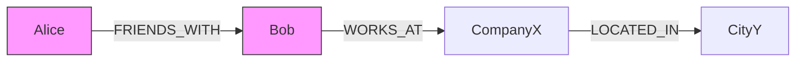
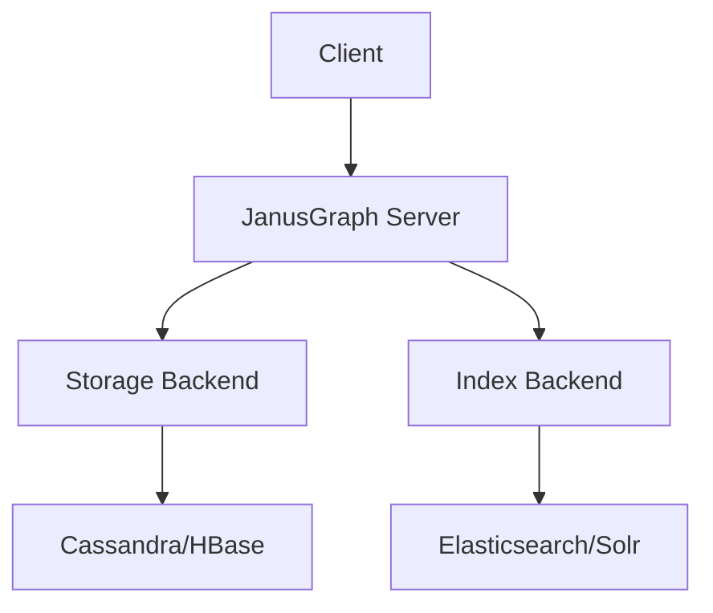
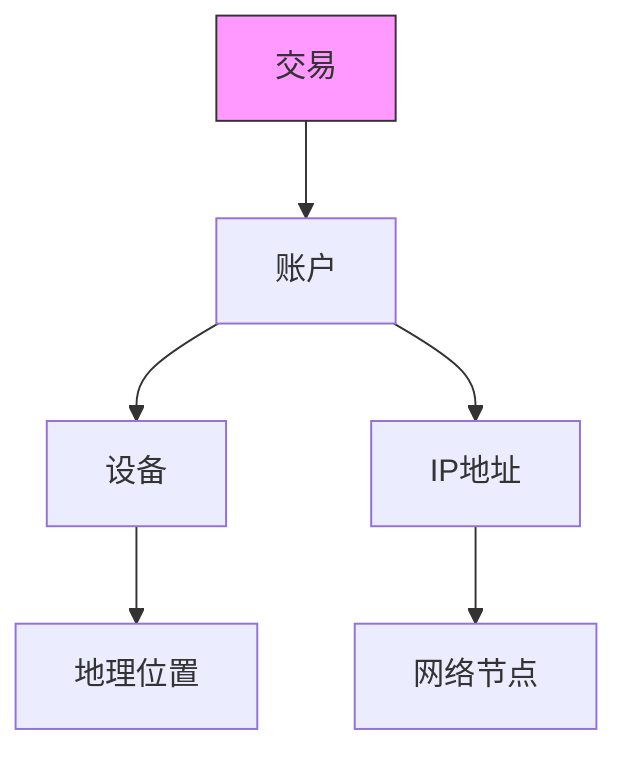

# Graph Database Lead Engineer 知识体系

作为Graph Database Lead Engineer候选人，您需要掌握图数据库的核心原理、架构设计以及解决复杂图问题的能力。以下是系统化的知识框架和面试准备指南。

## 一、图数据库核心原理

### 1. 图数据模型


**基本要素**：
- **顶点(Vertex)**：实体对象（如用户、产品）
- **边(Edge)**：实体间关系（带方向与属性）
- **属性(Property)**：顶点和边的键值对

### 2. 存储引擎设计
#### 原生图存储 vs 非原生图存储
| 类型         | 代表系统       | 存储方式                     | 遍历性能 |
|--------------|---------------|----------------------------|---------|
| **原生存储**  | Neo4j, JanusGraph | 邻接表+索引                 | O(1)    |
| **非原生**    | ArangoDB, OrientDB | 文档/键值存储上的图抽象       | O(logN) |

#### 物理存储结构示例（Neo4j）：
```
store/
    ├── neostore.nodestore.db   # 顶点存储
    ├── neostore.relationshipstore.db # 边存储
    ├── neostore.propertystore.db    # 属性存储
    └── neostore.labelstore.db  # 标签索引
```

### 3. 图遍历算法
**常见算法时间复杂度**：
| 算法           | 时间复杂度       | 适用场景               |
|----------------|----------------|----------------------|
| 深度优先搜索(DFS) | O(V+E)         | 路径查找               |
| 广度优先搜索(BFS) | O(V+E)         | 最短路径               |
| Dijkstra       | O(E + VlogV)   | 带权最短路径           |
| A*             | O(b^d)         | 启发式路径搜索         |
| PageRank       | O(kE)          | 重要性排名             |

## 二、高级架构设计

### 1. 分布式图处理
**JanusGraph架构**：


**分区策略**：
- **边切割(Edge-Cut)**：顶点分布在多机器，边存在单机
- **点切割(Vertex-Cut)**：边分布在多机器，顶点存在单机

### 2. 索引优化
**复合索引策略**：
```groovy
// JanusGraph索引示例
graph.tx().rollback()
mgmt = graph.openManagement()
name = mgmt.getPropertyKey('name')
age = mgmt.getPropertyKey('age')
mgmt.buildIndex('nameAndAge', Vertex.class)
    .addKey(name).addKey(age)
    .buildCompositeIndex()
mgmt.commit()
```

**索引类型对比**：
| 类型            | 适用场景               | 更新代价       |
|----------------|----------------------|--------------|
| 复合索引         | 精确匹配多属性         | 低           |
| 混合索引         | 全文/范围查询          | 中           |
| 顶点中心索引      | 特定顶点的边查询        | 自动维护      |

## 三、性能调优

### 1. 查询优化技巧
**Gremlin查询优化**：
```groovy
// 低效查询
g.V().hasLabel('person').out('knows').values('name')

// 优化版本（使用边索引）
g.V().has('person','name','Alice')
    .outE('knows').has('since', gt(2020))
    .inV().values('name')
```

**优化原则**：
1. 尽早过滤（减少遍历量）
2. 利用索引（避免全图扫描）
3. 限制路径长度（`limit()`步骤）

### 2. 集群配置
**JanusGraph生产配置**：
```properties
# 存储后端
storage.backend=cql
storage.hostname=10.0.0.1,10.0.0.2
storage.cql.keyspace=janusgraph_prod

# 缓存配置
cache.db-cache = true
cache.db-cache-size = 0.5
cache.db-cache-time = 180000

# 索引
index.search.backend=elasticsearch
index.search.hostname=10.0.0.3,10.0.0.4
```

## 四、面试题与答案

### 题目1：解释图数据库的ACID实现
**答案**：
1. **Neo4j实现**：
   - 写前日志(WAL)保证持久性
   - 指针实现原子更新（顶点/边/属性指针结构）
   - 页面缓存实现隔离（MVCC模式）
   
2. **分布式图库挑战**：
   - 使用Paxos/Raft协议协调多副本
   - 示例：JanusGraph通过存储后端（如Cassandra）实现

3. **配置示例**：
   ```properties
   # Neo4j配置
   dbms.tx_log.rotation.size=256MiB
   dbms.memory.pagecache.size=8G
   ```

### 题目2：如何设计社交网络的好友推荐？
**解决方案**：
```cypher
// 基于共同好友的推荐
MATCH (u:User {id:123})-[:FRIEND]->(f)-[:FRIEND]->(foaf)
WHERE NOT (u)-[:FRIEND]->(foaf)
RETURN foaf, count(*) AS commonFriends
ORDER BY commonFriends DESC
LIMIT 10

// 基于兴趣标签的推荐
MATCH (u:User {id:123})-[:INTERESTED_IN]->(t:Tag)<-[:INTERESTED_IN]-(similar)
WHERE NOT (u)-[:FRIEND]->(similar)
RETURN similar, count(t) AS commonInterests
ORDER BY commonInterests DESC
```

**算法选择**：
- Jaccard相似度：`共同好友数/总好友数`
- Personalized PageRank：考虑整体网络影响力

### 题目3：处理超大规模图的策略
**分层方案**：
1. **数据分片**：
   - 按业务域拆分子图（如按地域）
   - 使用Flink/Spark进行图计算

2. **查询优化**：
   ```groovy
   // 分片查询示例（JanusGraph）
   graph.traversal()
       .with('vertex-cut', true)
       .V().has('region','Asia')
       .outE('transactions')
   ```

3. **硬件配置**：
   - 内存：每10亿边约需128GB RAM
   - SSD：推荐NVMe存储
   - 网络：10Gbps+避免成为瓶颈

### 题目4：图数据库与关系型数据库的对比
**对比分析**：
| 维度           | 图数据库                      | 关系型数据库               |
|----------------|-----------------------------|--------------------------|
| **数据模型**    | 顶点-边模型                  | 表模型                   |
| **关联查询**    | O(1)复杂度跳转               | JOIN操作消耗大           |
| **灵活性**      | 动态添加边/属性              | 需预先定义Schema         |
| **适用场景**    | 社交网络/推荐系统/知识图谱    | 交易系统/报表分析         |
| **代表系统**    | Neo4j, JanusGraph, TigerGraph | MySQL, PostgreSQL       |

### 题目5：实现最短路径的几种方法
**方案对比**：
1. **BFS遍历**：
   ```cypher
   MATCH path=shortestPath((a:User)-[:FRIEND*..6]->(b:User))
   WHERE a.id=123 AND b.id=456
   RETURN length(path)
   ```
   - 优点：实现简单
   - 缺点：不支持权重

2. **Dijkstra算法**：
   ```groovy
   // Gremlin实现
   g.withSack(0).V(start)
    .repeat(outE().sack(sum).by('weight').inV())
    .until(hasId(end))
    .path().by('name').by('weight')
    .limit(1)
   ```
   - 优点：支持权重
   - 缺点：计算复杂度高

3. **A*算法**：
   - 需要预定义启发式函数（如地理距离）
   - 适合空间数据

## 五、生产环境案例

### 金融风控系统设计


**实现功能**：
1. 实时检测环路交易
   ```cypher
   MATCH (a1)-[t1:TRANSFER]->(a2)-[t2:TRANSFER]->(a3)
   WHERE t1.amount = t2.amount 
     AND t1.time < t2.time < t1.time + 10min
   RETURN a1, a2, a3
   ```
2. 识别共用设备风险
   ```groovy
   g.V().has('account','id','ac123')
       .both('uses_device')
       .in('uses_device')
       .where(neq('ac123'))
       .values('id')
   ```

## 六、新兴技术趋势

### 1. 图神经网络(GNN)
**应用场景**：
- 欺诈检测（特征学习）
- 药物发现（分子图分析）

**框架集成**：
```python
# PyTorch Geometric示例
from torch_geometric.data import Data
edge_index = torch.tensor([[0, 1], [1, 2]], dtype=torch.long)
x = torch.tensor([[1], [2], [3]], dtype=torch.float)
data = Data(x=x, edge_index=edge_index.t().contiguous())
```

### 2. 云原生图数据库
**服务对比**：
| 服务商         | 产品             | 特点                      |
|---------------|-----------------|--------------------------|
| AWS           | Neptune         | 支持Gremlin/SPARQL       |
| Microsoft     | Cosmos DB Graph | 兼容Gremlin, 全球分布     |
| TigerGraph    | Cloud           | 实时图分析                |

作为Graph DB Lead Engineer，除了技术深度外，还需具备：
- 图算法选型能力（根据业务场景）
- 性能瓶颈诊断方法论
- 团队图思维培养方案
- 与数据科学团队的协作经验
- 图可视化解决方案设计能力