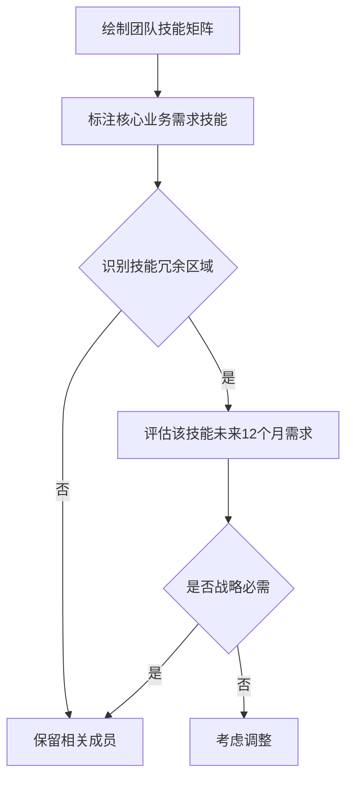

# 团队裁员决策框架：如何在无绩效问题情况下进行人员选择

作为Engineering Manager面临需要裁员但团队成员均无绩效问题的情况，这是一个极具挑战性的管理难题。在eBay DECO这样的技术团队中，这种决策需要系统化的思考框架和高度专业化的评估标准。以下是我建议的决策方法论：

## 战略匹配评估框架

### 1. 业务需求与技能矩阵分析

**评估维度**：
- 当前产品路线图的关键技术需求（如API网关优化、高并发处理等）
- 未来6-12个月技术战略方向（如微服务化、SRE转型等）
- 团队能力图谱与业务需求的Gap分析

**执行方法**：

**应用示例**：
"在API产品团队中，如果我们判断未来将减少SOAP协议支持而全面转向RESTful和GraphQL，那么即使优秀的SOAP专家也可能成为调整对象。我会通过技能映射，识别出技能组合与战略方向契合度最低的成员。"

## 团队架构健康度评估

### 2. 团队拓扑结构优化

**关键考量**：
- 保持核心能力组合的完整性（如架构设计+领域专家+运维专家）
- 避免单一技能点风险（如只有1人掌握的关键技术）
- 维持合理的职级金字塔结构

**评估工具**：
设计团队架构健康度评分卡：
1. 能力覆盖度（0-5分）
2. 知识共享度（0-5分） 
3. 梯队合理性（0-5分）
4. 未来扩展性（0-5分）

**决策原则**：
"优先保留能使团队架构评分提升或降幅最小的成员组合。例如，在两个同样优秀的API工程师之间，选择其技能能更好补充其他成员短板的那个。"

## 价值贡献多维评估

### 3. 五维价值评估模型

建立量化的评估体系（每项权重可根据团队阶段调整）：

| 维度           | 评估指标                          | 权重 |
|----------------|-----------------------------------|------|
| 技术输出       | 关键系统稳定性贡献、架构影响度    | 25%  |
| 知识辐射       | 文档产出、 mentoring效果         | 20%  |
| 流程优化       | 研发效率提升贡献                  | 15%  |
| 业务理解       | 跨功能协作能力、产品意识          | 20%  |
| 文化贡献       | 团队凝聚力影响、创新倡导          | 20%  |

**实施方法**：
"通过360度评估收集数据，对每个维度进行1-5分评分。例如在DECO团队中，可能提高'业务理解'权重，因为API产品需要深度理解开发者需求。"

## 变革响应能力评估

### 4. 未来适应性预测

**评估标准**：
- 技术学习曲线陡度（评估其掌握新技术速度的历史数据）
- 变革抵触指数（过往对组织变化的反应模式）
- 弹性能力表现（处理模糊性和压力的能力）

**数据收集**：
- 分析过去12个月技术转型中的适应表现
- 查看培训记录和认证获取情况
- 参考1:1会议中表现出的职业发展意向

**应用场景**：
"如果团队正在向SRE模式转型，即使某位工程师当前系统运维表现优秀，但如果历史显示其抗拒自动化变更，可能成为调整考虑对象。"

## 实施流程与沟通策略

### 5. 决策执行框架

**分阶段流程**：
1. 数据收集期（2周）：
   - 整理项目贡献度分析报告
   - 进行技能矩阵评估
   - 收集peer feedback

2. 校准期（1周）：
   - 与HRBP进行合规性审查
   - 与skip-level manager对齐
   - 评估替代方案（如转岗可能性）

3. 决策期：
   - 制定过渡性知识转移计划
   - 准备职业发展推荐信
   - 设计留守团队心理支持方案

**沟通原则**：
- 采用Radical Candor沟通模式（关心直接+挑战直接）
- 聚焦事实而非主观评价
- 提供实质性过渡支持（如延长股票vesting、职业咨询服务）

## 伦理与法律考量

### 6. 合规性检查清单

确保决策过程：
- 不涉及受保护特征（年龄、性别等）
- 有完整的文档记录
- 通过HR合规审查
- 考虑签证状态等法律因素

**文档模板**：
保留完整的决策记录，包括：
- 技能评估表格
- 项目贡献度分析
- 团队架构影响分析
- 替代方案考虑说明

在eBay这样的全球化公司，特别需要注意不同地区的劳动法差异，建议提前与当地HRBP深入沟通。

## 替代方案探索

在最终决定前，建议考虑：
1. 自愿离职计划
2. 转岗到其他急需人才的团队
3. 协商减少工作时间/薪酬方案
4. 提前退休选项（针对符合条件的员工）

作为Engineering Manager，在这种艰难决策中最重要的是保持透明、公正和同理心，确保过程专业且尊重每位贡献者，同时为团队未来的健康发展负责。最终的决策应该能够经得起"华尔街日报测试"——即如果决策过程被公开报道，你能够自信地为其合理性辩护。