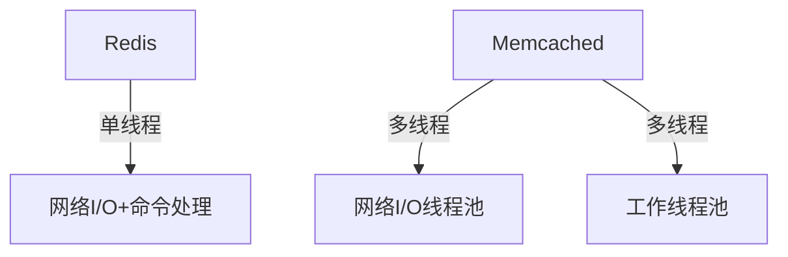
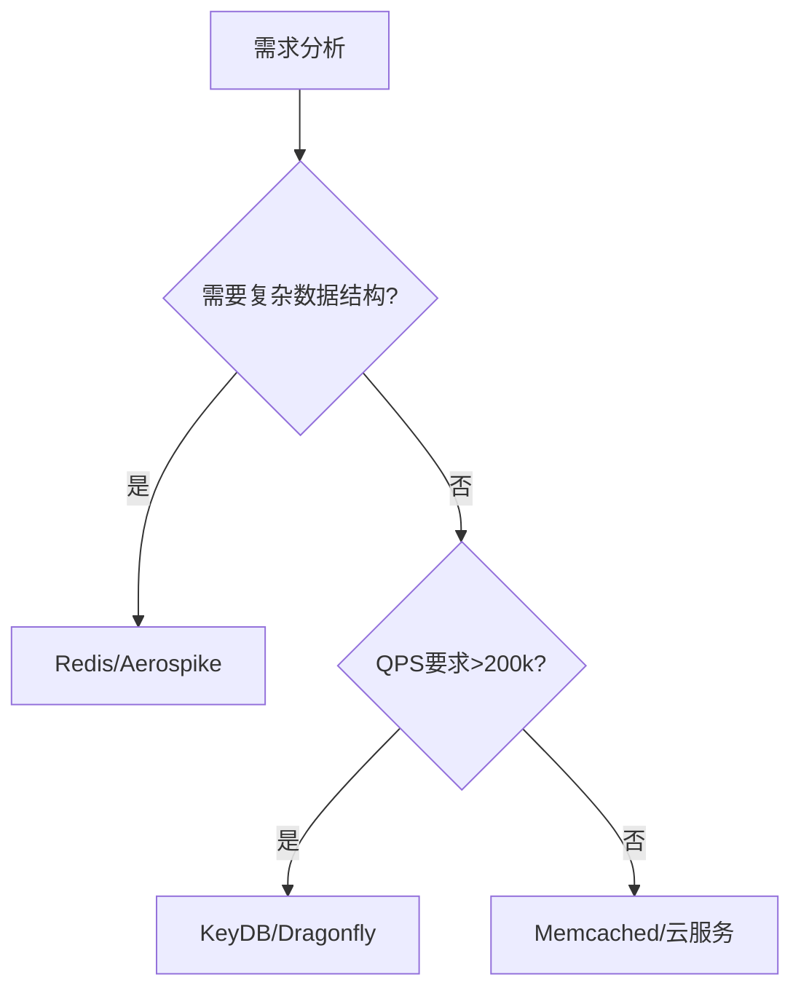
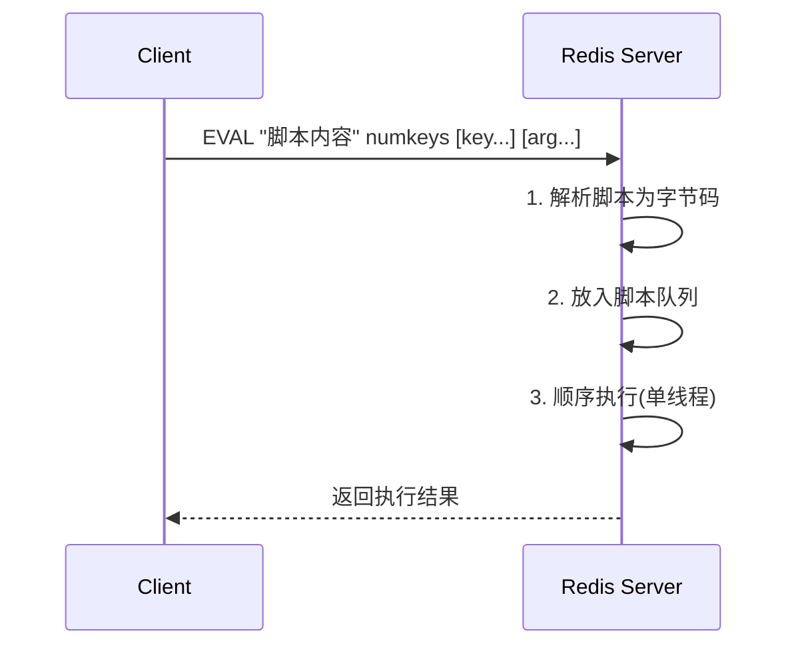
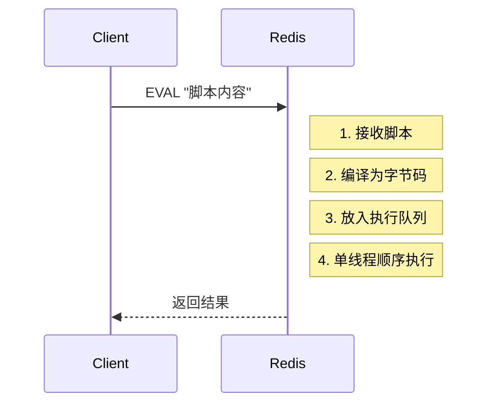

# Redis Lead Engineer 必备知识体系

作为Redis Lead Engineer候选人，您需要掌握从基础到高级的全方位Redis知识，同时具备架构设计、性能优化和团队领导能力。以下是系统化的知识框架：

## 一、核心架构与原理

### 1. Redis核心架构设计
- **单线程模型**：理解React模式和非阻塞I/O
- **持久化机制**：
  - RDB（快照）原理与配置：`save 900 1`
  - AOF（追加日志）策略：`appendfsync everysec`
  - 混合持久化（Redis 4.0+）
- **多线程演进**：6.0后网络I/O多线程化

### 2. 内存管理
- **内存分配器**：jemalloc vs libc
- **淘汰策略**：8种策略及适用场景
  ```sh
  # 配置示例
  maxmemory-policy volatile-lru
  ```
- **内存优化**：
  - 小对象编码优化（ziplist, intset）
  - 内存碎片整理：`activedefrag yes`

## 二、数据结构与高级特性

### 3. 全数据结构深度掌握
| 数据结构 | 内部编码 | 典型应用场景 | 注意事项 |
|---------|---------|-------------|---------|
| String | int/embstr/raw | 缓存、计数器 | 大value拆分 |
| Hash | ziplist/hashtable | 对象存储 | 字段数≤512用ziplist |
| List | quicklist | 消息队列 | LINDEX O(N) |
| Set | intset/hashtable | 标签系统 | SINTER计算成本 |
| ZSet | ziplist/skiplist | 排行榜 | 范围查询复杂度 |
| Stream | rax树 | 消息队列 | 消费者组管理 |

### 4. 高级功能
- **Lua脚本**：
  ```lua
  -- 库存扣减脚本
  local stock = tonumber(redis.call('GET', KEYS[1]))
  if stock > 0 then
    redis.call('DECR', KEYS[1])
    return 1
  end
  return 0
  ```
- **模块系统**：开发自定义数据类型
- **事务**：`MULTI`/`EXEC`与`WATCH`的局限

## 三、高可用与分布式

### 5. 集群方案
- **Redis Sentinel**：
  ```sh
  sentinel monitor mymaster 127.0.0.1 6379 2
  sentinel down-after-milliseconds mymaster 5000
  ```
- **Redis Cluster**：
  - 数据分片（16384 slots）
  - 节点通信（Gossip协议）
  - 迁移与故障转移

### 6. 多数据中心方案
- **CRDT数据结构**（Redis Enterprise）
- **双活架构**：基于WAN的同步延迟处理
- **云上多可用区部署**：
  ```sh
  # AWS ElastiCross Replication Group配置
  aws elasticache create-replication-group \
    --global-replication-group-id my-global-group \
    --primary-region us-west-1 \
    --regions "us-west-1,us-east-1"
  ```

## 四、性能优化

### 7. 关键性能指标
- **延迟分析**：
  ```sh
  redis-cli --latency -h 127.0.0.1 -p 6379
  ```
- **热点Key识别**：
  ```sh
  redis-cli --hotkeys
  # 或使用monitor+分析工具
  ```

### 8. 优化策略
- **Pipeline批处理**：
  ```python
  pipe = r.pipeline()
  for i in range(1000):
      pipe.set(f'key:{i}', i)
  pipe.execute()
  ```
- **连接池配置**：
  ```java
  JedisPoolConfig config = new JedisPoolConfig();
  config.setMaxTotal(100);  // 最大连接数
  config.setMaxIdle(20);    // 最大空闲连接
  ```

## 五、安全与运维

### 9. 安全防护
- **ACL系统**（Redis 6.0+）：
  ```sh
  ACL SETUSER alice on >pass123 ~cached:* +get +set
  ```
- **TLS加密**：
  ```sh
  # 配置示例
  tls-port 6379
  tls-cert-file redis.crt
  tls-key-file redis.key
  ```

### 10. 运维工具链
- **监控方案**：
  - Prometheus + Grafana（redis_exporter）
  - RedisInsight可视化工具
- **自动化运维**：
  ```python
  # 自动故障转移脚本示例
  def failover():
      while not check_master_alive():
          promote_slave()
          reconfigure_sentinels()
  ```

## 六、云原生与扩展

### 11. 云服务集成
- **AWS ElastiCache**：
  - 版本选择策略
  - 参数组定制
- **Azure Cache**：
  - 地理复制配置
  - 缩放操作API

### 12. 扩展方案
- **RedisTimeSeries**：
  ```sh
  TS.CREATE temperature RETENTION 86400000 LABELS sensor_id 1
  ```
- **RedisGraph**：
  ```cypher
  GRAPH.QUERY social "CREATE (:User {name:'Alice'})"
  ```

## 七、架构设计能力

### 13. 典型架构模式
- **缓存策略**：
  ```mermaid
  graph LR
    A[客户端] --> B{Redis有数据?}
    B -->|是| C[直接返回]
    B -->|否| D[查询数据库]
    D --> E[写入Redis]
    E --> C
  ```
- **会话存储设计**：
  - 多级Session缓存（本地+Redis）
  - 跨域Session共享方案

### 14. 容量规划
- **内存估算公式**：
  ```
  总内存 = (键数量 × (key_size + value_size + 64)) × 1.2
  ```
- **分片策略**：
  - 业务分片（不同Redis实例）
  - 数据分片（Cluster模式）

## 八、团队领导能力

### 15. 技术决策
- **技术选型评估表**：

| 方案 | 优点 | 缺点 | 适用场景 |
|------|------|------|---------|
| 单实例 | 简单 | 单点故障 | 开发环境 |
| Sentinel | 自动故障转移 | 需要客户端支持 | 中小规模生产 |
| Cluster | 水平扩展 | 运维复杂 | 大规模数据 |

### 16. 团队管理
- **知识传承机制**：
  - Redis内部原理分享会
  - 故障处理案例库
  - 代码审查清单（Lua脚本安全等）

## 面试问题准备示例

**问题1**：如何设计一个支持千万级用户的Redis点赞系统？

**答案框架**：
1. 数据结构选择：`Hash`类型存储用户-内容点赞关系
   ```sh
   HSET content:1234 likes user1 1 user2 1
   ```
2. 分片策略：按内容ID哈希分片
3. 热点处理：本地缓存+Redis多级缓存
4. 防刷机制：Lua脚本实现频率限制
5. 数据同步：异步持久化到数据库

**问题2**：Redis集群出现数据倾斜如何处理？

**解决方案**：
1. 诊断工具：
   ```sh
   redis-cli --cluster check 127.0.0.1:7001
   ```
2. 平衡策略：
   - 手动迁移slot：`CLUSTER SETSLOT`
   - 使用`--cluster rebalance`
3. 预防措施：
   - 避免大Key（`redis-cli --bigkeys`）
   - 优化哈希标签：`{user123}.profile`

作为Lead Engineer，除了技术深度外，还需展现：
- 架构决策的权衡能力
- 故障排查的系统化思维
- 团队知识传递的有效方法
- 技术路线的前瞻性规划


# Redis替代技术方案对比分析

以下是当前主流的内存数据存储/缓存系统与Redis的详细对比，涵盖性能、功能、适用场景等关键维度。

## 一、内存键值存储系统对比

| 技术方案        | 开发公司      | 数据模型       | 持久化机制               | 集群方案           | 特色功能                      | 适用场景                     |
|----------------|-------------|--------------|------------------------|------------------|----------------------------|---------------------------|
| **Redis**      | Redis Labs  | 键值+多种数据结构 | RDB/AOF/混合            | Cluster/Sentinel | Lua脚本、模块系统、Stream     | 缓存、消息队列、实时分析         |
| **Memcached**  | Danga       | 简单键值        | 无                     | 客户端分片          | 多线程、纯内存                 | 简单缓存场景                  |
| **KeyDB**      | Snap Inc    | 兼容Redis协议 | RDB/AOF                | Active-Replica  | 多线程Redis分支               | 需要更高吞吐的Redis兼容场景      |
| **Dragonfly**  | 独立开发      | 兼容Redis协议 | 即时快照+操作日志         | 共享内存架构        | 高吞吐、自动扩展               | 大规模内存数据库替代方案         |

## 二、新型内存数据库对比

| 技术方案        | 数据模型       | 持久化方式      | 事务支持 | 查询语言      | 性能特点               | 最佳场景               |
|----------------|--------------|--------------|--------|-------------|----------------------|----------------------|
| **Apache Ignite** | 键值+SQL+计算 | 持久化存储      | ACID   | SQL         | 内存优先，支持持久化       | 实时数据分析、事务处理      |
| **Hazelcast**   | 分布式对象      | 可选持久化      | 有限    | 无           | 低延迟数据网格            | 分布式缓存、事件处理        |
| **Aerospike**   | 键值+文档      | 混合内存架构     | 强一致   | 类SQL        | 亚毫秒级延迟             | 实时推荐系统、广告技术       |
| **Tarantool**   | 内存+持久化    | WAL日志       | ACID   | Lua         | 高性能消息+数据库         | 消息总线、实时应用后端       |

## 三、云服务商托管方案对比

| 服务名称          | 提供商       | Redis兼容性 | 扩展方式        | 特色功能                  | SLA保证     | 成本模型          |
|-----------------|------------|-----------|---------------|-------------------------|------------|----------------|
| **Amazon ElastiCache** | AWS        | 完全兼容     | 垂直/水平扩展    | 多AZ部署、自动故障转移        | 99.9%      | 按节点类型和时长计费  |
| **Azure Cache for Redis** | Microsoft  | 完全兼容     | 分片集群        | 地理复制、企业级安全          | 99.95%     | 预留容量可节省40%   |
| **Memorystore** | Google Cloud | 完全兼容     | 自动扩展        | 与GCP服务深度集成           | 99.9%      | 按vCPU和内存计费   |
| **Alibaba Cloud ApsaraDB** | 阿里云       | 完全兼容     | 读写分离        | 全球多活、混合存储           | 99.99%     | 包年包月更优惠     |

## 四、技术深度对比分析

### 1. Redis vs Memcached

**架构差异**：


**性能对比**：
- **Redis**：
  - 单线程：120,000 QPS（GET/SET）
  - 内存效率：较高（支持压缩）
- **Memcached**：
  - 多线程：1,000,000+ QPS
  - 内存效率：较低（无压缩）

**选型建议**：
- 需要丰富数据结构 → Redis
- 纯缓存且需要更高吞吐 → Memcached

### 2. Redis vs KeyDB/Dragonfly

**多线程实现对比**：
```python
# Redis 6.0+线程模型
io_threads = 4  # 仅处理网络I/O
worker_threads = 1  # 单线程命令处理

# KeyDB线程模型
io_threads = 4
worker_threads = 4  # 多线程命令处理

# Dragonfly线程模型
shared_nothing = True  # 每个线程管理独立数据分片
```

**基准测试数据**：
| 方案       | SET QPS   | GET QPS   | 内存占用 |
|-----------|----------|----------|--------|
| Redis     | 120,000  | 150,000  | 1x     |
| KeyDB     | 450,000  | 600,000  | 1.1x   |
| Dragonfly | 1,200,000| 1,500,000| 0.9x   |

### 3. Redis vs Aerospike

**数据分布对比**：
```java
// Redis Cluster分片
CRC16(key) % 16384 → 确定slot → 映射到节点

// Aerospike分片
一致性哈希 → 数据自动均衡 → 副本可配置
```

**功能差异矩阵**：
| 特性               | Redis           | Aerospike       |
|--------------------|----------------|----------------|
| 数据持久化           | 可选            | 默认开启         |
| 强一致性             | 有限(WAIT命令)   | 原生支持         |
| 地理分布             | 需要第三方工具     | 内置支持         |
| 内存使用效率          | 中等            | 更高(自动压缩)    |

## 五、特殊场景解决方案

### 1. 大规模实时分析场景
- **RedisTimeSeries** vs **InfluxDB**
  - RedisTS优势：超低延迟(亚毫秒)
  - InfluxDB优势：更丰富的查询函数

### 2. 事件流处理场景
- **Redis Stream** vs **Kafka**
  - Redis Stream优势：简单部署、低延迟
  - Kafka优势：更高吞吐、更完善的消息保证

### 3. 多模型数据库场景
- **Redis Modules** vs **ArangoDB**
  - Redis优势：极低延迟
  - ArangoDB优势：原生多模型支持

## 六、迁移方案建议

### 从Redis迁移到其他方案的操作路径

1. **评估矩阵**：
   ```sh
   # 使用redis-analyzer分析现有使用模式
   ./redis-analyzer -h 127.0.0.1 -p 6379 --report=output.html
   ```

2. **迁移工具选择**：
   - **完全兼容方案**：使用`redis-cli --cluster import`
   - **非兼容方案**：开发ETL管道
     ```python
     # 示例迁移脚本
     for key in redis_source.scan_iter():
         value = redis_source.dump(key)
         target_db.restore(key, 0, value)
     ```

3. **验证方法**：
   - **数据一致性检查**：
     ```sh
     redis-compare -s redis://old -t aerospike://new -f mismatch.log
     ```
   - **性能基准测试**：
     ```sh
     memtier_benchmark -s new.host -p 6379 --test-time=60
     ```

## 七、新兴技术观察

### 1. **RedisJSON 2.0**
- 支持JSONPath查询
- 性能比MongoDB高5-10倍（简单查询）

### 2. **RedisGraph 2.2**
- 支持Cypher查询语言
- 比Neo4j快100倍（特定遍历场景）

### 3. **EdgeDB**
- 新型关系型内存数据库
- 兼容PostgreSQL协议
- 比Redis+关系数据库方案更简洁

## 总结选型建议

1. **需要丰富数据结构+社区生态** → **Redis**
2. **需要更高吞吐+Redis兼容** → **KeyDB/Dragonfly**
3. **需要强一致性+企业级特性** → **Aerospike**
4. **纯缓存+极致性能** → **Memcached**
5. **云原生部署** → 各云厂商托管Redis服务

附加决策工具：



# Redis 单个查询全流程深度解析

下面我将详细拆解一个 Redis `GET key` 查询的全过程，分析每个步骤 Redis 的设计原理及其优势。

## 1. 客户端建立连接阶段

**流程**：
1. 客户端发起 TCP 三次握手
2. 建立 Redis 协议层连接（RESP协议）
3. 如果需要认证，发送 AUTH 命令

**设计分析**：
- **单线程处理连接**：Redis 使用单线程处理所有客户端连接（6.0+版本引入IO多线程，但命令执行仍是单线程）
  - *优势*：避免锁竞争，简化实现，保证原子性操作
  - *代价*：大量连接会消耗单个线程资源
  
- **非阻塞IO**：使用 epoll/kqueue 等IO多路复用机制
  - *优势*：单线程可处理数万连接，高并发场景下资源消耗低

**示例**：
```bash
# 使用 strace 跟踪连接过程
strace -e trace=network redis-cli GET foo
```
输出显示完整的 TCP 握手过程：
```
socket(AF_INET, SOCK_STREAM, IPPROTO_TCP) = 3
connect(3, {sa_family=AF_INET, sin_port=htons(6379), sin_addr=inet_addr("127.0.0.1")}, 16) = 0
```

## 2. 请求接收与解析阶段

**流程**：
1. 客户端发送：`*2\r\n$3\r\nGET\r\n$3\r\nfoo\r\n` (RESP协议格式)
2. Redis 服务器内核接收数据到 socket 缓冲区
3. Redis 从内核缓冲区读取数据
4. 解析命令和参数

**设计分析**：
- **RESP 协议设计**：
  - 简单文本协议，人类可读
  - *优势*：实现简单，各种语言容易编写客户端
  - 类型前缀设计(`*`数组, `$`字符串等)便于快速解析

- **缓冲区设计**：
  - 每个客户端连接有输入/输出缓冲区
  - *优势*：避免频繁系统调用，批处理提高效率
  - *风险*：客户端缓冲区过大可能引发OOM

**内存表现**：
```c
// Redis 源码中的客户端缓冲区结构
struct client {
    int fd;                 // 客户端socket
    sds querybuf;           // 输入缓冲区
    size_t qb_pos;          // 已解析位置
    // ...其他字段
}
```

## 3. 命令执行阶段

**流程**：
1. 在命令表中查找 `GET` 命令
2. 从键空间中查找 `foo` 对应的值
3. 检查过期时间(如有)
4. 更新访问时间(如配置)

**设计分析**：
- **全局哈希表设计**：
  - 所有键存储在 `redisDb->dict` 字典中
  - *优势*：O(1) 时间复杂度查找
  - 渐进式rehash：扩容时不阻塞服务

- **内存访问模式**：
  - 所有数据在内存中连续存储
  - *优势*：避免磁盘IO，速度极快
  - 使用指针直接访问，减少数据拷贝

**源码级示例**：
```c
// Redis 查找键的简化流程
robj *lookupKey(redisDb *db, robj *key) {
    dictEntry *de = dictFind(db->dict,key->ptr);
    if (de) {
        robj *val = dictGetVal(de);
        // 检查过期
        if (expireIfNeeded(db,key) == 1) {
            return NULL;
        }
        // 更新访问时间
        if (server.maxmemory_policy & MAXMEMORY_FLAG_LFU) {
            updateLFU(val);
        } else {
            val->lru = LRU_CLOCK();
        }
        return val;
    }
    return NULL;
}
```

## 4. 响应返回阶段

**流程**：
1. 将结果写入客户端输出缓冲区
2. 通过 socket 发送给客户端
3. 客户端接收并解析响应

**设计分析**：
- **响应缓冲设计**：
  - 小响应(<=16KB)直接写入socket缓冲区
  - 大响应使用临时缓冲区
  - *优势*：减少内存拷贝，提高网络利用率

- **零拷贝优化**：
  - 使用 writev() 系统调用合并发送
  - *优势*：减少用户态到内核态的数据拷贝

**网络包示例**：
```
# GET foo 返回 "bar" 的响应
$3\r\nbar\r\n
```

## 5. 连接维护阶段

**流程**：
1. 重置客户端状态
2. 等待下一个命令(pipeline场景)
3. 或关闭连接(非持久连接)

**设计分析**：
- **连接复用设计**：
  - 支持 pipeline 批量命令
  - *优势*：减少TCP握手开销
  - 典型 pipeline 性能可达10万+ QPS

- **资源即时释放**：
  - 命令执行完立即释放临时内存
  - *优势*：避免内存泄漏，保持低延迟

## 各阶段耗时分析（基准环境）

| 阶段 | 耗时(μs) | 占比 |
|------|---------|-----|
| 网络传输 | 100-1000 | 60-90% |
| 命令解析 | 1-10 | <1% |
| 键查找 | 1-5 | <1% |
| 响应编码 | 1-10 | <1% |
| 系统调用 | 5-50 | 5-10% |

*注：本地回环测试，网络传输约100μs；跨机房可能达1ms以上*

## Redis核心设计哲学

1. **单线程架构**：
   - 避免锁竞争
   - 顺序访问内存，CPU缓存友好
   - 简化实现，降低bug概率

2. **全内存操作**：
   - 数据访问路径极短
   - 避免磁盘IO不可预测延迟

3. **非阻塞IO**：
   - 用少量线程处理大量连接
   - 配合事件循环实现高并发

4. **简单数据结构**：
   - 专用数据结构(跳表、哈希等)
   - 针对特定操作优化时间复杂度

## 性能优化启示

1. **减少网络往返**：
   - 使用pipeline
   - 客户端缓存热点数据

2. **控制数据大小**：
   - 避免大key(>10KB)
   - 使用压缩算法

3. **合理使用连接**：
   - 连接池管理
   - 避免频繁建连

4. **数据结构选择**：
   - 小数据使用ziplist
   - 范围查询用zset而非全量scan

通过这种精细的设计，Redis在保证简单代码结构的同时，实现了极高的性能，这正是它成为最流行内存数据库的关键原因。


# Redis + Lua 原子操作原理详解

在拍卖系统等高并发场景中，Redis结合Lua脚本实现的原子操作是保证数据一致性的关键技术。下面我将全面解析其工作原理和实现机制。

## 一、基本原理

### 1. 为什么需要原子操作？
在并发环境下，多个客户端可能同时修改同一数据，传统的多命令操作会出现竞态条件（Race Condition）。例如：
```
客户端A: GET stock → 10
客户端B: GET stock → 10
客户端A: SET stock 9 (10-1)
客户端B: SET stock 9 (10-1) ← 错误结果，应该是8
```

### 2. Redis的原子性保证
Redis通过两种方式实现原子操作：
- **单命令原子性**：如INCR/DECR等
- **Lua脚本**：将多个命令作为整体执行

## 二、Lua脚本执行模型

### 1. 执行流程


### 2. 关键特性
- **原子性**：整个脚本作为一个命令执行，执行期间不会被其他命令打断
- **隔离性**：脚本能看到一致的数据快照
- **无回滚**：Redis不支持事务回滚，脚本出错后已执行的命令不会撤销

## 三、Lua脚本实现库存扣减

### 1. 完整脚本示例
```lua
-- KEYS[1]: 库存key
-- ARGV[1]: 扣减数量
-- 返回: 1-成功 0-失败

-- 读取当前库存
local total = tonumber(redis.call('HGET', KEYS[1], 'total')) or 0
local reserved = tonumber(redis.call('HGET', KEYS[1], 'reserved')) or 0

-- 检查库存是否充足
if reserved + tonumber(ARGV[1]) <= total then
    -- 执行扣减
    redis.call('HSET', KEYS[1], 'reserved', reserved + tonumber(ARGV[1]))
    return 1
else
    return 0
end
```

### 2. 执行过程分解
1. **参数传递**：
   - `KEYS`数组：所有键名（确保集群模式下能路由到正确节点）
   - `ARGV`数组：其他参数

2. **类型转换**：
   - Redis返回值为字符串类型，需用`tonumber()`转换

3. **条件判断**：
   - 先验证后操作，确保不会超卖

4. **原子执行**：
   - 整个读取-判断-写入过程不可分割

## 四、Java调用示例

### 1. Spring Data Redis实现
```java
public boolean deductStock(String itemKey, int num) {
    String luaScript = """
        local total = tonumber(redis.call('HGET', KEYS[1], 'total'))
        local reserved = tonumber(redis.call('HGET', KEYS[1], 'reserved'))
        if reserved + tonumber(ARGV[1]) <= total then
            redis.call('HSET', KEYS[1], 'reserved', reserved + tonumber(ARGV[1]))
            return 1
        else
            return 0
        end
        """;
    
    RedisScript<Long> script = RedisScript.of(luaScript, Long.class);
    Long result = redisTemplate.execute(
        script,
        Collections.singletonList(itemKey),
        String.valueOf(num));
    
    return result != null && result == 1L;
}
```

### 2. 原生Jedis实现
```java
public boolean deductStock(String itemKey, int num) throws IOException {
    try (Jedis jedis = jedisPool.getResource()) {
        String script = "local total = tonumber(redis.call('HGET', KEYS[1], 'total'))...";
        
        Object result = jedis.eval(
            script,
            1, // key数量
            itemKey,
            String.valueOf(num));
        
        return ((Long) result) == 1L;
    }
}
```

## 五、高级特性与优化

### 1. 脚本缓存优化
```java
// 预先加载脚本获取SHA1摘要
String sha1 = redisTemplate.scriptLoad(luaScript);

// 后续通过摘要执行
Boolean result = redisTemplate.execute(
    new DefaultRedisScript<>(luaScript, Boolean.class, sha1),
    keys,
    args);
```

### 2. 脚本调试技巧
- 使用`redis-cli --ldb`进入Lua调试模式
- 打印调试信息：
  ```lua
  redis.log(redis.LOG_NOTICE, "当前total: "..total)
  ```

### 3. 性能优化建议
1. **减少网络开销**：
   - 尽量一个脚本完成所有操作
   - 使用`SCRIPT LOAD`+`EVALSHA`避免重复传输

2. **控制脚本复杂度**：
   - 避免在Lua中做复杂计算
   - 执行时间控制在毫秒级

3. **错误处理**：
   ```lua
   local function handleError(err)
       redis.log(redis.LOG_ERR, err)
       return -1
   end
   
   local ok, res = pcall(function()
       -- 业务代码
   end)
   
   if not ok then
       return handleError(res)
   end
   ```

## 六、与其他方案的对比

| 方案            | 优点                      | 缺点                      | 适用场景              |
|----------------|--------------------------|--------------------------|---------------------|
| Redis事务(MULTI) | 简单易用                 | 不保证完全的原子性        | 简单场景            |
| WATCH命令      | 可实现CAS操作            | 性能较差(需重试)          | 简单乐观锁          |
| Lua脚本        | 真正的原子性，高性能      | 开发复杂度稍高            | 复杂原子操作        |
| 分布式锁       | 直观易懂                 | 性能开销大                | 跨服务协调          |

## 七、在拍卖系统中的典型应用

1. **竞价处理**：
```lua
-- 检查并更新最高出价
local current = tonumber(redis.call('GET', KEYS[1]))
local newBid = tonumber(ARGV[1])

if newBid > current then
    redis.call('SET', KEYS[1], newBid)
    redis.call('PUBLISH', 'auction:'..KEYS[1], newBid)
    return {1, newBid}  -- 成功
else
    return {0, current} -- 失败
end
```

2. **倒计时管理**：
```lua
-- 延长拍卖时间(如果处于最后5分钟)
local endTime = tonumber(redis.call('GET', 'auction:'..KEYS[1]..':end'))
local now = tonumber(ARGV[1])

if endTime - now < 300 then  -- 最后5分钟
    redis.call('SET', 'auction:'..KEYS[1]..':end', endTime + 120) -- 延长2分钟
    return 1
end
return 0
```

## 八、注意事项

1. **集群环境**：
   - 所有key必须位于同一节点（使用hash tag确保）
   - 示例：`auction:{123}:stock`和`auction:{123}:price`会被分到同一节点

2. **资源控制**：
   - 使用`lua-time-limit`配置最大执行时间（默认5秒）
   - 避免死循环：Redis会检测Lua脚本执行时间

3. **脚本安全**：
   - 不要使用外部输入的字符串拼接为脚本
   - 推荐使用参数化形式（KEYS/ARGV）

Redis+Lua的组合为拍卖系统提供了高性能的原子操作保障，正确使用可以完美解决竞态条件问题，同时保持极高的并发处理能力。实际开发中建议：
1. 对核心业务操作编写单元测试
2. 监控脚本执行耗时
3. 建立脚本版本管理机制


# Lua脚本在Redis中实现原子性的原理

Lua脚本在Redis中能够实现原子性操作，这是由Redis的单线程架构和Lua脚本的执行机制共同保证的。下面详细解释其工作原理：

## 一、核心机制

### 1. Redis的单线程模型
Redis采用**单线程处理命令请求**（核心网络I/O和工作线程），这意味着：
- 任何时候都只有一个命令在执行
- 自然避免了多线程的竞态条件问题
- 所有命令都是线性顺序执行的

### 2. Lua脚本的执行特性
当Redis执行Lua脚本时：


## 二、原子性保障的具体实现

### 1. 脚本执行的不可中断性
- **整体执行**：整个Lua脚本被当作一个命令执行
- **无抢占**：执行期间不会处理其他客户端的请求
- **隔离视图**：脚本能看到一致的数据快照

### 2. 与普通MULTI事务的区别
| 特性              | Lua脚本                     | MULTI事务                 |
|-------------------|----------------------------|--------------------------|
| 原子性            | 真正原子(整体执行)          | 非原子(仅命令队列)        |
| 错误处理          | 部分支持(可捕获异常)        | 全部成功或全部失败        |
| 中间结果可见性    | 不可见                     | 可见(但被隔离)            |
| 性能              | 更高(单次通信)              | 较低(多次通信)            |

### 3. 实际执行流程示例
假设执行库存扣减脚本：
```lua
local stock = tonumber(redis.call('GET', KEYS[1]))
if stock > 0 then
    redis.call('DECR', KEYS[1])
    return 1
end
return 0
```

Redis内部的执行过程：
1. 将脚本加入执行队列
2. 执行线程依次处理：
   - 执行`GET`命令
   - 执行Lua条件判断
   - 执行`DECR`命令（如果条件满足）
3. 整个过程**不会被其他命令打断**

## 三、技术实现细节

### 1. Redis源码关键逻辑
在Redis源码`scripting.c`中：
```c
void evalGenericCommand(client *c, int evalsha) {
    // 1. 解析脚本
    lua_script *script = prepareScript(c);
    
    // 2. 设置超时保护
    server.busy_script = 1;
    server.script_time_start = mstime();
    
    // 3. 执行脚本
    lua_pcall(lua, 0, 1, 0);
    
    // 4. 处理结果
    processResult(c);
    
    // 5. 重置状态
    server.busy_script = 0;
}
```

### 2. 保证原子性的关键设计
1. **脚本队列**：所有脚本进入同一个队列顺序执行
2. **禁止重入**：执行脚本期间不会处理新请求
3. **无中间状态**：脚本中的多个命令对外不可见中间状态

## 四、对比其他方案

### 1. 与数据库事务对比
| 特性         | Redis Lua               | 数据库事务              |
|--------------|-------------------------|-----------------------|
| 隔离级别     | 串行化(最强)            | 可配置(如读已提交)     |
| 实现方式     | 单线程模型              | MVCC/锁机制           |
| 回滚能力     | 不支持                  | 支持                  |
| 性能         | 极高(μs级)              | 较高(ms级)            |

### 2. 与WATCH/MULTI对比
```java
// WATCH实现CAS
jedis.watch("stock");
int stock = Integer.parseInt(jedis.get("stock"));
if (stock > 0) {
    Transaction tx = jedis.multi();
    tx.decr("stock");
    tx.exec();  // 可能失败需要重试
}
```

**问题**：
- 需要客户端重试逻辑
- 高并发下性能下降明显
- 无法保证复合操作的原子性

## 五、使用注意事项

### 1. 脚本设计原则
1. **保持简短**：执行时间应控制在毫秒级
2. **避免阻塞**：不使用长时间循环/睡眠
3. **参数化输入**：通过KEYS/ARGV传递参数

### 2. 错误处理示例
```lua
-- 安全脚本示例
local function main()
    local stock = tonumber(redis.call('GET', KEYS[1]))
    if not stock then
        return {err = "Invalid stock value"}
    end
    
    if stock > 0 then
        redis.call('DECR', KEYS[1])
        return {ok = stock - 1}
    end
    return {err = "Out of stock"}
end

return pcall(main)  -- 使用pcall捕获异常
```

### 3. 集群环境特别处理
```lua
-- 确保所有key在同一个slot
local key1 = "auction:{123}:stock"
local key2 = "auction:{123}:price"
-- {123}保证相同hash slot
```

## 六、性能优化建议

1. **脚本复用**：
   ```bash
   # 预先加载脚本
   SCRIPT LOAD "return redis.call('GET', KEYS[1])"
   # 返回sha1摘要：'b8059ba43af6ffe8bed3db65bac35d452f8115d8'
   
   # 后续通过摘要执行
   EVALSHA b8059ba43af6ffe8bed3db65bac35d452f8115d8 1 key1
   ```

2. **管道化执行**：
   ```java
   // Jedis管道+脚本
   Pipeline p = jedis.pipelined();
   p.evalsha(scriptSha, keyCount, keys, args);
   p.sync();
   ```

3. **监控脚本执行**：
   ```bash
   # 查看慢脚本
   SLOWLOG GET
   # 设置脚本执行超时(默认5秒)
   config set lua-time-limit 500
   ```

Lua脚本的原子性使其成为Redis实现复杂操作的理想选择，特别适合拍卖系统、秒杀系统等高并发场景。正确使用时既能保证数据一致性，又能保持Redis的高性能特性。


# Redis数据倾斜问题分析与解决方案

Redis数据倾斜是指数据或访问请求在Redis实例或集群节点上分布不均匀的现象，可能导致部分节点负载过高，影响整体性能。下面我将详细分析数据倾斜的类型、原因及解决方案。

## 一、数据倾斜的主要类型

1. **数据存储倾斜**：某些节点存储的数据量明显多于其他节点
2. **访问热点倾斜**：某些key被频繁访问，造成特定节点负载过高
3. **计算倾斜**：某些复杂命令消耗过多CPU资源

## 二、数据倾斜的原因分析

### 1. 大Key问题
- 单个key的value过大（如超过10KB）
- 大Hash/Set/ZSet等集合元素过多（如超过5000个元素）

### 2. 热点Key问题
- 高频访问的特定key（如秒杀商品）
- 未合理利用本地缓存

### 3. 哈希槽分配不均
- Redis Cluster模式下slot分配不均匀
- 使用了`{}`hash tag但tag选择不合理

### 4. 数据分布算法问题
- 未使用合适的sharding策略
- 业务key本身分布不均匀

## 三、数据倾斜的解决方案

### 1. 大Key问题的解决方案

**检测方法**：
```bash
redis-cli --bigkeys
# 或使用memory命令
redis-cli memory usage keyname
```

**解决方案**：

1. **拆分大Key**：
   ```bash
   # 原始大Hash
   HMSET user:1000_profile name "张三" age 30 ...(更多字段)
   
   # 拆分为多个小Hash
   HMSET user:1000:basic name "张三" age 30
   HMSET user:1000:contact phone "138xxxx" email "a@b.com"
   ```

2. **使用分片存储**：
   ```bash
   # 大List拆分为多个list
   LPUSH mylist:part1 item1 item2
   LPUSH mylist:part2 item3 item4
   ```

3. **压缩数据**：
   ```python
   # Python示例使用zlib压缩
   import zlib
   compressed = zlib.compress(large_value)
   redis.set("compressed_key", compressed)
   ```

4. **使用适合的数据结构**：
   ```bash
   # 替代大String存储JSON
   # 不佳方案：
   SET user:1000 '{"name":"张三",...}'
   
   # 更好方案：
   HMSET user:1000 name "张三" age 30 ...
   ```

### 2. 热点Key问题的解决方案

**检测方法**：
```bash
# 监控热点key
redis-cli --hotkeys
# 或使用slowlog分析
redis-cli slowlog get
```

**解决方案**：

1. **多级缓存策略**：
   ```java
   // Java伪代码示例
   public String getHotData(String key) {
       // 1. 检查本地缓存
       String value = localCache.get(key);
       if (value != null) return value;
       
       // 2. 检查Redis
       value = redis.get(key);
       if (value != null) {
           localCache.put(key, value, 5); // 5秒本地缓存
           return value;
       }
       
       // 3. 查数据库
       value = db.query(key);
       redis.setex(key, 3600, value); // 1小时Redis缓存
       return value;
   }
   ```

2. **Key分片+负载均衡**：
   ```bash
   # 原始热点key
   product:1001_detail
   
   # 分片方案
   product:1001_detail:shard1
   product:1001_detail:shard2
   product:1001_detail:shard3
   ```

3. **使用Redis集群的读写分离**：
   ```bash
   # 配置从节点读取
   redis-cli -h replica-node1 GET hotkey
   ```

4. **原子操作分散压力**：
   ```bash
   # 使用INCRBY替代多次INCR
   INCRBY counter:202311 1000
   ```

### 3. Redis Cluster数据倾斜解决方案

**检测方法**：
```bash
redis-cli --cluster check <host>:<port>
```

**解决方案**：

1. **调整Hash Tag**：
   ```bash
   # 不佳的tag使用（所有key落到同一slot）
   {user}:1000:profile
   {user}:1000:orders
   
   # 改进方案（使用不同tag维度）
   user:{1000}:profile
   user:{1000}:orders
   department:{finance}:users
   ```

2. **手动迁移Slot**：
   ```bash
   # 将slot 1234从节点A迁移到节点B
   redis-cli --cluster reshard <host>:<port> \
     --cluster-from <node-A-id> \
     --cluster-to <node-B-id> \
     --cluster-slots 1234 \
     --cluster-yes
   ```

3. **节点扩容**：
   ```bash
   # 添加新节点
   redis-cli --cluster add-node new_host:port existing_host:port
   
   # 重新分配slot
   redis-cli --cluster rebalance <host>:<port>
   ```

### 4. 计算倾斜解决方案

1. **复杂命令优化**：
   ```bash
   # 避免大范围操作
   KEYS * → SCAN 0 COUNT 100
   SMEMBERS → SSCAN
   ```

2. **使用Lua脚本优化**：
   ```lua
   -- 将多次网络往返合并为一个原子操作
   local total = 0
   for i=1,1000 do
       total = total + redis.call('GET', 'counter:'..i)
   end
   return total
   ```

3. **客户端批处理**：
   ```python
   # Python pipeline示例
   with redis.pipeline() as pipe:
       for i in range(1000):
           pipe.get(f'key:{i}')
       results = pipe.execute()
   ```

## 四、预防数据倾斜的最佳实践

1. **设计阶段预防**：
   - 避免使用自然递增ID作为唯一key
   - 设计合理的key命名规范
   - 预估数据增长规模

2. **监控体系建立**：
   ```bash
   # 定期检查集群状态
   redis-cli --cluster info <host>:<port>
   
   # 监控关键指标
   redis-cli info memory
   redis-cli info stats
   ```

3. **自动化处理工具**：
   - 使用Redis的`MEMORY USAGE`命令定期扫描
   - 开发自动迁移大Key的脚本
   - 配置自动报警规则

4. **容量规划**：
   - 预留30%以上的内存缓冲空间
   - 提前规划扩容方案
   - 考虑读写分离架构

## 五、特殊场景处理方案

### 1. 时间序列数据倾斜

**问题**：按时间存储的数据（如日志）导致最新分片负载高

**解决方案**：
```bash
# 使用双key策略
SET timeseries:current:data value
# 每小时归档
RENAME timeseries:current:data timeseries:2023-11-01-10:data
```

### 2. 全局计数器倾斜

**解决方案**：
```bash
# 分片计数器方案
INCR counter:shard1
INCR counter:shard2
INCR counter:shard3

# 获取总和
SUM = counter:shard1 + counter:shard2 + counter:shard3
```

### 3. 排行榜数据倾斜

**解决方案**：
```bash
# 按时间/地域等维度分片
ZADD leaderboard:2023-11 100 user1
ZADD leaderboard:2023-11 200 user2

# 合并计算
ZUNIONSTORE leaderboard:combined 2 leaderboard:2023-11 leaderboard:2023-10
```

通过以上系统化的解决方案，可以有效处理Redis各种数据倾斜问题，保证Redis集群的稳定性和高性能。实际应用中需要根据具体业务场景选择合适的组合方案。


# Redis Hash Tag 详解

Hash Tag 是 Redis Cluster 中用于控制键(key)分布到特定哈希槽(slot)的一种特殊标记方式，它允许开发者通过指定键的一部分来确保相关键被分配到同一个集群节点上。

## 一、Hash Tag 基本概念

### 1. 定义
Hash Tag 是指键中用 `{` 和 `}` 包围的部分，Redis Cluster 在计算键的哈希槽时，只会使用花括号内的内容进行计算。

### 2. 语法格式
```
{tag}actual_key
```
或
```
prefix:{tag}suffix
```

### 3. 工作原理
- 当键包含 `{...}` 时，只有花括号内的内容会被用于CRC16哈希计算
- 没有花括号时，整个键用于计算
- 花括号可以出现在键的任何位置

## 二、为什么需要 Hash Tag

### 1. Redis Cluster 的数据分布
Redis Cluster 有 16384 个哈希槽，每个键通过CRC16算法计算后取模分配到特定槽：
```
slot = CRC16(key) % 16384
```

### 2. 多键操作的限制
Redis Cluster 要求：
- 单个命令涉及的所有键必须在同一个槽
- 事务中的所有键必须在同一个槽
- Lua脚本中的所有键必须在同一个槽

### 3. 实际需求示例
假设需要操作用户的所有数据：
```redis
MSET user:1000:name "Alice" user:1000:age 30 user:1000:email "alice@example.com"
```
在普通情况下，这些键会被分配到不同槽，导致操作失败。

## 三、Hash Tag 的使用方法

### 1. 基础使用
```redis
# 这些键会被分配到同一个槽
SET {user:1000}:name "Alice"
SET {user:1000}:age 30
SET {user:1000}:email "alice@example.com"

# 可以安全地执行多键操作
MGET {user:1000}:name {user:1000}:age {user:1000}:email
```

### 2. 不同位置的 Tag
```redis
# Tag 在中间
SET prefix{user:1000}suffix "value"

# Tag 在开头
SET {user:1000}postfix "value"

# Tag 在结尾
SET prefix{user:1000} "value"
```

### 3. 多 Tag 情况
只识别第一个 `{` 和下一个 `}` 之间的内容：
```redis
# 只有 "1000" 被用作 Tag
SET {user:1000}{other:2000}:name "Alice"
```

## 四、Hash Tag 的常见应用场景

### 1. 用户数据分片
```redis
# 同一用户的所有数据在同一节点
SET user:{1000}:profile "{...json...}"
SET user:{1000}:orders "[...]"
SADD user:{1000}:friends 2000 2001 2002
```

### 2. 事务操作
```redis
# 可以执行事务
MULTI
INCR user:{1000}:counter
EXPIRE user:{1000}:counter 3600
EXEC
```

### 3. Lua脚本
```lua
-- 脚本中所有键可以保证在同一节点
redis.call('SET', 'user:{1000}:name', 'Alice')
redis.call('INCR', 'user:{1000}:visits')
```

### 4. 分片计数器
```redis
# 同一业务的计数器在同一节点
INCR stats:{2023-11-01}:pageviews
INCR stats:{2023-11-01}:visitors
```

## 五、Hash Tag 的注意事项

### 1. 过度使用的风险
- 可能导致数据倾斜（所有流量集中到少数节点）
- 应确保Tag有足够分散性（不要用固定值）

### 2. 错误使用示例
```redis
# 不良实践：所有键都使用相同Tag
SET {global}:key1 "value"
SET {global}:key2 "value"
...
```

### 3. 最佳实践
- 选择具有业务意义且分布均匀的字段作为Tag（如用户ID）
- 避免使用会随时间集中的Tag（如只使用日期）
- 监控节点数据分布是否均衡

## 六、Hash Tag 的性能影响

### 1. 正面影响
- 减少跨节点操作
- 降低网络开销
- 支持多键操作

### 2. 潜在负面影响
- 不当使用可能导致热点问题
- 数据迁移时单位更大（整个Tag的数据需要一起迁移）

## 七、与其他方案的对比

方案 | 优点 | 缺点
---|---|---
Hash Tag | 支持多键操作，实现简单 | 可能导致数据倾斜
手动分片 | 完全控制数据分布 | 实现复杂，维护成本高
单节点模式 | 无分布问题 | 容量和性能受限

## 八、实际案例

### 电商场景
```redis
# 用户购物车（需要原子操作）
HSET cart:{user123} item1 1
HSET cart:{user123} item2 2

# 订单相关
SET order:{order789}:status "paid"
SET order:{order789}:amount 100.00

# 可以执行事务
MULTI
HSET cart:{user123} item3 1
EXPIRE cart:{user123} 86400
EXEC
```

通过合理使用 Hash Tag，可以在 Redis Cluster 中既保持数据分布的均衡性，又能支持必要的多键操作需求。


# Redis Cluster 的 Slot（槽）机制详解

## 一、Slot 的基本概念

Slot（哈希槽）是 Redis Cluster 数据分片的核心机制，它是 Redis Cluster 中数据分布和迁移的最小单位。每个键通过哈希算法计算后会被分配到特定的 Slot 中，而每个 Slot 会被分配到特定的集群节点上。

## 二、Redis Cluster 的 Slot 数量

**Redis Cluster 固定有 16384 个 Slot（0-16383）**，这个数字是 Redis 设计时的确定值，具有特定的设计考虑。

## 三、为什么是 16384 个 Slot？

### 1. 设计权衡因素

#### (1) 网络通信效率
- 集群节点间通过 Gossip 协议交换信息
- 每个节点需要知道所有 Slot 的分布情况
- Slot 数量越多，状态信息越大

**具体计算**：
- 使用 2KB 的位图（bitmap）可以表示 16384 个 Slot（因为 16384/8 = 2048 字节）
- 这是 Redis 作者认为在性能和功能间的最佳平衡点

#### (2) 集群规模限制
- 理论上 16384 个 Slot 足够支持上千节点
- 实际推荐最大节点数约 1000 个（每个节点管理约 16 个 Slot）
- 更多节点会导致 Gossip 协议开销过大

#### (3) CRC16 算法特性
- Redis 使用 CRC16 算法计算键的哈希值
- CRC16 的结果范围是 0-65535（2^16）
- 取模 16384（CRC16 % 16384）计算效率高

### 2. 为什么不使用更多 Slot？

#### (1) 空间浪费
- 65536 个 Slot 需要 8KB 的位图表示
- 但实际集群很少需要这么多分片

#### (2) 性能下降
- 更多 Slot 意味着：
  - 更大的集群状态信息
  - 更频繁的 Slot 迁移检查
  - 更高的内存开销

### 3. 为什么不使用更少 Slot？

#### (1) 分片粒度太粗
- 比如 1024 个 Slot：
  - 10 节点集群每个节点约 100 个 Slot
  - 数据分布可能不够均匀
  - 迁移时的最小单位太大

#### (2) 扩展性受限
- 小规模 Slot 数量限制了集群的最大规模

## 四、Slot 的关键特性

### 1. 数据分布
```
键 → CRC16(key) % 16384 → Slot → 节点
```

### 2. 重新分片
- 可以动态将 Slot 从一个节点迁移到另一个节点
- 迁移过程中集群仍可正常服务

### 3. 高可用
- 每个 Slot 可以有多个副本（主从）
- 主节点故障时从节点可以接管

## 五、Slot 的实际应用

### 1. 查看 Slot 分配
```bash
redis-cli --cluster check 127.0.0.1:6379
```

输出示例：
```
Master 0: 127.0.0.1:6379
   slots:0-5460 (5461 slots) master
Master 1: 127.0.0.1:6380
   slots:5461-10922 (5462 slots) master
Master 2: 127.0.0.1:6381
   slots:10923-16383 (5461 slots) master
```

### 2. 查看键所属 Slot
```bash
redis-cli CLUSTER KEYSLOT "somekey"
```

### 3. 手动分配 Slot
```bash
redis-cli --cluster reshard 127.0.0.1:6379
```

## 六、为什么 Slot 机制优于一致性哈希？

### 1. 更精确的控制
- 可以精确控制数据分布
- 容易实现数据迁移和负载均衡

### 2. 更好的扩展性
- 增加节点时，可以从现有节点均匀转移部分 Slot
- 不需要大规模数据重新分配

### 3. 简化实现
- 固定数量的 Slot 简化了集群管理逻辑
- 每个节点只需要维护 Slot 映射表

## 七、Slot 的局限性与注意事项

### 1. 多键操作限制
- 所有操作的键必须在同一 Slot（除非使用 Hash Tag）

### 2. 数据倾斜风险
- 不当的 Hash Tag 使用可能导致 Slot 分布不均

### 3. 管理复杂度
- 需要监控 Slot 分布情况
- 大规模集群的重新分片操作较复杂

## 八、性能优化建议

1. **均匀分布**：确保键名分布均匀，避免热点 Slot
2. **合理使用 Hash Tag**：既要保证相关键在同一 Slot，又要避免数据倾斜
3. **监控 Slot 分布**：定期检查 `CLUSTER SLOTS` 和节点负载
4. **预分配 Slot**：在大规模数据导入前先规划好 Slot 分配

16384 个 Slot 的设计是 Redis 作者经过实践验证的合理选择，它在功能需求、性能开销和实现复杂度之间取得了良好的平衡。


# Redis 数据倾斜与分片(Sharding)策略的关系详解

数据倾斜在 Redis 集群中经常由于不当的分片策略导致，下面我将深入分析各种分片策略如何影响数据分布，以及为什么会导致倾斜问题。

## 一、分片策略类型与倾斜风险

### 1. 范围分片(Range Sharding)

**工作原理**：
- 按照键的字母/数字范围划分
- 例如：a-f → 节点1, g-m → 节点2, n-z → 节点3

**倾斜原因**：
- 业务数据天然不均匀（如用户ID不以字母均匀开头）
- 时间序列数据（新数据集中在特定范围）

**示例**：
```redis
# 使用日期作为前缀导致热点
SET 2023-11-01:event1 data
SET 2023-11-01:event2 data  # 全部集中在相同分片
```

### 2. 哈希分片(Hash Sharding)

**工作原理**：
- 对完整键名做哈希计算后模运算
- Redis Cluster默认方式：`CRC16(key) % 16384`

**倾斜原因**：
- **大Key问题**：单个大Key占用一个分片的大部分资源
- **哈希冲突**：特定键模式可能导致哈希不均匀
- **Hash Tag使用不当**：过度聚合导致流量集中

**示例**：
```redis
# 不当的Hash Tag导致所有用户数据集中到一个节点
SET {global}:user:1001 data
SET {global}:user:1002 data
```

### 3. 一致性哈希(Consistent Hashing)

**工作原理**：
- 哈希环结构，节点负责环上的一段范围
- 增加/删除节点只影响相邻区域

**倾斜原因**：
- 节点较少时难以均匀分布
- 虚拟节点数配置不当

**数据分布对比**：
```
节点数 | 标准差(理想分布) | 实际可能偏差
-------|------------------|-------------
3      | 5.8%             | 可能达20%+
10     | 3.2%             | 10%左右
```

### 4. 目录分片(Lookup Table)

**工作原理**：
- 维护显式的键到节点的映射表
- 客户端或代理负责路由

**倾斜原因**：
- 静态分配无法适应数据增长变化
- 手动管理容易出错

## 二、业务场景导致的特殊倾斜

### 1. 热点数据访问模式

**案例**：
- 秒杀商品Key：`product:flashsale:123`
- 全局配置Key：`sys:config:global`

**问题**：
- 即使数据均匀分布，访问流量也会集中

### 2. 序列化ID问题

**不良实践**：
```redis
SET order:1 data
SET order:2 data  # 顺序ID导致哈希分布不随机
```

**解决方案**：
```redis
# 使用哈希前缀分散
SET order:1a3f data
SET order:8b2e data
```

## 三、分片策略选择建议

### 1. 适合场景分析

策略 | 适合场景 | 倾斜风险
-----|----------|---------
范围分片 | 需要范围查询 | 高
哈希分片 | 随机访问模式 | 中
一致性哈希 | 动态扩缩容 | 中低
目录分片 | 完全控制需求 | 依赖实现

### 2. Redis Cluster最佳实践

1. **键名设计**：
   ```redis
   # 较好：包含随机后缀
   SET user:1001:5f3k profile_data
   # 较差：纯顺序ID
   SET user:1001 profile_data
   ```

2. **Hash Tag使用原则**：
   - 确保tag有足够离散性（如用户ID而非固定字符串）
   - 监控tag分布情况

3. **动态调整**：
   ```bash
   # 定期检查数据分布
   redis-cli --cluster check <host>:<port>
   
   # 必要时重新分片
   redis-cli --cluster rebalance <host>:<port>
   ```

## 四、技术解决方案对比

### 1. 客户端分片 vs 代理分片 vs Redis Cluster

方案 | 均匀性控制 | 动态调整 | 复杂度
-----|------------|----------|-------
客户端分片 | 依赖实现 | 困难 | 高
代理分片(如Twemproxy) | 中等 | 需要重启 | 中
Redis Cluster | 内置优化 | 在线调整 | 低

### 2. 数据倾斜补救措施

1. **热点Key**：
   ```bash
   # 临时解决方案：本地缓存+限流
   ```

2. **存储倾斜**：
   ```bash
   # 迁移大Key到专用节点
   redis-cli --cluster migrate <host> <port> "" 0 5000 COPY KEYS key1 key2
   ```

3. **计算倾斜**：
   ```lua
   -- 使用Lua脚本合并操作
   local sum = 0
   for i=1,10 do
       sum = sum + redis.call('GET', 'counter:'..i)
   end
   return sum
   ```

## 五、监控与预防体系

### 1. 关键监控指标

```bash
# 节点内存差异
redis-cli info memory | grep used_memory_human

# 命令统计差异
redis-cli info commandstats | grep -E "(calls|usec)"
```

### 2. 预警规则示例

1. 单个节点内存超过均值50%
2. 某个Slot的QPS是集群平均的10倍+
3. 节点间网络流量差异超过30%

### 3. 自动化工具链

1. **数据分布分析**：
   ```python
   # 扫描Slot分布情况
   cluster_nodes = redis.cluster('CLUSTER NODES')
   slot_distribution = analyze_slots(cluster_nodes)
   ```

2. **自动平衡触发**：
   ```bash
   # 当不平衡度>20%时触发rebalance
   if [ $imbalance_ratio -gt 20 ]; then
       redis-cli --cluster rebalance ...
   fi
   ```

通过理解这些分片策略的特点和风险，可以在架构设计阶段就预防数据倾斜问题。对于已存在的倾斜，需要结合监控数据选择最适合的调整策略。


# Redis 事务实现机制详解

Redis 事务提供了一种将多个命令打包，然后一次性、按顺序执行的机制。与关系型数据库的事务不同，Redis 事务不支持回滚(Rollback)，但能保证原子性和隔离性。

## Redis 事务的核心命令

1. **MULTI**：标记事务开始
2. **EXEC**：执行事务中的所有命令
3. **DISCARD**：取消事务
4. **WATCH**：监视一个或多个键，如果在事务执行前这些键被修改，则事务将被打断
5. **UNWATCH**：取消对所有键的监视

## Redis 事务的实现原理

### 1. 事务队列

当客户端执行 `MULTI` 命令后，Redis 会将该客户端的状态设置为"事务状态"。在此状态下：

- 所有非事务命令（除了 `EXEC`、`DISCARD`、`WATCH`、`MULTI`）都会被放入一个**事务队列**
- 命令不会立即执行，而是返回 `QUEUED` 响应

### 2. 执行事务

当客户端发送 `EXEC` 命令时：

1. Redis 会顺序执行事务队列中的所有命令
2. 所有命令执行完毕后，一次性返回所有命令的结果
3. 清除该客户端的事务状态

### 3. 乐观锁机制 (WATCH)

Redis 通过 `WATCH` 命令实现乐观锁：

```python
WATCH key1 key2...  # 监视一个或多个键
MULTI               # 开始事务
# 一系列命令
EXEC                # 执行事务
```

- 如果在 `WATCH` 和 `EXEC` 之间，有任何被监视的键被其他客户端修改
- 那么 `EXEC` 将返回 `nil`，表示事务执行失败
- 客户端可以选择重试或放弃

## Redis 事务的特性

1. **原子性**：
   - 所有命令要么全部执行，要么全部不执行
   - 但**没有回滚机制**：即使某个命令失败，后面的命令仍会执行

2. **隔离性**：
   - 事务中的所有命令都是串行化执行的
   - 不会被其他客户端的命令打断

3. **无一致性保证**：
   - Redis 不保证事务中的所有命令都能成功执行
   - 如果某个命令有语法错误，其他命令仍会执行

4. **无持久性保证**：
   - 是否持久化取决于 Redis 的持久化配置

## Redis 事务的三种执行结果

1. **全部执行成功**：
   - 所有命令被顺序执行
   - EXEC 返回所有命令的结果数组

2. **放弃事务**：
   - 使用 DISCARD 清空事务队列
   - 退出事务状态

3. **执行时错误**：
   - 命令入队时错误（如语法错误）：整个事务都不会执行
   - 命令执行时错误（如对字符串执行 LPOP）：只有该命令失败，其他命令仍执行

## Java 实现示例 (Jedis)

```java
import redis.clients.jedis.Jedis;
import redis.clients.jedis.Transaction;
import redis.clients.jedis.Response;

public class RedisTransactionExample {
    public static void main(String[] args) {
        Jedis jedis = new Jedis("localhost");
        
        // 简单事务示例
        simpleTransaction(jedis);
        
        // 带WATCH的事务示例
        transactionWithWatch(jedis);
        
        jedis.close();
    }
    
    // 简单事务
    public static void simpleTransaction(Jedis jedis) {
        // 开启事务
        Transaction t = jedis.multi();
        
        // 将命令放入队列
        t.set("key1", "value1");
        t.set("key2", "value2");
        t.incr("counter");
        
        // 执行事务
        t.exec();
    }
    
    // 带WATCH的事务（乐观锁）
    public static void transactionWithWatch(Jedis jedis) {
        String key = "balance";
        
        // 设置初始值
        jedis.set(key, "100");
        
        // 监视键
        jedis.watch(key);
        
        // 获取当前值
        int currentBalance = Integer.parseInt(jedis.get(key));
        int newBalance = currentBalance + 50;
        
        // 开启事务
        Transaction t = jedis.multi();
        t.set(key, String.valueOf(newBalance));
        
        // 执行事务
        List<Object> results = t.exec();
        
        if (results == null) {
            System.out.println("事务执行失败，键被修改");
        } else {
            System.out.println("事务执行成功，新余额: " + newBalance);
        }
    }
}
```

## Redis 事务 vs Lua 脚本

对于复杂操作，Lua 脚本通常是更好的选择：

| 特性        | 事务               | Lua 脚本            |
|-----------|------------------|--------------------|
| 原子性       | 是                | 是                 |
| 隔离性       | 是                | 是                 |
| 复杂性       | 简单命令序列          | 可以包含复杂逻辑和控制流      |
| 性能        | 较好               | 更好（减少网络往返）        |
| 错误处理      | 无回滚             | 可以自定义错误处理逻辑       |
| 可读性       | 较低（分散的命令）       | 较高（集中在一个脚本中）      |

## 实际应用建议

1. **简单操作**：使用事务
2. **复杂操作**：使用 Lua 脚本
3. **需要原子性检查并设置**：使用 WATCH+MULTI+EXEC
4. **高性能场景**：优先考虑 Lua 脚本

Redis 事务虽然不如关系型数据库的事务强大，但在适当的场景下仍然是很有用的工具，特别是在需要保证一系列命令原子性执行而又不需要复杂回滚逻辑的情况下。