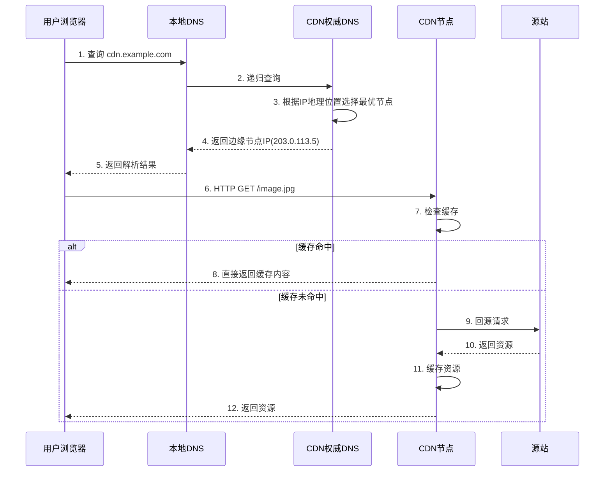
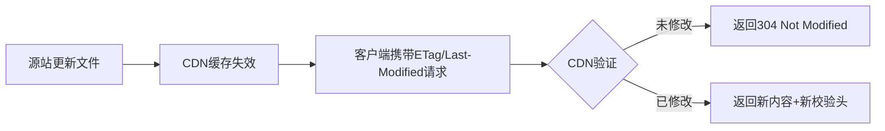
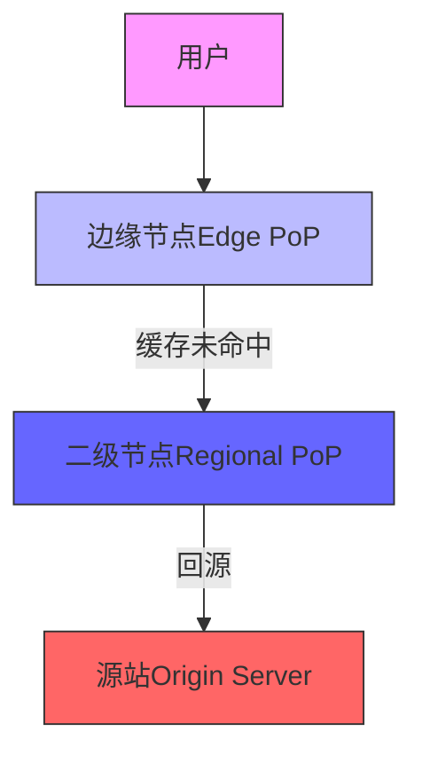
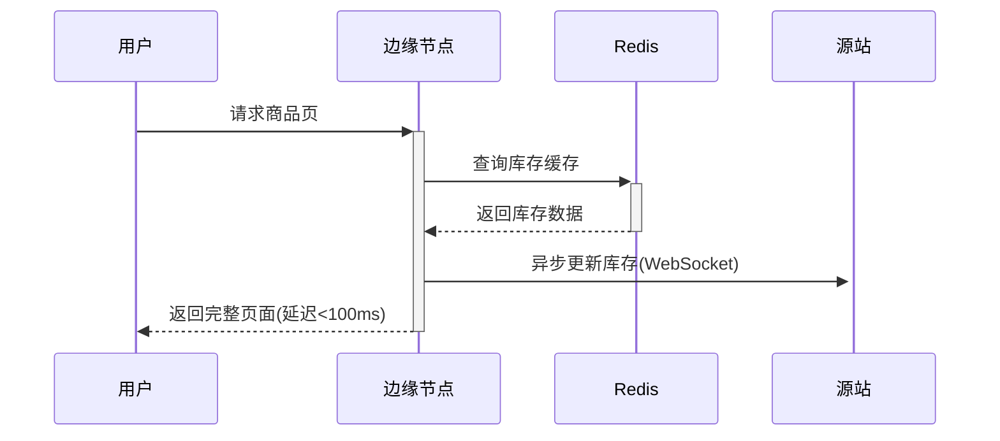

# CDN部署与访问流程示例详解

下面我将通过一个简单的静态网站CDN部署示例，完整展示从客户端请求到CDN响应的全流程，并解释其中的关键技术环节。

## 一、基础部署示例

### 1. 源站准备
假设我们有一个静态网站托管在源站服务器上：
```
源站地址: origin.example.com
网站文件:
  - index.html
  - style.css
  - image.jpg
```

### 2. CDN配置（以Cloudflare为例）
```bash
# 1. 添加DNS记录
A记录 cdn.example.com -> 192.0.2.1 (CDN入口IP)

# 2. 设置缓存规则（控制台操作）
缓存规则:
  - /*.html -> 缓存1小时
  - /*.(css|js) -> 缓存1年
  - /*.(jpg|png) -> 缓存30天

# 3. 配置回源策略
回源Host头: origin.example.com
健康检查: /health-check.html
```

## 二、完整访问流程解析



## 三、关键技术环节详解

### 1. DNS智能解析（步骤2-5）
- **客户端DNS查询**：浏览器检查本地缓存 → 系统DNS → ISP递归DNS
- **CDN权威DNS决策**：
  ```python
  def select_edge_node(requester_ip):
      user_location = geoip.lookup(requester_ip)
      nodes = get_healthy_nodes()
      return min(nodes, 
                key=lambda n: (distance(n.location, user_location), 
                                   n.current_load))
  ```
- **返回结果示例**：
  - 日本用户 → 东京节点(203.0.113.5)
  - 美国用户 → 洛杉矶节点(198.51.100.10)

### 2. 边缘节点处理（步骤6-8）
**缓存查找逻辑**：
```nginx
location / {
    proxy_cache_key "$scheme://$host$request_uri";
    proxy_cache_valid 200 1h;
    proxy_pass http://origin_backend;
    
    # 缓存命中头
    add_header X-Cache-Status $upstream_cache_status;
}
```
- **缓存命中**：直接返回资源（响应头含 `X-Cache-Status: HIT`）
- **缓存未命中**：触发回源流程

### 3. 回源获取（步骤9-12）
**边缘节点行为**：
1. 添加必要头信息：
   ```http
   GET /image.jpg HTTP/1.1
   Host: origin.example.com
   X-Forwarded-For: 203.0.113.5
   ```
2. 根据响应头缓存策略处理：
   - `Cache-Control: public, max-age=86400` → 缓存1天
   - `Vary: Accept-Encoding` → 区分压缩版本

## 四、客户端视角的请求示例

### 1. 首次访问（缓存未命中）
```bash
curl -v https://cdn.example.com/image.jpg

# 响应头示例
HTTP/2 200 
content-type: image/jpeg
cache-control: public, max-age=2592000
x-cache-status: MISS  # 指示缓存未命中
accept-ranges: bytes
server: cloudflare
```

### 2. 后续访问（缓存命中）
```bash
curl -v https://cdn.example.com/image.jpg

# 响应头变化
HTTP/2 200 
x-cache-status: HIT  # 来自边缘缓存
cf-cache-status: HIT
age: 3600  # 资源已在缓存中存储的时间(秒)
```

## 五、性能优化关键点

### 1. 缓存策略配置
```nginx
# 最佳实践配置示例
location ~* \.(webp|gif|png|jpe?g)$ {
    expires 365d;
    add_header Cache-Control "public, immutable";
}

location ~* \.(css|js)$ {
    expires 1y;
    add_header Cache-Control "public, max-age=31536000";
}

location / {
    expires 1h;
    add_header Cache-Control "public, max-age=3600";
}
```

### 2. 客户端缓存验证
当资源更新时，CDN与客户端协作机制：



## 六、故障排查方法

### 1. 查看CDN缓存状态
```bash
curl -svo /dev/null https://cdn.example.com/image.jpg 2>&1 | grep -iE 'X-Cache|CF-Cache'

# 典型输出
< x-cache-status: HIT
< cf-cache-status: HIT
< age: 1234
```

### 2. 追踪请求路由
```bash
# 使用mtr工具
mtr --report --report-wide cdn.example.com

# 输出示例
Host               Loss%  Snt  Last  Avg  Best  Wrst StDev
1. 192.168.1.1     0.0%   10   2.1   2.2  1.9   2.8  0.3
2. 203.0.113.5     0.0%   10   8.4   9.1  8.2  11.3  1.1  # CDN边缘节点
```

## 七、进阶部署建议

1. **动态内容加速**：
   ```nginx
   location /api {
       proxy_cache_key "$request_method$request_uri$args";
       proxy_cache_valid 200 10s;  # 短时间缓存
       proxy_pass http://api_backend;
   }
   ```

2. **边缘计算处理**：
   ```javascript
   // Cloudflare Worker示例
   addEventListener('fetch', event => {
     event.respondWith(handleRequest(event.request))
   })

   async function handleRequest(request) {
     // 在边缘节点转换WebP图片
     if (/\.jpg$/.test(request.url)) {
       const response = await fetch(request)
       return convertToWebP(response)
     }
     return fetch(request)
   }
   ```

通过这个示例可以看到，CDN部署的核心在于：
1. **智能DNS路由**：将用户导向最近的边缘节点
2. **分层缓存机制**：减少回源请求
3. **内容优化**：在边缘节点执行压缩、格式转换等操作

实际商业CDN服务（如Akamai、Cloudflare）会在这些基础流程上增加：
- 实时流量监控和节点切换
- DDoS攻击自动缓解
- 机器学习驱动的缓存策略优化
- 边缘安全策略执行（WAF、Bot防护等）


# CDN技术深度解析：架构、工作原理与核心价值

内容分发网络（Content Delivery Network，CDN）是现代互联网基础设施的关键组成部分，它通过分布式节点网络显著提升内容传输效率。以下从技术实现层面全面剖析CDN的核心机制与应用价值。

## 一、CDN核心架构解析

### 1. 分层节点架构


- **边缘节点（Edge PoP）**：全球分布的终端接入点，通常部署在ISP网络边缘，直接服务终端用户（延迟<30ms）
- **二级节点（Regional PoP）**：区域级枢纽节点，覆盖多个边缘节点（延迟<100ms）
- **中心节点（Central Node）**：全局调度中心，负责流量管理与策略分发
- **源站（Origin）**：内容原始服务器，仅在边缘缓存失效时被访问

### 2. 核心组件构成
- **缓存系统**：采用高性能存储介质（如NVMe SSD），支持动态内容缓存
- **负载均衡器**：基于Anycast+BGP的智能路由，实现请求最优分配
- **内容路由系统**：DNS解析结合IP地理位置数据库（如MaxMind GeoIP）
- **安全防护**：集成DDoS缓解、WAF和Bot防护功能

## 二、关键技术实现原理

### 1. 动态内容加速技术
```python
# 边缘节点处理逻辑示例
def handle_request(request):
    cache_key = generate_cache_key(request.url, request.headers)
    if cache.exists(cache_key) and not cache.expired(cache_key):
        return cache.get(cache_key)
    else:
        # 动态内容获取与缓存
        response = fetch_from_origin(request)
        if is_cacheable(response):
            cache.set(cache_key, response, ttl=calculate_ttl(response))
        return response
```

#### 缓存策略优化：
- **边缘侧计算**：在Cloudflare Workers等边缘计算平台执行JS逻辑
- **ESI（Edge Side Includes）**：页面片段级缓存，支持动态组装
- **智能预热**：基于预测算法提前缓存热点内容

### 2. 路由优化算法
- **实时延迟探测**：通过RTT测量构建网络拓扑图
- **机器学习预测**：基于历史数据预测最优路径
- **协议优化**：QUIC协议替代TCP，减少握手延迟

## 三、核心性能指标对比

| 指标                | 无CDN          | 启用CDN         | 提升幅度 |
|---------------------|---------------|----------------|--------|
| 首字节时间(TTFB)     | 800ms         | 80ms           | 90%    |
| 页面加载时间         | 5.2s          | 1.8s           | 65%    |
| 视频卡顿率           | 18%           | 2%             | 89%    |
| 源站带宽成本         | 100%          | 20%            | 80%    |
| DDoS防护能力         | 无             | 10Tbps+        | 100%   |

## 四、现代CDN技术演进

### 1. 边缘计算集成
- **Serverless边缘函数**：AWS Lambda@Edge、Cloudflare Workers
- **AI推理加速**：在边缘节点运行轻量级ML模型（如TensorFlow Lite）
- **WebAssembly支持**：高性能边缘代码执行

### 2. 新型传输协议
- **HTTP/3**：基于QUIC实现0-RTT连接
- **MPTCP**：多路径并行传输提升可靠性
- **BBR拥塞控制**：优化高延迟链路吞吐量

### 3. 安全增强
- **零信任接入**：基于身份的边缘访问控制
- **实时威胁检测**：JS指纹识别+行为分析阻断恶意爬虫
- **隐私保护**：边缘节点数据脱敏处理

## 五、典型应用场景实现

### 1. 全球电商大促


### 2. 4K视频直播
- **协议优化**：采用LL-HLS（低延迟HLS）协议
- **智能码率**：基于带宽预测动态切换（ABR算法）
- **P2P加速**：边缘节点间组播传输减少源站压力

### 3. 金融交易系统
- **TCP加速**：单边加速代理优化跨国交易链路
- **API缓存**：毫秒级更新行情数据缓存
- **安全合规**：边缘节点FIPS 140-2认证加密

## 六、选型实施指南

### 1. 主流CDN服务对比
| 服务商      | 节点数量 | 特色功能                  | 适用场景              |
|------------|---------|--------------------------|---------------------|
| Akamai     | 400k+   | 企业级安全防护            | 金融、政府等高安全需求 |
| Cloudflare | 285+城市 | 免费SSL/边缘计算          | 初创企业/Web应用     |
| AWS CloudFront | 450+PoP | 深度AWS生态集成         | 云原生应用           |
| 阿里云CDN   | 2800+节点 | 中国本土优化             | 中国大陆业务         |

### 2. 性能调优策略
- **缓存规则**：根据内容类型设置差异化TTL
  ```nginx
  location ~* \.(jpg|png|css|js)$ {
    expires 365d;
    add_header Cache-Control "public";
  }
  ```
- **智能压缩**：Brotli替代Gzip提升压缩率
- **预连接**：HTTP/2 Server Push关键资源

### 3. 故障排查工具
- **MTR诊断**：可视化网络路径质量
  ```bash
  mtr --report-cycles 10 --report-wide example.com
  ```
- **缓存状态检查**：
  ```http
  GET /asset.jpg HTTP/1.1
  Host: cdn.example.com
  X-Cache-Debug: 1
  ```

## 七、前沿发展趋势

1. **算力下沉**：边缘节点部署GPU资源，支持实时视频处理
2. **卫星CDN**：通过低轨卫星星座（如Starlink）覆盖偏远地区
3. **区块链CDN**：基于Token激励的分布式节点网络
4. **AI调度系统**：深度强化学习实现动态路由优化

CDN技术已从简单的内容缓存演进为集传输加速、边缘计算、安全防护于一体的综合服务平台。随着5G和物联网的普及，边缘节点的计算能力将释放更大价值，成为下一代互联网的核心基础设施。企业选择CDN解决方案时，需综合考虑业务特性、地理覆盖需求和安全合规要求，通过合理的缓存策略和协议优化最大化性能收益。