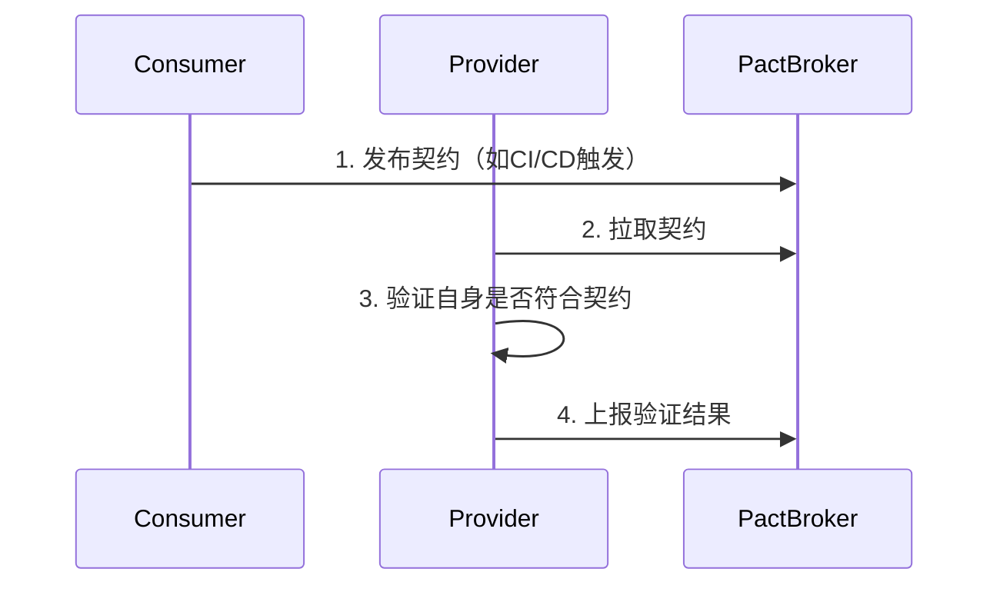

# **契约测试（Contract Testing）详解**

在微服务架构中，**契约测试（Contract Testing）** 是一种确保服务间 API 兼容性的关键实践。它通过预先定义服务间的交互契约（Contract），并在独立环境中验证这些契约，从而避免因接口变更导致的集成故障。下面从 **原理、工作流程、工具实践** 和 **对比其他测试** 四个方面深入解析。

---

## **📌 一、为什么需要契约测试？**
### **1. 微服务集成痛点**
- **问题场景**：
  - 服务A 依赖 服务B 的 `/users` API。
  - 服务B 升级后修改了响应字段（如 `username` → `name`），但未通知服务A。
  - 服务A 仍按旧格式解析，导致生产环境故障。
- **根本原因**：服务间缺乏 **强制的接口兼容性保障**。

### **2. 传统测试的不足**
| 测试类型       | 缺点                          |
|----------------|-------------------------------|
| 单元测试       | 仅测试单个服务，不验证跨服务交互 |
| 集成测试       | 环境复杂、运行慢、难以覆盖所有组合 |
| E2E 测试       | 反馈周期长，定位问题困难       |

**契约测试的核心价值**：  
✅ **提前发现接口不兼容**（无需部署所有服务）。  
✅ **减少对完整测试环境的依赖**。  
✅ **加速CI/CD流水线**（比集成测试更快）。

---

## **📌 二、契约测试的核心原理**
### **1. 什么是契约（Contract）？**
契约是服务间交互的 **结构化约定**，包含：
- **请求格式**（HTTP方法、URL、Headers、Body）
- **响应格式**（状态码、Body结构）
- **交互场景**（如“当用户存在时返回200”）。

**示例（Pact契约）**：
```json
{
  "description": "获取用户详情",
  "request": {
    "method": "GET",
    "path": "/users/123"
  },
  "response": {
    "status": 200,
    "body": {
      "id": 123,
      "name": "Alice"
    }
  }
}
```

### **2. 契约测试的两种角色**
| 角色            | 职责                          | 技术实现                     |
|-----------------|-------------------------------|------------------------------|
| **消费者（Consumer）** | 定义期望的请求/响应格式       | 在单元测试中生成契约文件（如 `user-service.spec.js` 生成 `user-api-pact.json`） |
| **提供者（Provider）** | 验证自身能否满足所有消费者的契约 | 读取契约文件并模拟请求验证响应 |

---

## **📌 三、契约测试的工作流程**
### **1. 消费者驱动契约（CDC）模式**


### **2. 具体步骤**
#### **步骤1：消费者生成契约**
- 消费者在单元测试中定义期望的交互。
- **示例（JavaScript + Pact）**：
  ```javascript
  const { Pact } = require('@pact-foundation/pact');

  describe('User API Contract', () => {
    const provider = new Pact({
      consumer: 'frontend',
      provider: 'user-service',
    });

    it('期望获取用户123的详情', async () => {
      await provider.addInteraction({
        state: '用户123存在',
        uponReceiving: '获取用户详情请求',
        withRequest: {
          method: 'GET',
          path: '/users/123',
        },
        willRespondWith: {
          status: 200,
          body: {
            id: 123,
            name: 'Alice', // 消费者期望的字段
          },
        },
      });

      // 调用真实API客户端，Pact会拦截请求并比对契约
      const response = await userApiClient.getUser(123);
      expect(response.name).toEqual('Alice');
    });
  });
  ```

#### **步骤2：提供者验证契约**
- 提供者读取契约文件，模拟请求并验证响应。
- **示例（Spring Cloud Contract）**：
  ```java
  @Test
  public void validateUserContract() throws Exception {
    mockMvc.perform(get("/users/123"))
        .andExpect(status().isOk())
        .andExpect(jsonPath("$.id").value(123))
        .andExpect(jsonPath("$.name").exists()); // 确保字段存在
  }
  ```

#### **步骤3：契约存储与共享**
- 使用 **Pact Broker** 或 **Git仓库** 存储契约文件，供团队协作。
  ```bash
  # 发布契约到Pact Broker
  pact-broker publish ./pacts --consumer-app-version=1.0.0 --broker-url=http://broker.example.com
  ```

---

## **📌 四、主流工具对比**
| 工具               | 语言支持        | 核心特性                      | 适用场景              |
|--------------------|----------------|-----------------------------|---------------------|
| **Pact**           | JS/Java/Ruby等 | 消费者驱动、Pact Broker      | 多语言微服务         |
| **Spring Cloud Contract** | Java/Kotlin   | 提供者生成契约、Stub测试     | Spring生态          |
| **Dredd**          | 任何HTTP API   | 基于OpenAPI/Swagger文档测试  | 文档驱动开发         |

---

## **📌 五、契约测试 vs 其他测试**
| 维度         | 契约测试                | 集成测试               | E2E测试            |
|--------------|------------------------|-----------------------|--------------------|
| **运行速度** | ⚡️ 快（隔离测试）       | 🐢 中等（需部分依赖）  | 🐢 慢（全链路部署） |
| **反馈时机** | 开发阶段               | 部署阶段              | 生产前验证         |
| **覆盖范围** | 接口格式兼容性         | 服务间真实交互        | 全业务流程         |

**理想组合**：  
🔹 **契约测试**（保障接口兼容性） +  
🔹 **集成测试**（验证关键交互） +  
🔹 **E2E测试**（覆盖核心业务流程）。

---

## **🚀 六、最佳实践**
1. **消费者驱动**：由调用方（消费者）定义契约，避免提供者过度设计。
2. **契约版本化**：每个契约关联服务版本（如 `user-service:v1.2.0`）。
3. **CI/CD集成**：
   - 消费者：每次提交生成新契约。
   - 提供者：定时或触发式验证所有依赖契约。
4. **契约审查**：重大变更需团队审核（如字段删除）。

---

## **💡 面试问题示例**
**Q：如何用契约测试避免“服务A修改接口导致服务B崩溃”？**  
**A**：  
1. 服务B（消费者）在单元测试中定义对服务A的契约（如期望的响应字段）。  
2. 服务A（提供者）在CI中自动验证是否满足所有消费者的契约。  
3. 如果服务A的修改破坏了契约（如删除字段），CI会立即失败并阻止部署。  

**Q：契约测试能否替代集成测试？**  
**A**：  
不能。契约测试仅验证接口格式兼容性，而集成测试会验证：  
- 真实网络通信（超时、重试）。  
- 数据库/中间件交互。  
- 业务逻辑组合效果。  

---

通过契约测试，团队可以在 **早期开发阶段** 发现接口不兼容问题，显著降低微服务架构的集成风险。结合 **Pact Broker** 等工具，还能实现跨团队的契约可视化管理和变更追踪。


在微服务架构中，**API 版本管理**和**发布策略**直接影响系统的 **兼容性**、**可维护性** 和 **用户体验**。以下是针对 GraphQL 和 REST 的完整解决方案：

---

## **📌 一、API 版本管理策略**
### **1. REST API 的版本管理**
#### **(1) URL 路径版本控制（最常见）**
```bash
# 显式版本号
https://api.example.com/v1/products
https://api.example.com/v2/products
```
**优点**：简单直观，缓存友好。  
**缺点**：URL 污染，客户端必须硬编码版本号。

#### **(2) 请求头版本控制**
```bash
GET /products HTTP/1.1
Accept: application/json; version=2
```
**优点**：URL 干净，适合渐进式升级。  
**缺点**：需要客户端配合，调试复杂。

#### **(3) 查询参数版本控制**
```bash
https://api.example.com/products?version=2
```
**优点**：临时测试方便。  
**缺点**：不适合长期版本化。

---

### **2. GraphQL API 的版本管理**
GraphQL **官方推荐演进式设计**（无版本化），但可通过以下方式实现兼容：
#### **(1) 字段级弃用（@deprecated）**
```graphql
type Product {
  id: ID!
  price: Float! @deprecated(reason: "Use `priceV2`")
  priceV2: Money!  # 新字段
}
```
**优点**：无缝过渡，客户端逐步迁移。  
**缺点**：Schema 会膨胀，需清理旧字段。

#### **(2) Schema 扩展（联合类型）**
```graphql
union ProductResult = ProductV1 | ProductV2

type Query {
  product(id: ID!): ProductResult!
}
```
**优点**：支持多版本共存。  
**缺点**：客户端需处理类型判断。

#### **(3) 子图版本化（Federation）**
```graphql
# 子图A (v1)
type Product @key(fields: "id") {
  id: ID!
  price: Float!
}

# 子图B (v2)
type Product @key(fields: "id") {
  id: ID!
  priceV2: Money!
}
```
**适用场景**：微服务架构中部分服务升级。

---

## **📌 二、API 发布策略**
### **1. 蓝绿部署（Blue-Green）**
- **原理**：同时运行新旧版本，通过流量切换（如 Nginx、Kubernetes Service）瞬间迁移。
- **适用场景**：零停机发布，快速回滚。
- **工具**：Kubernetes、AWS Elastic Load Balancer。

### **2. 金丝雀发布（Canary）**
- **原理**：逐步将部分流量（如 5%）导向新版本，监控无异常后全量发布。
- **适用场景**：降低高风险变更的影响。
- **工具**：Istio、Linkerd。

### **3. 功能开关（Feature Flags）**
```yaml
# 配置中心（如 LaunchDarkly）
features:
  new_pricing_api: 
    enabled: true
    rollout_percentage: 30%
```
**优点**：动态控制功能，无需代码发布。  
**适用场景**：AB 测试或紧急关闭问题功能。

---

## **📌 三、微服务架构中的实践**
### **1. API 网关统一入口**
- **职责**：
  - 路由请求到正确的服务版本（如 `/v1/*` → 服务A，`/v2/*` → 服务B）。
  - 聚合 GraphQL 子图（Apollo Federation）。
- **工具**：Kong、Apollo Router、Nginx。

### **2. 契约测试（Contract Testing）**
- **问题**：服务A依赖服务B的接口变更导致故障。
- **解决方案**：使用 Pact 或 Spring Cloud Contract 预先约定接口规范。
- **示例**：
  ```javascript
  // Pact 测试用例
  provider
    .given("Product exists")
    .uponReceiving("a request for Product")
    .withRequest({ method: "GET", path: "/v1/products/1" })
    .willRespondWith({ status: 200, body: { id: 1, price: 9.99 } });
  ```

### **3. 版本化数据库迁移**
- **策略**：
  - **向后兼容模式**：新增列而非修改列（如 `price` → `price_v2`）。
  - **双写模式**：新旧版本同时写入数据库，确保回滚能力。
- **工具**：Flyway、Liquibase。

---

## **📌 四、监控与回滚**
### **1. 关键监控指标**
| 指标                | 工具示例                  |
|---------------------|--------------------------|
| 错误率（5xx）       | Prometheus + Grafana     |
| 延迟（P99）         | Datadog                  |
| 流量分布（v1 vs v2）| Istio 流量监控           |

### **2. 回滚机制**
- **自动化回滚**：CI/CD 管道集成健康检查（如 Kubernetes Rollback）。
- **数据回滚**：数据库备份（如 AWS RDS Snapshot）。

---

## **🚀 五、最佳实践总结**
| 场景                | 推荐策略                  |
|---------------------|--------------------------|
| **REST 版本化**     | URL 路径版本 + 蓝绿部署   |
| **GraphQL 演进**    | `@deprecated` + 子图扩展 |
| **高风险变更**      | 金丝雀发布 + 契约测试    |
| **多团队协作**      | API 网关 + Schema Registry|

---

## **💡 面试问题示例**
**Q：如何在微服务中实现无感知的 API 版本升级？**  
**A**：  
1. **采用蓝绿部署**：新旧版本并行运行，通过负载均衡器切换流量。  
2. **契约测试保障**：确保下游服务兼容新接口（如 Pact）。  
3. **监控告警**：实时跟踪错误率和延迟，异常时自动回滚。  
4. **GraphQL 场景**：通过 `@deprecated` 逐步迁移字段，而非强制升级。  

**Q：GraphQL 如何避免 REST 式的版本号污染？**  
**A**：  
1. **演进式设计**：新增字段（如 `priceV2`）而非修改原有字段。  
2. **弃用机制**：用 `@deprecated` 标记旧字段，文档通知客户端迁移。  
3. **工具辅助**：Apollo Studio 分析客户端查询，识别仍在使用旧字段的请求。  

---

通过合理选择版本策略和发布流程，可以平衡 **系统稳定性** 和 **迭代速度**。对于核心服务，建议结合 **金丝雀发布** + **契约测试** 最大限度降低风险。