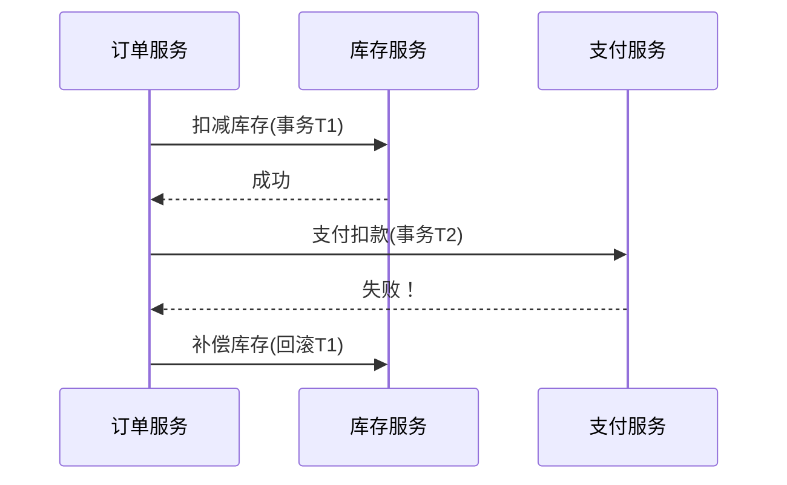
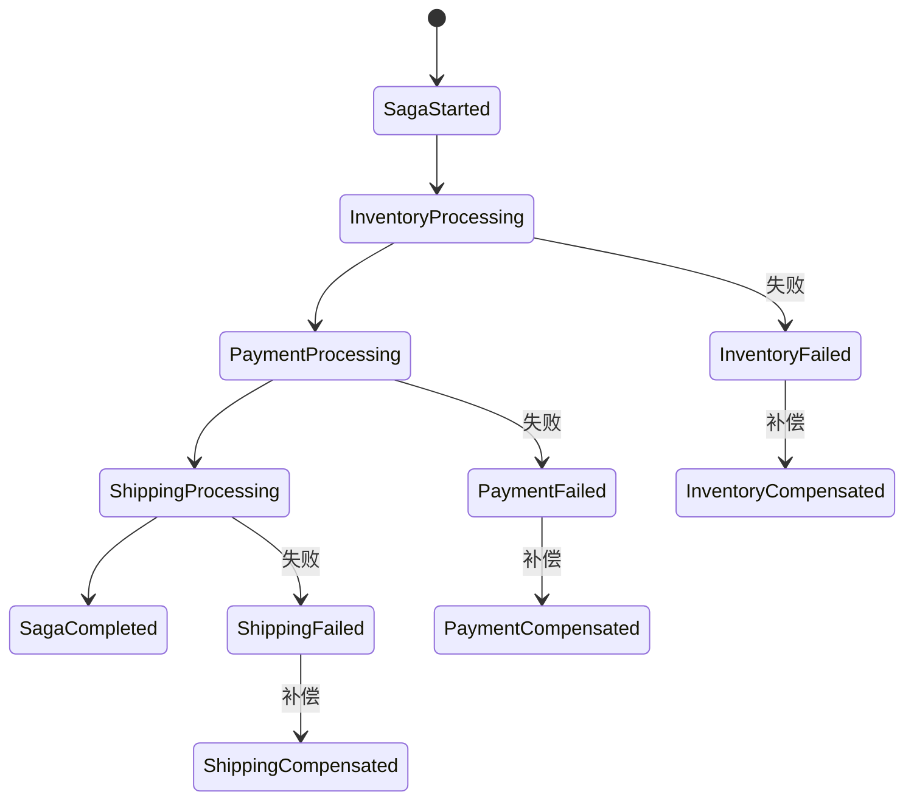
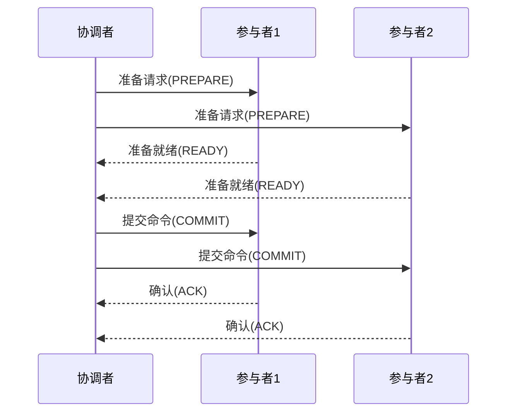
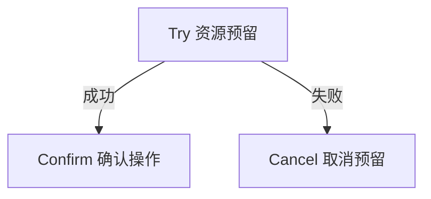
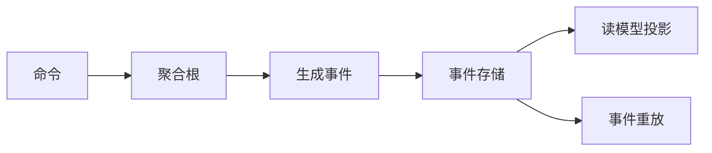

# Saga模式详解：分布式事务的解决方案

Saga模式是一种管理**跨服务分布式事务**的设计模式，专门解决微服务架构下的数据一致性问题。下面我将全面解析其工作原理和应用场景。

## 一、核心要解决的问题

### 典型分布式事务问题场景
**案例**：电商下单流程
```
1. 订单服务：创建订单
2. 库存服务：扣减库存
3. 支付服务：扣款
4. 物流服务：创建运单
```
当步骤3支付失败时，需要回滚前序操作，但在微服务中：
- 各服务有独立数据库
- 无法使用传统ACID事务
- 可能出现订单创建但库存未扣减等不一致状态

## 二、Saga模式工作原理

### 基本执行方式


### 两种实现形式

#### 1. 编排式(Choreography)
**特点**：
- 无中心协调器
- 服务间通过事件通信
- 最终一致性

**流程示例**：
```
订单服务 → 发布"订单创建"事件 → 
库存服务(订阅) → 扣库存 → 发布"库存已扣"事件 → 
支付服务(订阅) → 扣款 → 发布"支付完成"事件
```

#### 2. 编排式(Orchestration)
**特点**：
- 有中心协调器
- 显式控制流程
- 更易监控调试

**流程示例**：
```
Saga协调器 → 命令订单服务创建订单 → 
         → 命令库存服务扣减库存 → 
         → 命令支付服务扣款
```

## 三、Saga的关键设计

### 1. 事务补偿机制
每个正向操作都需要定义对应的补偿操作：

| 正向操作          | 补偿操作              |
|------------------|----------------------|
| 创建订单          | 取消订单              |
| 扣减库存          | 恢复库存              |
| 预扣支付款        | 退款                  |

**补偿操作特点**：
- 等幂性设计（多次执行效果相同）
- 可重试
- 可能需要额外业务逻辑（如取消订单需记录原因）

### 2. 实现示例（Java+Spring）

#### 编排式实现
```java
// Saga协调服务
public class OrderSagaCoordinator {
    
    @Autowired
    private InventoryClient inventoryClient;
    
    @Autowired
    private PaymentClient paymentClient;
    
    @Transactional
    public void createOrder(Order order) {
        try {
            // 1. 创建订单（本地事务）
            orderRepository.save(order);
            
            // 2. 扣减库存
            inventoryClient.reduceStock(order.getItems());
            
            // 3. 支付扣款
            paymentClient.debit(order.getUserId(), order.getTotal());
            
        } catch (Exception e) {
            // 触发补偿流程
            compensate(order);
            throw new SagaException("Order creation failed", e);
        }
    }
    
    private void compensate(Order order) {
        try {
            paymentClient.refund(order.getUserId(), order.getTotal());
        } catch (Exception e) {
            log.error("Refund failed", e);
        }
        
        try {
            inventoryClient.restoreStock(order.getItems());
        } catch (Exception e) {
            log.error("Restore stock failed", e);
        }
        
        order.setStatus(OrderStatus.CANCELLED);
        orderRepository.save(order);
    }
}
```

#### 事件驱动实现
```java
// 订单服务
public class OrderService {
    
    @Transactional
    public void createOrder(Order order) {
        orderRepository.save(order);
        eventPublisher.publish(new OrderCreatedEvent(order));
    }
    
    @Transactional
    public void cancelOrder(Long orderId) {
        orderRepository.updateStatus(orderId, OrderStatus.CANCELLED);
    }
}

// 库存服务
@Service
@RequiredArgsConstructor
public class InventoryHandler {
    
    private final InventoryRepository repository;
    
    @TransactionalEventListener
    public void handle(OrderCreatedEvent event) {
        repository.reduceStock(event.getItems());
        // 发布InventoryUpdatedEvent
    }
    
    @TransactionalEventListener
    public void handle(OrderCancelledEvent event) {
        repository.restoreStock(event.getItems());
    }
}
```

## 四、Saga的适用场景

### 最佳使用场景
1. **长周期业务流程**（秒级/分钟级）
2. **跨多个服务的操作**
3. **无法使用传统事务的场景**
4. **需要最终一致性的系统**

### 典型应用案例
| 行业       | 应用场景                     | Saga的作用                     |
|------------|----------------------------|-------------------------------|
| 电商       | 订单创建流程                | 协调订单-库存-支付-物流        |
| 银行       | 跨行转账                    | 协调借方/贷方银行系统          |
| 旅游       | 机票+酒店套餐预订           | 保证多个预订同时成功或取消     |
| 拍卖       | 竞价-订单-支付流程          | 处理拍卖成功后的事务链         |

## 五、Saga的优缺点分析

### 优势
1. **服务自治**：各服务使用自己的数据库
2. **松耦合**：服务间仅通过API/事件通信
3. **高可用**：没有全局锁，系统部分故障仍可运行
4. **可扩展**：适合云原生和微服务架构

### 挑战
1. **调试复杂**：分布式跟踪难度大
2. **补偿逻辑**：需要精心设计回滚操作
3. **一致性延迟**：系统处于临时不一致状态
4. **等幂性要求**：所有操作必须支持重复执行

## 六、Saga模式进阶设计

### 1. 持久化Saga状态
```java
@Entity
public class SagaInstance {
    @Id
    private String sagaId;
    private String type; // 如"OrderCreation"
    private SagaStatus status;
    
    @OneToMany
    private List<SagaStep> steps;
    
    // 记录创建/更新时间等
}

@Entity
public class SagaStep {
    private String serviceName;
    private StepStatus status;
    private String compensationData; // 补偿所需数据
}
```

### 2. 超时处理机制
```java
// 在Saga协调器中
public void startSagaWithTimeout(Saga saga, Duration timeout) {
    sagaExecutor.start(saga);
    
    scheduledExecutor.schedule(() -> {
        if (!saga.isCompleted()) {
            saga.compensate(); // 超时触发补偿
        }
    }, timeout.toMillis(), TimeUnit.MILLISECONDS);
}
```

### 3. 可视化监控


## 七、与其他模式的对比

| 模式          | 一致性      | 隔离性    | 适用场景               |
|---------------|------------|----------|-----------------------|
| 2PC           | 强一致性   | 高       | 短事务、低延迟        |
| Saga          | 最终一致   | 低       | 长事务、跨服务        |
| TCC           | 最终一致   | 中       | 需要预留资源的场景     |
| 事件溯源      | 最终一致   | 低       | 需要完整审计追踪      |

在拍卖系统设计中，Saga模式特别适合处理"竞价成功→生成订单→支付→物流通知"这样的跨服务业务流程，既能保持各服务的独立性，又能确保整个业务链的最终一致性。


# 分布式事务模式全解析：Saga、2PC、TCC与事件溯源

## 一、Saga的全称
Saga模式的全称是 **"Saga Pattern"**，名称源自1987年Hector Garcia-Molina和Kenneth Salem在论文《Sagas》中提出的概念。在分布式系统领域，它特指一种管理**长时间运行事务**(Long Running Transaction)的架构模式。

## 二、2PC (两阶段提交)

### 基本概念
**Two-Phase Commit**（两阶段提交）是一种经典的分布式事务协议，通过协调者(Coordinator)协调多个参与者(Participant)实现ACID事务。

### 工作原理


### 关键特点
1. **两个阶段**：
   - **准备阶段**：协调者询问所有参与者是否可以提交
   - **提交阶段**：根据参与者反馈决定提交或中止

2. **优缺点**：
   - ✅ 强一致性保证
   - ❌ 同步阻塞（参与者故障会导致整个系统阻塞）
   - ❌ 单点故障风险（协调者故障）

3. **应用场景**：
   - 数据库集群（如MySQL Cluster）
   - 短周期、高一致性的金融交易

### Java实现示例
```java
public class TwoPCCoordinator {
    public boolean execute(Transaction transaction) {
        // 阶段1：准备
        boolean allPrepared = participants.stream()
            .allMatch(p -> p.prepare(transaction));
        
        if (!allPrepared) {
            participants.forEach(p -> p.rollback(transaction));
            return false;
        }
        
        // 阶段2：提交
        boolean allCommitted = participants.stream()
            .allMatch(p -> p.commit(transaction));
        
        if (!allCommitted) {
            // 需要人工干预
            alertAdmin("Commit failed", transaction);
        }
        return allCommitted;
    }
}
```

## 三、TCC (尝试-确认-取消)

### 基本概念
**Try-Confirm-Cancel**是一种补偿型事务模式，通过业务逻辑实现分布式事务。

### 三个阶段
1. **Try**：预留业务资源
2. **Confirm**：确认执行业务
3. **Cancel**：取消预留

### 工作流程


### 关键特点
1. **业务侵入性**：需要改造业务逻辑实现三接口
2. **最终一致性**：允许中间状态存在
3. **优点**：
   - ✅ 避免长事务锁资源
   - ✅ 高性能
4. **缺点**：
   - ❌ 实现复杂度高
   - ❌ 需要设计等幂操作

### 电商案例
| 服务       | Try                  | Confirm           | Cancel             |
|------------|----------------------|-------------------|--------------------|
| 库存服务   | 预扣库存(状态冻结)   | 确认扣减          | 释放冻结库存        |
| 支付服务   | 冻结资金             | 实际扣款          | 解冻资金            |

### Java实现
```java
public class OrderService {
    @Transactional
    public void createOrder(Order order) {
        // 1. Try阶段
        inventoryService.tryReduceStock(order.getItems());
        paymentService.tryDebit(order.getUserId(), order.getAmount());
        
        // 2. Confirm阶段
        try {
            inventoryService.confirmReduceStock(order.getItems());
            paymentService.confirmDebit(order.getUserId(), order.getAmount());
            order.setStatus(CONFIRMED);
        } catch (Exception e) {
            // 3. Cancel阶段
            inventoryService.cancelReduceStock(order.getItems());
            paymentService.cancelDebit(order.getUserId(), order.getAmount());
            order.setStatus(CANCELLED);
        }
        orderRepository.save(order);
    }
}
```

## 四、事件溯源 (Event Sourcing)

### 基本概念
**Event Sourcing**通过持久化**状态变更事件**（而非最终状态）来重建系统状态。

### 核心思想
- 状态是事件的衍生物
- 所有变更被记录为不可变事件
- 通过重放事件重建状态

### 架构图


### 关键特点
1. **优势**：
   - ✅ 完整审计追踪
   - ✅ 时间旅行调试
   - ✅ 天然解耦
2. **挑战**：
   - ❌ 学习曲线陡峭
   - ❌ 事件模型设计复杂
   - ❌ 查询性能问题

### 拍卖系统示例
```java
// 事件定义
public interface AuctionEvent {}
public record AuctionStarted(String auctionId, Item item) implements AuctionEvent {}
public record BidPlaced(String auctionId, String bidder, BigDecimal amount) implements AuctionEvent {}
public record AuctionEnded(String auctionId, String winner) implements AuctionEvent {}

// 聚合根
public class Auction {
    private String id;
    private Item item;
    private List<Bid> bids = new ArrayList<>();
    
    public List<AuctionEvent> process(Command command) {
        if (command instanceof StartAuction cmd) {
            return List.of(new AuctionStarted(cmd.auctionId(), cmd.item()));
        }
        // 其他命令处理...
    }
    
    public void apply(AuctionEvent event) {
        if (event instanceof BidPlaced e) {
            bids.add(new Bid(e.bidder(), e.amount()));
        }
        // 其他事件应用...
    }
}
```

## 五、模式对比分析

| 特性          | 2PC               | TCC               | Saga              | 事件溯源          |
|---------------|-------------------|-------------------|-------------------|-------------------|
| **一致性**    | 强一致            | 最终一致          | 最终一致          | 最终一致          |
| **隔离性**    | 完全隔离          | 业务隔离          | 无隔离            | 无隔离            |
| **性能**      | 低                | 高                | 中                | 中                |
| **复杂度**    | 中                | 高                | 中                | 高                |
| **适用场景**  | 短事务、金融支付  | 需要预留资源      | 长流程、跨服务    | 需要完整审计追踪  |
| **实现方式**  | 协议层面          | 业务层面          | 业务/流程层面     | 架构层面          |

## 六、选型建议

1. **强一致性需求**：选择2PC（但需接受性能代价）
2. **高并发秒杀**：TCC（利用资源预留机制）
3. **跨服务长流程**：Saga（如订单-库存-支付-物流）
4. **审计追踪需求**：事件溯源+ CQRS

在拍卖系统设计中，通常会组合使用这些模式：
- **竞价过程**：事件溯源记录所有出价事件
- **订单创建**：Saga协调订单-库存-支付
- **支付环节**：TCC保证资金操作安全性
- **数据同步**：2PC用于核心财务数据同步

每种模式都有其适用场景，实际系统往往需要根据业务特点进行组合或变通实现。