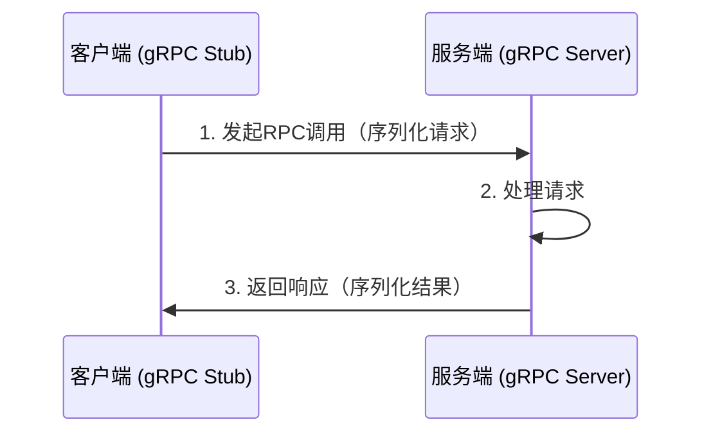

# **gRPC 详解：原理、核心特性与微服务实践**

gRPC 是一个高性能、开源的 **远程过程调用（RPC）框架**，由 Google 开发并基于 HTTP/2 和 Protocol Buffers（Protobuf）构建。它专为微服务和分布式系统设计，提供了比传统 REST API 更高效的通信机制。以下是全面解析：

---

## **📌 一、gRPC 核心原理**
### **1. 基本架构**


### **2. 核心组件**
| 组件                | 作用                                                                 |
|---------------------|----------------------------------------------------------------------|
| **Protocol Buffers** | 定义服务接口和消息格式（IDL），生成跨语言代码。                      |
| **HTTP/2 传输**     | 多路复用、二进制帧、头部压缩，降低延迟。                             |
| **gRPC Stub**       | 客户端生成的代理类，屏蔽网络调用细节。                               |
| **拦截器（Interceptor）** | 实现认证、日志、监控等横切关注点。                                  |

---

## **📌 二、为什么选择 gRPC？**
### **1. 性能优势（vs REST）**
| 特性                | gRPC                          | REST/HTTP+JSON               |
|---------------------|-------------------------------|------------------------------|
| **序列化**          | 二进制 Protobuf（体积小）     | 文本 JSON（体积大）          |
| **传输协议**        | HTTP/2（多路复用）           | HTTP/1.1（队头阻塞）         |
| **代码生成**        | 自动生成客户端/服务端代码     | 手动编写 Swagger 客户端      |
| **流式支持**        | 双向流（Streaming）           | 仅请求-响应                  |

**性能对比示例**：  
- 相同请求下，gRPC 的延迟比 REST 低 **30%~50%**，带宽占用减少 **60%**。

### **2. 适用场景**
- **微服务间通信**：服务网格（如 Istio）内部常用 gRPC。
- **实时流式数据**：聊天应用、股票行情推送。
- **多语言环境**：统一接口定义，生成各语言客户端。

---

## **📌 三、gRPC 通信模式**
### **1. 一元调用（Unary RPC）**
- **模式**：类似传统 HTTP 请求，一问一答。
- **示例**：
  ```protobuf
  service UserService {
    rpc GetUser (UserRequest) returns (UserResponse);
  }
  ```

### **2. 服务端流（Server Streaming）**
- **模式**：客户端发送一个请求，服务端返回多个响应（如日志推送）。
- **示例**：
  ```protobuf
  rpc ListUsers (UserQuery) returns (stream UserResponse);
  ```

### **3. 客户端流（Client Streaming）**
- **模式**：客户端发送多个请求，服务端返回一个响应（如文件上传）。
- **示例**：
  ```protobuf
  rpc UploadFile (stream FileChunk) returns (UploadResult);
  ```

### **4. 双向流（Bidirectional Streaming）**
- **模式**：双方独立发送消息（如聊天室）。
- **示例**：
  ```protobuf
  rpc Chat (stream Message) returns (stream Message);
  ```

---

## **📌 四、gRPC 实战示例**
### **1. 定义服务（.proto 文件）**
```protobuf
syntax = "proto3";

message UserRequest {
  int32 id = 1;
}

message UserResponse {
  string name = 1;
  string email = 2;
}

service UserService {
  rpc GetUser (UserRequest) returns (UserResponse);
}
```

### **2. 生成代码**
```bash
# 生成 Go 代码
protoc --go_out=. --go-grpc_out=. user.proto

# 生成 Python 代码
protoc --python_out=. --grpc_python_out=. user.proto
```

### **3. 实现服务端（Python）**
```python
from concurrent import futures
import grpc
import user_pb2
import user_pb2_grpc

class UserService(user_pb2_grpc.UserServiceServicer):
    def GetUser(self, request, context):
        return user_pb2.UserResponse(name="Alice", email="alice@example.com")

server = grpc.server(futures.ThreadPoolExecutor(max_workers=10))
user_pb2_grpc.add_UserServiceServicer_to_server(UserService(), server)
server.add_insecure_port('[::]:50051')
server.start()
server.wait_for_termination()
```

### **4. 实现客户端（Go）**
```go
package main

import (
	"log"
	"context"
	"google.golang.org/grpc"
	pb "path/to/user_pb"
)

func main() {
	conn, _ := grpc.Dial("localhost:50051", grpc.WithInsecure())
	client := pb.NewUserServiceClient(conn)
	response, _ := client.GetUser(context.Background(), &pb.UserRequest{Id: 123})
	log.Printf("User: %v", response.Name)
}
```

---

## **📌 五、高级特性**
### **1. 拦截器（Middleware）**
- **用途**：认证、日志、限流。
- **示例（Go 服务端拦截器）**：
  ```go
  func loggingInterceptor(ctx context.Context, req interface{}, info *grpc.UnaryServerInfo, handler grpc.UnaryHandler) (resp interface{}, err error) {
      log.Printf("Request: %v", req)
      return handler(ctx, req)
  }
  server := grpc.NewServer(grpc.UnaryInterceptor(loggingInterceptor))
  ```

### **2. 负载均衡**
- **客户端负载均衡**：通过 `grpc.Dial` 配置：
  ```go
  conn, _ := grpc.Dial(
      "dns:///my-service.example.com",
      grpc.WithDefaultServiceConfig(`{"loadBalancingConfig": [{"round_robin":{}}]}`),
  )
  ```

### **3. 健康检查**
- **标准协议**：使用 `grpc.health.v1.Health` 服务：
  ```protobuf
  service Health {
    rpc Check(HealthCheckRequest) returns (HealthCheckResponse);
  }
  ```

---

## **📌 六、gRPC 的局限性**
1. **浏览器支持有限**：  
   - 需通过 `grpc-web` 转译（如 Envoy 代理）。
2. **调试复杂度高**：  
   - 二进制协议需专用工具（如 `grpcurl`、BloomRPC）。
3. **防火墙兼容性**：  
   - 部分企业网络可能屏蔽 HTTP/2。

---

## **🚀 七、gRPC 最佳实践**
1. **Protobuf 版本控制**：  
   - 通过 `reserved` 标记废弃字段，避免破坏性变更。
   ```protobuf
   message User {
     reserved 2;  // 废弃旧字段
     string name = 1;
     string email = 3;
   }
   ```
2. **超时与重试**：  
   - 客户端设置超时：
     ```go
     ctx, cancel := context.WithTimeout(context.Background(), 5*time.Second)
     defer cancel()
     response, err := client.GetUser(ctx, request)
     ```
3. **监控与追踪**：  
   - 集成 OpenTelemetry 实现分布式追踪。

---

## **💡 面试问题示例**
**Q：gRPC 如何实现高性能？**  
**A**：  
1. **二进制 Protobuf 编码**：比 JSON 更小的数据体积。  
2. **HTTP/2 多路复用**：单连接并行处理多个请求，避免队头阻塞。  
3. **代码生成**：减少运行时反射开销。  

**Q：gRPC 适合替代 REST 吗？**  
**A**：  
- **适合内部服务**：微服务间通信优先选择 gRPC。  
- **不适合场景**：  
  - 需要直接浏览器调用的 API（需额外 grpc-web 支持）。  
  - 对人类可读性要求高的调试接口（如开发测试阶段）。  

---

通过 gRPC，开发者可以构建 **低延迟、高吞吐** 的分布式系统，尤其在微服务架构中优势显著。合理利用其流式特性、拦截器和多语言支持，能显著提升系统可维护性和扩展性。


# **Protocol Buffers (Protobuf) 详解**

Protocol Buffers (简称 Protobuf) 是 Google 开发的一种 **高效二进制数据序列化格式**，专为结构化数据的传输和存储设计。它比 JSON 和 XML 更小、更快，并支持跨语言代码生成，是 gRPC 的默认接口定义语言（IDL）。以下是全面解析：

---

## **📌 一、Protobuf 核心特性**
| 特性                | 说明                                                                 |
|---------------------|----------------------------------------------------------------------|
| **二进制编码**       | 体积比 JSON/XML 小 3~10 倍，解析速度快 5~100 倍。                    |
| **跨语言支持**       | 通过 `.proto` 文件生成 Java、C++、Go、Python 等代码。                |
| **强类型约束**       | 编译时检查字段类型，避免运行时错误。                                 |
| **向后兼容性**       | 通过字段编号（而非名称）实现版本演进。                               |
| **代码生成**         | 自动生成数据访问类，减少手写解析代码。                               |

---

## **📌 二、Protobuf 工作原理**
### **1. 开发流程**


### **2. 数据编码原理**
- **Tag-Length-Value (TLV) 结构**：  
  每个字段由 `字段编号 + 数据类型 + 值` 组成，无冗余字段名。
- **Varint 压缩**：  
  对小整数用变长编码（如 `300` 用 2 字节而非 4 字节）。

**示例**：  
消息 `{ id: 42, name: "Alice" }` 的二进制编码（简化版）：
```
08 2A 12 05 41 6C 69 63 65
```
- `08`：字段1（id）的标签（Wire Type=0，字段号=1）  
- `2A`：42 的 Varint 编码  
- `12`：字段2（name）的标签（Wire Type=2，字段号=2）  
- `05`：字符串长度=5  
- `41 6C 69 63 65`：ASCII "Alice"

---

## **📌 三、Protobuf 语法详解**
### **1. 基本消息定义**
```protobuf
syntax = "proto3";  // 指定版本

message User {
  int32 id = 1;      // 字段编号必须唯一且不变
  string name = 2;
  string email = 3;
  repeated string roles = 4;  // 列表类型
}
```

### **2. 字段规则**
| 规则          | 说明                          |
|---------------|-------------------------------|
| `optional`    | 可选字段（proto3 默认）       |
| `repeated`    | 可重复字段（列表/数组）       |
| `required`    | 必须字段（proto2 已废弃）     |

### **3. 数据类型**
| 类型          | 对应语言示例                   |
|---------------|-------------------------------|
| `int32`       | Java: `int`, Go: `int32`      |
| `double`      | C++: `double`, Python: `float`|
| `bool`        | 布尔值                        |
| `string`      | UTF-8 字符串                  |
| `bytes`       | 二进制数据                    |
| `enum`        | 枚举类型                      |
| `map`         | 键值对                        |

### **4. 服务定义（用于 gRPC）**
```protobuf
service UserService {
  rpc GetUser (UserRequest) returns (UserResponse);
}

message UserRequest {
  int32 id = 1;
}

message UserResponse {
  User user = 1;
}
```

---

## **📌 四、Protobuf 实战示例**
### **1. 安装编译器**
```bash
# 下载 protoc (https://github.com/protocolbuffers/protobuf/releases)
# 安装各语言插件（如Go）
go install google.golang.org/protobuf/cmd/protoc-gen-go@latest
```

### **2. 生成代码**
```bash
protoc --go_out=. --go_opt=paths=source_relative user.proto
```
生成的文件（Go）：
```go
type User struct {
    Id    int32  `protobuf:"varint,1,opt,name=id,proto3" json:"id,omitempty"`
    Name  string `protobuf:"bytes,2,opt,name=name,proto3" json:"name,omitempty"`
    Email string `protobuf:"bytes,3,opt,name=email,proto3" json:"email,omitempty"`
}
```

### **3. 序列化/反序列化（Python）**
```python
import user_pb2

# 序列化
user = user_pb2.User(id=123, name="Alice")
binary_data = user.SerializeToString()

# 反序列化
new_user = user_pb2.User()
new_user.ParseFromString(binary_data)
print(new_user.name)  # 输出 "Alice"
```

---

## **📌 五、高级特性**
### **1. 版本兼容性策略**
- **字段编号不可变**：删除或注释字段时需标记 `reserved`：
  ```protobuf
  message User {
    reserved 2;          // 保留字段编号2
    reserved "email";    // 保留字段名
    int32 id = 1;
    // string email = 2; // 已废弃
  }
  ```
- **新增字段**：必须使用新编号，且默认值需处理（如 `optional`）。

### **2. Oneof 类型**
```protobuf
message Event {
  oneof payload {
    string text = 1;
    bytes image = 2;
  }
}
```
- 同一时间只能设置其中一个字段，节省内存。

### **3. 选项（Options）**
```protobuf
import "google/protobuf/descriptor.proto";

extend google.protobuf.MessageOptions {
  string my_option = 51234;
}

message MyMessage {
  option (my_option) = "Hello";
}
```
- 可用于自定义元数据或代码生成控制。

---

## **📌 六、Protobuf vs JSON**
| 对比维度       | Protobuf                          | JSON                            |
|----------------|-----------------------------------|---------------------------------|
| **数据体积**   | ⚡️ 小（二进制编码）              | 大（文本 + 重复字段名）         |
| **解析速度**   | ⚡️ 快（无需分词）                | 慢（需解析字符串）              |
| **可读性**     | 差（二进制不可读）                | 好（文本可直接查看）            |
| **修改灵活性** | 需重新生成代码                    | 直接编辑文本                    |
| **适用场景**   | 微服务通信、高性能存储            | Web API、配置文件               |

---

## **📌 七、最佳实践**
1. **字段编号规划**：  
   - 1~15：常用字段（占用 1 字节）  
   - ≥16：较少使用的字段（占用 2 字节）  
2. **避免频繁变更**：  
   - 使用 `reserved` 防止字段号被误用。  
3. **性能敏感场景**：  
   - 优先使用 `int32` 而非 `string` 存储数值ID。  
4. **文档注释**：  
   ```protobuf
   message User {
     string name = 1 [(description) = "用户全名"];
   }
   ```

---

## **💡 面试问题示例**
**Q：Protobuf 如何实现向后兼容？**  
**A**：  
1. **字段编号唯一性**：旧代码会忽略未知编号的字段。  
2. **默认值处理**：未设置的 `optional` 字段返回类型默认值（如 `0` 或 `""`）。  
3. **reserved 标记**：防止已删除字段的编号被复用。  

**Q：Protobuf 为什么比 JSON 快？**  
**A**：  
1. **二进制编码**：无冗余字段名，无需分词。  
2. **静态类型**：解析时直接按类型读取，无需类型推断。  
3. **Varint 压缩**：减少整数存储空间。  

---

Protobuf 是构建高性能分布式系统的基石，尤其适合 **微服务通信** 和 **数据持久化**。合理设计 `.proto` 文件，能显著提升系统效率和可维护性。


在 gRPC 中，服务端向客户端推送消息主要通过 **流式 RPC（Streaming RPC）** 实现，具体分为以下三种模式。以下是详细的技术实现方案和代码示例：

---

## **📌 一、gRPC 服务端推送的三种模式**
### **1. 服务端流式 RPC（Server-side Streaming）**
- **特点**：客户端发送一个请求，服务端返回一个流式响应（多次推送）。
- **适用场景**：实时日志推送、股票行情更新。

#### **Proto 定义**
```protobuf
service NotificationService {
  rpc SubscribeToUpdates (SubscribeRequest) returns (stream Notification);
}

message SubscribeRequest {
  string user_id = 1;
}

message Notification {
  string content = 1;
  int64 timestamp = 2;
}
```

#### **服务端实现（Go）**
```go
func (s *NotificationServer) SubscribeToUpdates(req *pb.SubscribeRequest, stream pb.NotificationService_SubscribeToUpdatesServer) error {
    for {
        // 模拟持续推送
        notification := &pb.Notification{
            Content:   fmt.Sprintf("Update for user %s", req.UserId),
            Timestamp: time.Now().Unix(),
        }
        if err := stream.Send(notification); err != nil {
            return err
        }
        time.Sleep(2 * time.Second) // 控制推送频率
    }
}
```

#### **客户端调用（Go）**
```go
stream, err := client.SubscribeToUpdates(ctx, &pb.SubscribeRequest{UserId: "123"})
if err != nil { /* ... */ }

for {
    notification, err := stream.Recv()
    if err == io.EOF {
        break // 流结束
    }
    if err != nil { /* ... */ }
    fmt.Println("Received:", notification.Content)
}
```

---

### **2. 双向流式 RPC（Bidirectional Streaming）**
- **特点**：客户端和服务端各自通过一个读写流发送消息。
- **适用场景**：聊天应用、实时游戏指令同步。

#### **Proto 定义**
```protobuf
service ChatService {
  rpc Chat (stream ChatMessage) returns (stream ChatMessage);
}

message ChatMessage {
  string user = 1;
  string text = 2;
}
```

#### **服务端实现（Go）**
```go
func (s *ChatServer) Chat(stream pb.ChatService_ChatServer) error {
    for {
        // 接收客户端消息
        msg, err := stream.Recv()
        if err == io.EOF {
            return nil
        }
        if err != nil { /* ... */ }

        // 推送响应给客户端
        reply := &pb.ChatMessage{
            User: "Server",
            Text: fmt.Sprintf("Echo: %s", msg.Text),
        }
        if err := stream.Send(reply); err != nil {
            return err
        }
    }
}
```

#### **客户端调用（Go）**
```go
stream, err := client.Chat(ctx)
if err != nil { /* ... */ }

// 发送消息
go func() {
    for {
        stream.Send(&pb.ChatMessage{User: "Client", Text: "Hello"})
        time.Sleep(1 * time.Second)
    }
}()

// 接收服务端推送
for {
    reply, err := stream.Recv()
    if err == io.EOF { break }
    if err != nil { /* ... */ }
    fmt.Println("Server says:", reply.Text)
}
```

---

### **3. 客户端流式 RPC（Client-side Streaming）**
- **特点**：客户端发送流式请求，服务端返回单个响应。
- **适用场景**：批量上传数据后触发服务端推送汇总结果。

#### **Proto 定义**
```protobuf
service DataUploadService {
  rpc UploadData (stream DataChunk) returns (UploadSummary);
}

message DataChunk {
  bytes content = 1;
}

message UploadSummary {
  int64 total_size = 1;
}
```

#### **服务端实现（Go）**
```go
func (s *DataUploadServer) UploadData(stream pb.DataUploadService_UploadDataServer) error {
    var totalSize int64
    for {
        chunk, err := stream.Recv()
        if err == io.EOF {
            // 客户端流结束，返回汇总结果
            return stream.SendAndClose(&pb.UploadSummary{TotalSize: totalSize})
        }
        if err != nil { /* ... */ }
        totalSize += int64(len(chunk.Content))
    }
}
```

---

## **📌 二、关键技术与优化**
### **1. 流控制（Flow Control）**
- **问题**：服务端推送过快可能导致客户端缓冲区溢出。
- **解决方案**：  
  - 使用 `grpc.MaxSendMsgSize` 和 `grpc.MaxRecvMsgSize` 限制消息大小。  
  - 客户端通过 `Recv()` 处理速度控制服务端推送频率。

### **2. 心跳与保活**
- **机制**：gRPC 内置 HTTP/2 的 PING 帧检测连接健康状态。  
- **配置**（Go 示例）：
  ```go
  conn, err := grpc.Dial(address,
      grpc.WithKeepaliveParams(keepalive.ClientParameters{
          Time:    10 * time.Second, // 发送心跳间隔
          Timeout: 5 * time.Second,  // 等待 ACK 超时
      }),
  )
  ```

### **3. 错误处理**
- **流中断**：监听 `io.EOF` 和 `context.Canceled`。  
- **重试策略**：结合 gRPC 的 `RetryPolicy`（需服务端支持幂等调用）。

---

## **📌 三、多语言支持**
| **语言**   | **服务端流式示例**                     | **双向流式示例**                     |
|------------|--------------------------------------|--------------------------------------|
| **Java**   | [官方示例](https://grpc.io/docs/languages/java/basics/#server-side-streaming-rpc) | [官方示例](https://grpc.io/docs/languages/java/basics/#bidirectional-streaming-rpc) |
| **Python** | [异步实现](https://grpc.io/docs/languages/python/async/streaming/) | [同步实现](https://grpc.io/docs/languages/python/basics/#bidirectional-streaming-rpc) |
| **C++**    | [文档](https://grpc.io/docs/languages/cpp/basics/#server-side-streaming-rpc) | [文档](https://grpc.io/docs/languages/cpp/basics/#bidirectional-streaming-rpc) |

---

## **📌 四、适用场景对比**
| **模式**               | **客户端→服务端** | **服务端→客户端** | **典型场景**               |
|------------------------|------------------|------------------|---------------------------|
| **服务端流式**         | 单次请求         | 多次响应         | 实时监控、通知推送        |
| **双向流式**           | 多次请求         | 多次响应         | 聊天、实时协作            |
| **客户端流式**         | 多次请求         | 单次响应         | 批量上传后触发处理        |

---

## **💡 总结**
- **服务端推送首选**：服务端流式或双向流式 RPC。  
- **性能关键点**：流控制、心跳保活、错误恢复。  
- **多语言支持**：gRPC 的流式接口在主流语言中均有成熟实现。  

**示例项目参考**：  
- [gRPC 官方示例库](https://github.com/grpc/grpc-go/tree/master/examples)  
- [实时聊天应用实现](https://github.com/grpc/grpc/tree/master/examples/cpp/route_guide)