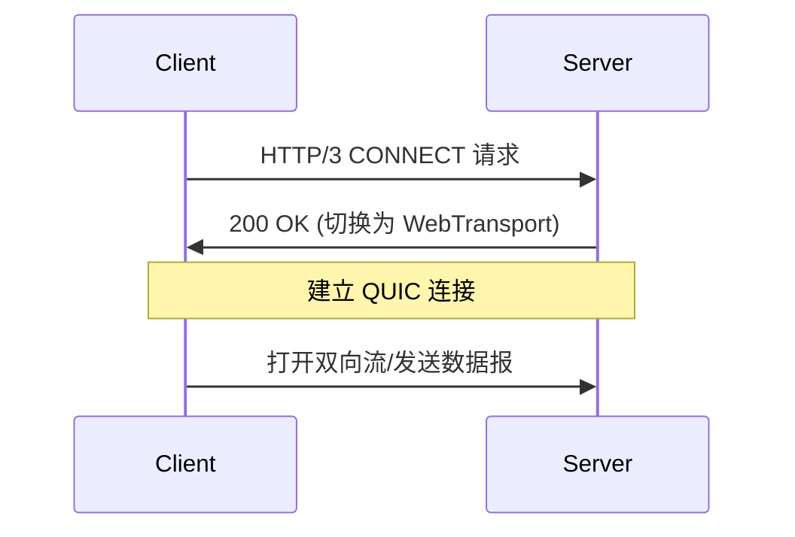

# **WebSocket 技术详解：原理、应用场景与优劣分析**

WebSocket 是一种基于 TCP 的全双工通信协议，允许客户端和服务器之间建立持久连接，实现 **低延迟、双向实时数据传输**。以下是其核心技术原理、典型应用场景及优缺点分析。

---

## **📌 一、WebSocket 核心原理**
### **1. 协议握手（HTTP 升级）**
WebSocket 通过 HTTP/1.1 的 `Upgrade` 头协商建立连接：
```http
GET /chat HTTP/1.1
Host: example.com
Upgrade: websocket
Connection: Upgrade
Sec-WebSocket-Key: dGhlIHNhbXBsZSBub25jZQ==
Sec-WebSocket-Version: 13
```
**服务器响应**：
```http
HTTP/1.1 101 Switching Protocols
Upgrade: websocket
Connection: Upgrade
Sec-WebSocket-Accept: s3pPLMBiTxaQ9kYGzzhZRbK+xOo=
```
- **关键点**：  
  - 状态码 `101` 表示协议切换成功。  
  - `Sec-WebSocket-Key` 和 `Sec-WebSocket-Accept` 用于安全验证。

### **2. 数据帧格式**
WebSocket 数据传输以 **帧（Frame）** 为单位，结构如下：
```
 0                   1                   2                   3
 0 1 2 3 4 5 6 7 8 9 0 1 2 3 4 5 6 7 8 9 0 1 2 3 4 5 6 7 8 9 0 1
+-----+-----+-----+-----+-----+-----+-----+-----+-----+-----+-----+
| FIN | RSV | OPCODE | MASK | Payload Len | Masking Key (if MASK=1)
+-----+-----+-----+-----+-----+-----+-----+-----+-----+-----+-----+
| Extended Payload Length (if Payload Len=126/127)                |
+-----------------------------------------------------------------+
| Masking Key (continued)         | Payload Data                  |
+-----------------------------------------------------------------+
```
- **关键字段**：  
  - `OPCODE`：帧类型（如 `0x1` 文本，`0x2` 二进制）。  
  - `MASK`：客户端到服务器的数据必须掩码加密（防代理缓存污染攻击）。  
  - `FIN`：标记是否为消息的最后一帧。

### **3. 心跳机制（Ping/Pong）**
- **作用**：保持连接活跃，检测对端是否在线。  
- **流程**：  
  ```mermaid
  sequenceDiagram
      Client->>Server: Ping (opcode=0x9)
      Server->>Client: Pong (opcode=0xA)
  ```

---

## **📌 二、WebSocket 的优势**
| **优势**                | **说明**                                                                 |
|-------------------------|-------------------------------------------------------------------------|
| **低延迟**              | 无需重复握手，数据直达（对比 HTTP 轮询）。                              |
| **全双工通信**          | 客户端和服务器可同时发送数据。                                          |
| **节省带宽**            | 无 HTTP 头开销（每个消息仅 2~10 字节帧头）。                            |
| **支持二进制传输**      | 可传输文本（JSON）或二进制数据（如音视频流）。                          |
| **跨域支持**            | 通过 `Origin` 头限制来源，结合 CORS 更安全。                            |

---

## **📌 三、WebSocket 的局限性**
| **缺点**                | **说明**                                                                 |
|-------------------------|-------------------------------------------------------------------------|
| **无自动重连**          | 连接断开需手动实现重连逻辑。                                            |
| **无内置广播**          | 需自行维护客户端列表实现群发（如用 Redis Pub/Sub）。                    |
| **代理兼容性问题**      | 部分企业代理或旧防火墙可能阻断 WebSocket 连接。                         |
| **无原生状态管理**      | 需额外设计会话标识（如 Cookie 或 Token）。                              |
| **长连接资源消耗**      | 大量空闲连接占用服务器内存（需心跳保活）。                              |

---

## **📌 四、WebSocket 应用场景**
### **1. 实时通信**
- **在线聊天**：消息即时推送（如 Slack、Discord）。  
- **客服系统**：用户与客服实时对话。

### **2. 实时数据监控**
- **股票行情**：实时推送价格变动（如 TradingView）。  
- **物联网设备**：传感器数据实时上报（如温度、湿度）。

### **3. 多人协作工具**
- **在线文档编辑**：多人同时编辑同步（如 Google Docs）。  
- **白板协作**：实时绘制内容同步。

### **4. 游戏开发**
- **多人在线游戏**：玩家动作实时同步（如 Web 端 MOBA 游戏）。  
- **游戏状态更新**：排行榜、战斗结果推送。

### **5. 音视频直播**
- **直播弹幕**：观众评论实时显示。  
- **视频会议**：信令传输（如 WebRTC 的信令通道）。

---

## **📌 五、WebSocket 与替代方案对比**
| **技术**          | **协议**   | **延迟** | **双向通信** | **适用场景**                     |
|-------------------|------------|----------|--------------|----------------------------------|
| **WebSocket**     | TCP        | 极低     | 支持         | 高实时性需求（聊天、游戏）       |
| **HTTP 轮询**     | HTTP       | 高       | 不支持       | 兼容性要求高的简单场景           |
| **Server-Sent Events (SSE)** | HTTP | 中等     | 单向（服务器→客户端） | 实时通知（如新闻推送） |
| **WebTransport**  | QUIC       | 极低     | 支持         | 未来替代 WebSocket（HTTP/3 生态）|

---

## **📌 六、代码示例**
### **1. 客户端（JavaScript）**
```javascript
const socket = new WebSocket('wss://example.com/chat');

// 监听连接打开
socket.onopen = () => {
    socket.send('Hello Server!');
};

// 接收消息
socket.onmessage = (event) => {
    console.log('Received:', event.data);
};

// 错误处理
socket.onerror = (error) => {
    console.error('WebSocket Error:', error);
};

// 连接关闭
socket.onclose = () => {
    console.log('Connection closed');
};
```

### **2. 服务端（Node.js + ws 库）**
```javascript
const WebSocket = require('ws');
const wss = new WebSocket.Server({ port: 8080 });

wss.on('connection', (ws) => {
    console.log('New client connected');

    // 接收消息
    ws.on('message', (message) => {
        console.log('Received:', message.toString());
        ws.send('Server: ' + message);
    });

    // 定时推送
    setInterval(() => {
        ws.send('Server heartbeat');
    }, 5000);
});
```

---

## **📌 七、最佳实践**
1. **心跳保活**：定期发送 Ping/Pong 防止连接超时。  
2. **错误恢复**：监听 `onclose` 事件并实现自动重连。  
3. **消息压缩**：对大消息使用 `permessage-deflate` 扩展压缩。  
4. **限流保护**：避免客户端洪水攻击（如限制每秒消息数）。  

---

## **💡 总结**
**WebSocket 的核心价值**：  
✅ **极低延迟**（对比 HTTP 轮询）  
✅ **双向实时通信**（全双工）  
✅ **轻量级协议**（低开销）  

**适用场景**：  
- 需要 **高实时性** 的应用（如聊天、游戏、金融行情）。  
- 替代 **HTTP 长轮询** 的复杂方案。  

**未来趋势**：  
WebSocket 可能逐步被 **WebTransport**（基于 QUIC）取代，但在 HTTP/3 生态成熟前仍是实时通信的首选方案。


# **WebTransport 技术详解：下一代 Web 实时通信协议**

WebTransport 是一种基于 QUIC 和 HTTP/3 的新型 Web API，旨在提供比 WebSocket 更灵活、更高效的实时数据传输能力。它结合了 QUIC 协议的多路复用、低延迟特性，并支持多种传输模式（如可靠流、不可靠数据报）。以下是其核心技术原理、应用场景及与 WebSocket 的对比。

---

## **📌 一、WebTransport 的核心特性**
### **1. 基于 HTTP/3 和 QUIC**
- **底层协议**：直接运行在 QUIC 上，继承其 0-RTT 握手、连接迁移等优势。
- **多路复用**：每个 WebTransport 会话可创建多个双向或单向流，互不阻塞。

### **2. 支持多种传输模式**
| **模式**            | **可靠性** | **有序性** | **适用场景**               |
|---------------------|------------|------------|----------------------------|
| **可靠流（Stream）** | 可靠       | 有序       | 文件传输、关键指令         |
| **不可靠数据报（Datagram）** | 不可靠     | 无序       | 游戏状态更新、实时视频     |
| **单向流（Unidirectional）** | 可配置     | 可选       | 服务器推送、日志流         |

### **3. 原生多流支持**
- 每个流独立管理，避免 WebSocket 的单通道限制。
- 示例：一个视频会议应用可同时传输：
  - 可靠流：信令（如加入/离开房间）。
  - 不可靠数据报：视频帧（允许丢包）。

### **4. 更强的安全性与隐私**
- 强制使用 TLS 1.3 加密。
- 隔离不同来源的流，防止跨会话干扰。

---

## **📌 二、WebTransport 的工作原理**
### **1. 协议握手**

- **关键点**：握手完成后，QUIC 连接直接用于数据传输。

### **2. 数据流管理**
- **双向流（Bidirectional Stream）**：类似 WebSocket，但可创建多个。
- **单向流（Unidirectional Stream）**：服务器→客户端的推送通道。
- **数据报（Datagram）**：无需建立流的独立消息（类似 UDP）。

### **3. API 设计（JavaScript）**
```javascript
// 1. 建立连接
const transport = new WebTransport('https://example.com:4433/data');
await transport.ready;

// 2. 创建可靠双向流
const stream = await transport.createBidirectionalStream();
const writer = stream.writable.getWriter();
writer.write(new Uint8Array([1, 2, 3]));

// 3. 发送不可靠数据报
transport.datagrams.send(new Uint8Array([4, 5, 6]));

// 4. 接收服务器推送
const reader = transport.datagrams.readable.getReader();
while (true) {
    const {value, done} = await reader.read();
    if (done) break;
    console.log('Received datagram:', value);
}
```

---

## **📌 三、WebTransport 的应用场景**
### **1. 实时游戏**
- **可靠流**：传输玩家登录、支付等关键指令。
- **不可靠数据报**：同步玩家位置（允许丢包）。

### **2. 音视频传输**
- **单向流**：服务器推送视频切片（如 WebRTC 的替代方案）。
- **数据报**：实时弹幕（低优先级，可丢弃）。

### **3. 物联网（IoT）**
- **双向流**：设备固件升级。
- **数据报**：传感器高频上报（如温度数据）。

### **4. 大规模实时通知**
- 替代 WebSocket 的广播场景（如股票行情推送）。

---

## **📌 四、WebTransport vs WebSocket**
| **特性**          | **WebSocket**       | **WebTransport**               |
|-------------------|---------------------|--------------------------------|
| **底层协议**      | TCP                 | QUIC (HTTP/3)                 |
| **多路复用**      | 单通道              | 多流（可靠/不可靠）           |
| **传输模式**      | 仅可靠有序          | 可靠流 + 不可靠数据报         |
| **连接迁移**      | 不支持              | 支持（QUIC Connection ID）    |
| **头部开销**      | 每个消息 2~10 字节  | 数据报无额外头                |
| **浏览器支持**    | 全平台              | Chrome ≥97，逐步普及中        |

---

## **📌 五、WebTransport 的局限性**
### **1. 兼容性挑战**
- **浏览器支持**：仅现代浏览器支持（Chrome、Edge、Firefox 实验性）。
- **服务器部署**：需支持 HTTP/3 和 QUIC（如 Nginx 1.25+）。

### **2. 开发复杂度**
- 需处理多种流类型（可靠/不可靠），API 比 WebSocket 复杂。

### **3. 调试工具缺乏**
- 目前 Wireshark 对 QUIC 解析不完善，需依赖浏览器开发者工具。

---

## **📌 六、未来展望**
1. **替代 WebSocket**：在需要多流或不可靠传输的场景中成为首选。
2. **与 WebRTC 整合**：作为信令通道或数据通道补充。
3. **Web 游戏引擎适配**：Unity、Unreal 等引擎可能原生支持。

---

## **💡 总结**
**WebTransport 的核心价值**：  
✅ **多模式传输**（可靠流 + 不可靠数据报）  
✅ **QUIC 优势**（0-RTT、连接迁移、多路复用）  
✅ **更高效的实时通信**（适合游戏、音视频、IoT）  

**当前适用场景**：  
- 需要 **混合可靠性** 的应用（如游戏+聊天）。  
- 追求 **极致低延迟** 的实时系统。  

**开发者建议**：  
- 在 Chrome 环境中优先试用，逐步替代 WebSocket。  
- 关注 [W3C WebTransport 标准](https://w3c.github.io/webtransport/) 进展。  

WebTransport 代表了 Web 实时通信的未来方向，随着 HTTP/3 生态的成熟，其重要性将不断提升。