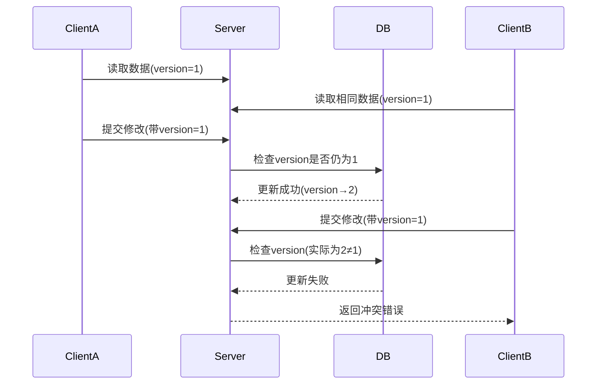

# 乐观锁（Optimistic Locking）详解

乐观锁是一种并发控制机制，它假设多用户并发访问资源时不会产生冲突，因此不会立即加锁，而是在数据提交更新时检查是否有冲突。

## 核心思想

1. **乐观假设**：认为大部分情况下数据访问不会冲突
2. **事后检查**：在数据提交时才检查是否有冲突
3. **无阻塞**：读取数据时不会阻塞其他读写操作

## 实现原理

### 基本实现方式

| 实现方式       | 描述                                                                 |
|----------------|----------------------------------------------------------------------|
| 版本号机制     | 数据增加version字段，每次更新时version+1，提交时校验version是否变化  |
| 时间戳机制     | 使用最后修改时间戳作为冲突检测依据                                   |
| 条件比较       | 更新时检查关键字段是否被修改（如库存量）                             |

### 典型工作流程



## 具体实现示例

### 1. 数据库版本号实现

**表结构**：
```sql
CREATE TABLE products (
    id BIGINT PRIMARY KEY,
    name VARCHAR(100),
    stock INT,
    version INT DEFAULT 0  -- 版本号字段
);
```

**Java代码实现**：
```java
// 更新时检查版本号
@Transactional
public boolean updateProductWithVersion(Long productId, int newStock) {
    Product product = productRepository.findById(productId);
    int oldVersion = product.getVersion();
    
    product.setStock(newStock);
    product.setVersion(oldVersion + 1);
    
    // UPDATE products SET stock=?, version=? 
    // WHERE id=? AND version=?
    int rows = productRepository.updateWithVersion(
        productId, newStock, oldVersion + 1, oldVersion);
    
    return rows > 0;  // 返回是否更新成功
}
```

### 2. CAS (Compare-And-Swap) 实现

```java
// 原子变量实现的乐观锁
public class OptimisticLockExample {
    private AtomicInteger version = new AtomicInteger(0);
    
    public boolean tryUpdate() {
        int currentVersion = version.get();
        // 模拟一些处理逻辑
        Thread.sleep(100); 
        
        // 只有版本号未变时才更新
        return version.compareAndSet(currentVersion, currentVersion + 1);
    }
}
```

## 乐观锁 vs 悲观锁

| 特性         | 乐观锁                      | 悲观锁            |
|--------------|----------------------------|-------------------|
| 并发假设     | 冲突很少发生                | 冲突经常发生      |
| 加锁时机     | 提交时检查                  | 访问数据前加锁    |
| 实现方式     | 版本号/CAS                  | SELECT FOR UPDATE |
| 性能         | 高并发下性能更好            | 高并发下性能下降  |
| 适用场景     | 读多写少，冲突率低          | 写多读少，冲突率高|
| 回滚代价     | 冲突时需要重试整个业务逻辑   | 无额外回滚代价    |

## 实际应用场景

1. **电商库存系统**：
```java
public boolean deductStock(Long productId, int quantity) {
    Product product = productDao.get(productId);
    if (product.getStock() < quantity) {
        return false;
    }
    
    // 乐观锁更新
    int updated = productDao.updateStock(
        productId, 
        product.getStock() - quantity, 
        product.getVersion());
    
    return updated > 0;
}
```

2. **拍卖系统竞价**（如前文eBay案例）
3. **多用户协作编辑系统**（如Google Docs）

## 优缺点分析

**优点**：
- 避免了加锁的开销，提高系统吞吐量
- 不会产生死锁问题
- 适合读多写少的场景

**缺点**：
- 冲突频繁时重试成本高
- 需要额外的版本字段或机制
- 不保证操作一定能成功完成

## 最佳实践

1. **结合重试机制**：
```java
@Retryable(maxAttempts = 3, backoff = @Backoff(delay = 100))
public void updateWithRetry(Product product) {
    // 乐观锁更新操作
}
```

2. **适当控制重试次数**：避免活锁（无限重试）
3. **关键业务考虑混合使用**：如先乐观锁尝试，失败后转悲观锁

乐观锁特别适合像拍卖系统这样的高并发场景，因为它能最大程度地减少锁竞争，提高系统响应能力。