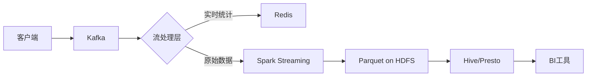
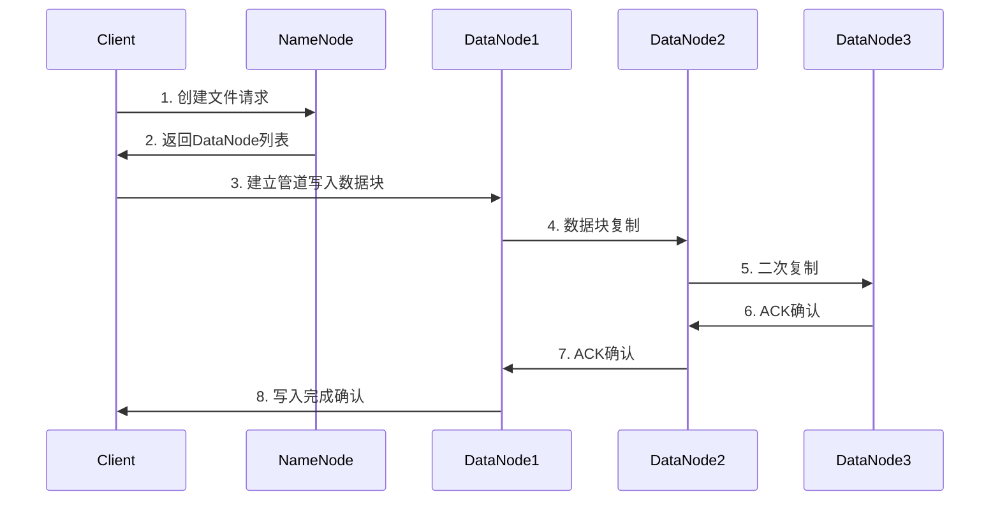
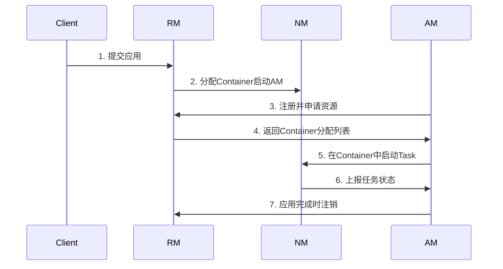

# Hadoop Lead Engineer 必备知识体系

作为Hadoop Lead Engineer候选人，您需要掌握从底层架构到生态组件的全方位知识，同时具备大规模集群管理、性能优化和团队领导能力。以下是系统化的知识框架：

## 一、核心架构与原理

### 1. Hadoop核心组件
- **HDFS架构**：
  - NameNode/DataNode工作原理
  - 写入流程（Pipeline机制）
  - 读取流程（短路读取优化）
  - 高可用实现（QJM/ZKFC）
  
- **YARN架构**：
  ```mermaid
  graph TD
    Client-->RM(ResourceManager)
    RM-->NM(NodeManager)
    NM-->C(Container)
    C-->AM(ApplicationMaster)
    AM-->Task
  ```

### 2. 分布式计算模型
- **MapReduce原理**：
  - Shuffle机制详解（Sort/Merge）
  - Combiner优化
  - 推测执行(Speculative Execution)

- **数据本地化(Data Locality)**：
  - 本地/机架/跨数据中心调度策略
  - `net.topology.script.file.name`配置

## 二、生态组件深度掌握

### 3. 数据处理框架对比
| 组件       | 计算模型   | 延迟    | 适用场景              | 调优要点          |
|-----------|----------|--------|---------------------|-----------------|
| MapReduce | Batch    | 分钟级  | ETL、离线分析         | Reduce数量设置   |
| Spark     | Micro-batch | 秒级  | 迭代计算、机器学习      | 内存管理策略      |
| Flink     | Streaming | 毫秒级 | 实时处理、CEP         | Checkpoint配置  |
| Hive      | SQL-on-Hadoop | 分钟级 | 数据仓库           | 分区/分桶策略     |

### 4. 存储格式与压缩
- **列式存储**：
  - Parquet（嵌套数据结构）
  - ORC（Hive优化格式）
  
- **压缩算法选择**：
  ```java
  // 性能对比
  Snappy > LZ4 > Zstd > Gzip > Bzip2
  // 压缩率对比
  Bzip2 > Gzip > Zstd > LZ4 > Snappy
  ```

## 三、集群管理与运维

### 5. 集群规划与部署
- **硬件配置原则**：
  - DataNode：CPU核数 ≈ 磁盘数×2
  - 内存分配公式：
    ```
    Container内存 = (总内存 - 系统预留) / vcores
    ```

- **关键配置文件**：
  ```xml
  <!-- yarn-site.xml -->
  <property>
    <name>yarn.nodemanager.resource.memory-mb</name>
    <value>81920</value> <!-- 80GB -->
  </property>
  ```

### 6. 监控与调优
- **监控指标**：
  - HDFS：`MissingBlocks`, `UnderReplicatedBlocks`
  - YARN：`PendingApps`, `AllocatedMB`
  
- **性能优化**：
  ```sh
  # 基准测试工具
  hadoop jar hadoop-mapreduce-client-jobclient-*.jar \
    TestDFSIO -write -nrFiles 10 -fileSize 1GB
  ```

## 四、安全与治理

### 7. 安全体系
- **认证**：
  - Kerberos集成
  - LDAP对接
  
- **授权**：
  ```sh
  # HDFS ACL示例
  hdfs dfs -setfacl -m user:alice:r-x /data/sensitive
  ```

- **数据加密**：
  - HDFS透明加密(TDE)
  - KMS密钥管理

### 8. 元数据与数据治理
- **Apache Atlas**：
  - 血缘关系追踪
  - 数据分类分级
  
- **数据质量检查**：
  ```sql
  -- 使用Griffin进行规则定义
  CREATE RULE table1.column1 VALUES MUST NOT BE NULL;
  ```

## 五、云原生与新技术

### 9. 云上Hadoop架构
- **存算分离**：
  - S3作为存储层
  - EMR集群动态伸缩
  
- **成本优化**：
  ```python
  # 使用Spot实例自动伸缩脚本
  def scale_cluster(current_load):
      if current_load > 0.7:
          add_spot_nodes(10)
      elif current_load < 0.3:
          remove_nodes(5)
  ```

### 10. 新一代技术栈
- **数据湖架构**：
  - Hudi/Iceberg/Delta Lake对比
  - ACID事务支持实现
  
- **Kubernetes集成**：
  ```yaml
  # Spark on K8s示例
  spec:
    driver:
      cores: 1
      memory: "2g"
    executor:
      instances: 10
      memory: "4g"
  ```

## 六、团队领导能力

### 11. 技术路线规划
- **演进路线图示例**：
  ```
  2023 Q3: 迁移到Hadoop 3.x
  2024 Q1: 引入Spark Structured Streaming
  2024 Q3: 实现存算分离架构
  ```

### 12. 故障处理流程
1. **分类**：
   - P0（全集群不可用）：15分钟响应
   - P1（关键作业失败）：1小时响应
2. **根因分析**：
   - 使用`hadoop dfsadmin -report`诊断HDFS状态
   - 分析YARN日志：
     ```sh
     yarn logs -applicationId application_123456789_0001
     ```

## 面试问题准备示例

**问题1**：如何处理HDFS小文件问题？

**答案框架**：
1. 预防措施：
   - 使用Hive合并小文件：
     ```sql
     SET hive.merge.mapfiles=true;
     SET hive.merge.size.per.task=256000000;
     ```
2. 治理方案：
   - Hadoop Archive (HAR)
   - Spark合并作业：
     ```scala
     df.repartition(10).write.parquet("hdfs://output")
     ```
3. 架构优化：
   - 接入Kafka+Spark Streaming替代直接写HDFS

**问题2**：如何设计千万级日活用户的用户行为分析平台？

**架构设计**：


**关键决策点**：
1. 数据采集：埋点SDK选型（全埋点/代码埋点）
2. 实时层：Flink vs Spark Streaming
3. 存储格式：Parquet分区策略（按dt/hour）
4. 查询引擎：Presto vs Impala性能测试

作为Hadoop Lead Engineer，除了技术深度外，还需展现：
- 大规模集群治理经验（PB级数据量）
- 成本控制能力（存储/计算资源优化）
- 跨团队协调能力（与数据/算法团队协作）
- 技术前瞻性（云原生转型规划）


以下是关于Hadoop核心架构及原理的详细介绍，分为HDFS和YARN两大组件进行说明：

---

### **一、HDFS（Hadoop Distributed File System）核心架构**

#### **1. 设计目标与特点**
- **设计目标**：
  - 存储超大规模数据集（PB级及以上）
  - 运行于廉价硬件集群
  - 高容错性（自动故障恢复）
  - 流式数据访问（适合批处理而非实时访问）
- **核心特点**：
  - 分块存储（默认128MB/块）
  - 多副本机制（默认3副本）
  - 一次写入多次读取（WORM模型）

#### **2. 核心组件**
| 组件                | 功能说明                                                                 |
|---------------------|--------------------------------------------------------------------------|
| **NameNode (NN)**   | - 存储元数据（文件系统树、块位置映射）<br>- 单点故障（通过HA解决）          |
| **DataNode (DN)**   | - 存储实际数据块<br>- 定期向NameNode发送心跳和块报告                        |
| **Secondary NameNode** | - 定期合并FsImage和EditLog（非HA模式）<br>- *注意：不是热备节点*           |
| **JournalNode (JN)** | - 在HA架构中存储EditLog（通常部署奇数个）                                 |

#### **3. 关键流程**
##### **写入流程**


##### **读取流程**
1. Client向NameNode获取块位置
2. 优先选择最近的DataNode（网络拓扑感知）
3. 支持短路读取（Client与DN同节点时直接读本地文件）

#### **4. 高可用（HA）实现**
- **主备NameNode架构**：
  - Active NN处理请求，Standby NN同步元数据
  - 使用ZooKeeper实现故障自动切换（ZKFC）
- **元数据同步**：
  - EditLog通过JournalNode集群共享
  - DataNode同时向主备NN发送块报告

---

### **二、YARN（Yet Another Resource Negotiator）核心架构**

#### **1. 设计目标**
- 解耦资源管理与作业调度
- 支持多计算框架（MapReduce/Spark/Flink等）
- 提高集群利用率

#### **2. 核心组件**
| 组件                     | 功能说明                                                                 |
|--------------------------|--------------------------------------------------------------------------|
| **ResourceManager (RM)** | - 全局资源调度器<br>- 处理客户端请求<br>- 监控NodeManager                |
| **NodeManager (NM)**     | - 单节点资源管理<br>- 启动/监控Container<br>- 上报资源使用情况            |
| **ApplicationMaster (AM)** | - 单个应用的管理者<br>- 向RM申请资源<br>- 与NM协作运行任务               |
| **Container**            | - 资源抽象单位（CPU+内存）<br>- 运行应用任务的基本单元                    |

#### **3. 任务调度流程**


#### **4. 调度器类型**
| 调度器              | 特点                                                                     | 适用场景               |
|---------------------|--------------------------------------------------------------------------|-----------------------|
| **FIFO Scheduler**  | 简单队列，先到先得                                                       | 测试环境               |
| **Capacity Scheduler** | 分层队列，资源按比例分配<br>（Hadoop默认）                              | 多租户共享集群          |
| **Fair Scheduler**  | 动态平衡资源，小作业快速响应                                             | 交互式分析场景          |

---

### **三、核心原理深度解析**

#### **1. 数据一致性保证**
- **写入一致性**：
  - 客户端写入时，所有副本完成写入才算成功
  - 使用租约机制（Lease）防止并发写入冲突
- **读取一致性**：
  - 通过块版本号（Generation Stamp）检测过期副本

#### **2. 容错机制**
| 故障类型         | 处理机制                                                                 |
|------------------|--------------------------------------------------------------------------|
| **DataNode故障** | - 心跳超时（默认10分钟）<br>- 自动触发副本复制                          |
| **NameNode故障** | - HA自动切换（ZooKeeper选举）<br>- 元数据恢复（FsImage+EditLog）         |
| **网络分区**     | - 隔离策略（`dfs.namenode.avoid.read.stale.datanode`配置）               |

#### **3. 关键性能优化**
- **短路读取（Short-Circuit Read）**：
  ```xml
  <!-- hdfs-site.xml -->
  <property>
    <name>dfs.client.read.shortcircuit</name>
    <value>true</value>
  </property>
  ```
- **机架感知（Rack Awareness）**：
  - 副本放置策略：
    1. 第一个副本：本地节点
    2. 第二个副本：同机架不同节点
    3. 第三个副本：不同机架

#### **4. 资源隔离模型**
- **资源划分**：
  ```bash
  # 每个Container资源限制
  yarn.scheduler.minimum-allocation-mb=1024  # 最小1GB
  yarn.scheduler.maximum-allocation-mb=8192  # 最大8GB
  ```
- **Cgroups支持**：
  ```xml
  <property>
    <name>yarn.nodemanager.linux-container-executor.cgroups.mount</name>
    <value>true</value>
  </property>
  ```

---

### **四、架构演进与对比**

#### **Hadoop 2.x vs 3.x关键改进**
| 特性                | Hadoop 2.x                     | Hadoop 3.x改进                  |
|---------------------|--------------------------------|---------------------------------|
| **HDFS Erasure Coding** | 仅多副本存储（3副本，200%开销） | 支持纠删码（1.5倍存储开销）       |
| **YARN时间线服务**   | 单点瓶颈                       | 分布式时间线服务（v2）            |
| **Java版本**        | JDK 7                          | 支持JDK 8/11                     |
| **NameNode联邦**    | 单命名空间                     | 支持多个命名空间联邦               |

---

### **五、生产环境设计建议**

#### **1. 集群规模规划**
- **小型集群（<50节点）**：
  - NameNode与RM可共部署
  - 副本数设为2
- **大型集群（>500节点）**：
  - 专用NameNode/RM节点（高配CPU+大内存）
  - 启用NameNode联邦

#### **2. 监控指标**
| 组件   | 关键指标                          | 报警阈值              |
|--------|-----------------------------------|-----------------------|
| HDFS   | `MissingBlocks`                   | >0持续5分钟           |
|        | `UsedSpacePercentage`             | >85%                  |
| YARN   | `PendingApplications`             | >10持续10分钟         |
|        | `AvailableMB`                     | <总内存10%            |

#### **3. 故障演练**
- **模拟DataNode宕机**：
  ```bash
  # 随机停用一个DataNode
  hdfs dfsadmin -shutdownDatanode <DN_HOST>:50020
  ```
- **验证自动恢复**：
  ```bash
  hdfs dfsadmin -report | grep 'Under Replicated Blocks'
  ```

---

以上内容涵盖了Hadoop核心架构的核心原理和关键设计思想，实际应用中需结合具体业务场景调整参数和架构设计。