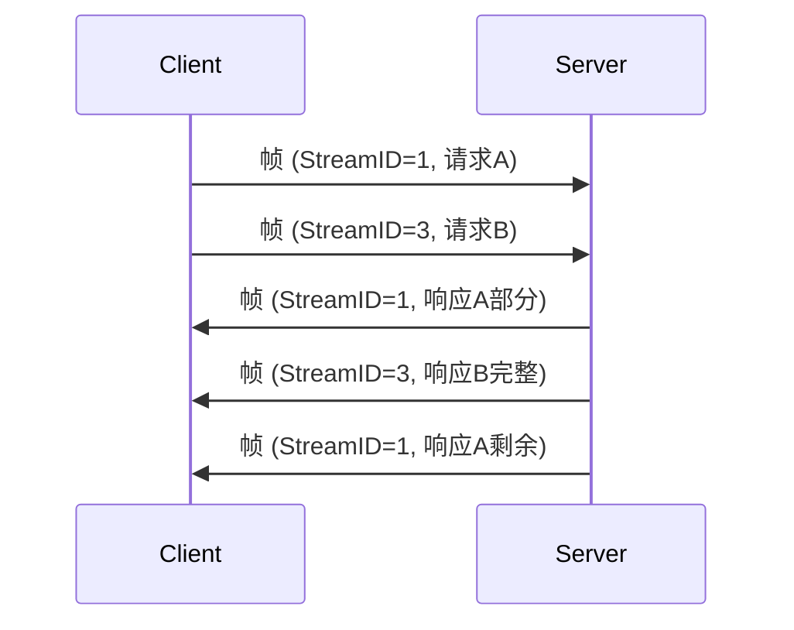
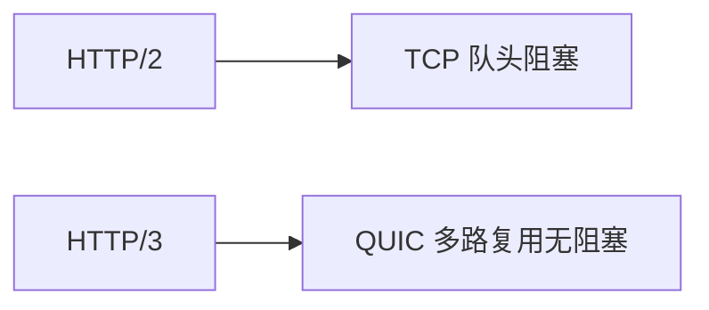
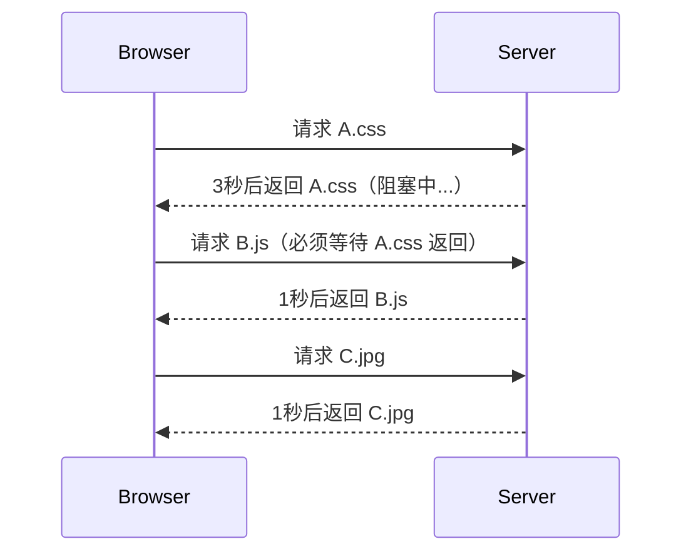
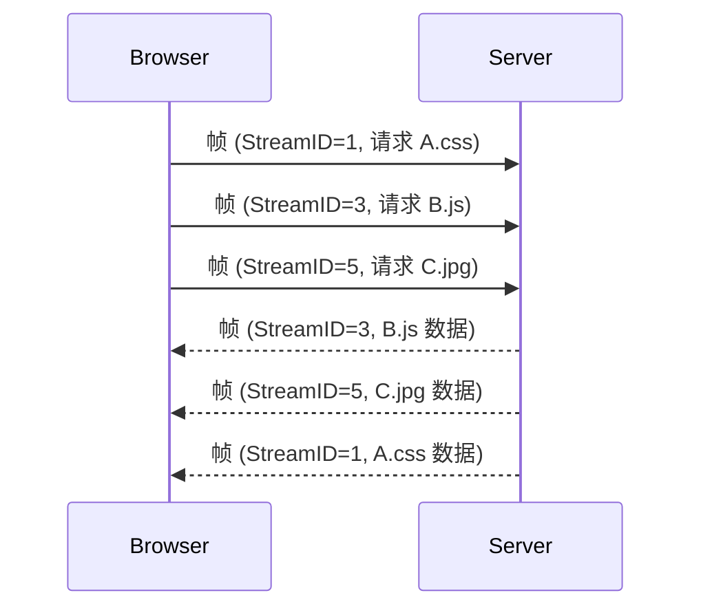
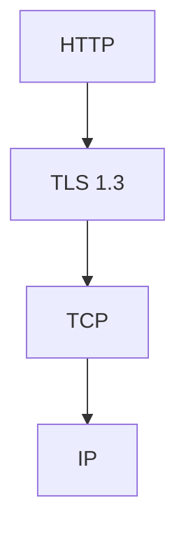
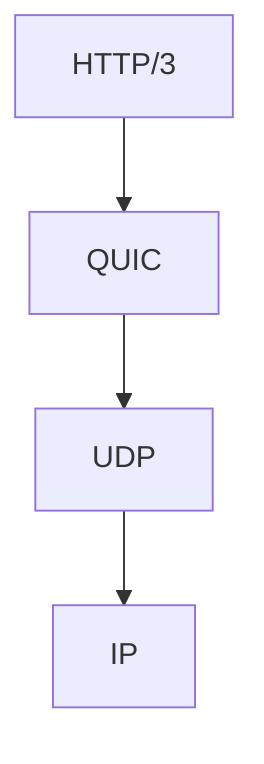
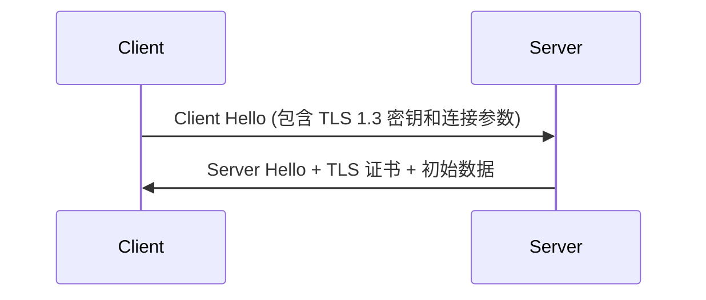

# **HTTP/2 多路复用（Multiplexing）详解**

HTTP/2 的多路复用是 HTTP 协议的一项革命性改进，它解决了 HTTP/1.x 时代的 **队头阻塞（Head-of-Line Blocking）** 问题，显著提升了网络通信效率。下面从 **原理、工作机制、优势** 和 **对比分析** 四个方面深入解析。

---

## **📌 一、HTTP/1.x 的核心问题**
### **1. 队头阻塞（Head-of-Line Blocking）**
在 HTTP/1.1 中：
- **每个 TCP 连接只能串行处理请求**：必须等前一个请求完成，才能发送下一个请求。
- **浏览器限制并发连接数**（通常 6~8 个），导致大量请求排队。

**示例**：  
如果请求 `A.css` 因网络延迟未返回，后续 `B.js` 和 `C.jpg` 即使已准备好，也无法立即发送。

### **2. 低效的解决方案**
- **域名分片（Domain Sharding）**：通过多个域名绕过连接数限制，但增加 DNS 开销。
- **资源合并**：将多个小文件合并为大文件，牺牲缓存粒度。

---

## **📌 二、HTTP/2 多路复用原理**
### **1. 核心机制**
HTTP/2 引入 **二进制分帧层（Binary Framing Layer）**，将请求/响应分解为更小的 **帧（Frame）**，并赋予每个帧一个 **流标识符（Stream ID）**。同一连接上的多个请求/响应可以 **交错发送和接收**，互不阻塞。



### **2. 关键概念**
| 术语               | 作用                                                                 |
|--------------------|----------------------------------------------------------------------|
| **流（Stream）**   | 一个独立的双向逻辑通道，承载一个请求/响应，对应唯一 Stream ID。      |
| **帧（Frame）**    | 最小通信单位（如 HEADERS 帧、DATA 帧），包含 Stream ID 标识归属。    |
| **多路复用**       | 多个流的帧在同一个 TCP 连接上交错传输。                              |

### **3. 帧结构示例**
```
+-----------------------------------------------+
| Length (24 bits)                              | 帧长度
+---------------+---------------+---------------+
| Type (8 bits)  | Flags (8 bits)| R (1 bit)     | 类型、标志、保留位
+-------------------------------+---------------+
| Stream ID (31 bits)                           | 流标识符
+-----------------------------------------------+
| Frame Payload (0~16,384 bytes)                | 帧内容
+-----------------------------------------------+
```

---

## **📌 三、多路复用的优势**
### **1. 性能提升**
- **降低延迟**：无需等待前一个请求完成，多个请求并行处理。
- **减少连接数**：单个 TCP 连接即可支持数十个并发流，省去 TCP 握手和 TLS 协商开销。
- **避免队头阻塞**：即使某个流因网络问题延迟，其他流仍可正常传输。

### **2. 实际效果对比**
| 场景                | HTTP/1.1                      | HTTP/2 (多路复用)             |
|---------------------|-------------------------------|-------------------------------|
| 加载包含 50 个资源的页面 | 需要 6~8 个 TCP 连接排队下载 | 1 个连接并行下载所有资源      |
| 网络延迟高           | 后续请求被阻塞                | 其他资源仍可加载              |
| 小文件请求           | 每个文件占用一个连接          | 所有小文件共享同一连接        |

**数据参考**：  
HTTP/2 可使页面加载时间减少 **30%~50%**（尤其在高延迟网络中）。

---

## **📌 四、多路复用的实现条件**
### **1. 必须基于 HTTP/2**
- 需要客户端和服务器同时支持 HTTP/2（现代浏览器和主流服务器均默认支持）。
- 协商方式：
  - **ALPN**（TLS 扩展）：HTTPS 连接时协商协议。
  - **Upgrade 头**：HTTP 明文连接时升级（较少用）。

### **2. 依赖单连接**
- 所有流共享同一个 TCP 连接，因此：
  - **优点**：减少连接管理开销。
  - **缺点**：若 TCP 连接出现丢包，所有流都会受拥塞控制影响（但应用层仍可继续处理已接收的帧）。

---

## **📌 五、与类似技术的对比**
### **1. HTTP/2 vs WebSocket**
| 特性               | HTTP/2 多路复用               | WebSocket                     |
|--------------------|-------------------------------|-------------------------------|
| **设计目标**       | 优化 HTTP 请求/响应           | 全双工实时通信                |
| **数据格式**       | 二进制帧                      | 二进制或文本帧                |
| **多路复用**       | 原生支持                      | 需应用层自己实现              |
| **适用场景**       | 网页资源加载、API 调用        | 聊天室、实时游戏              |

### **2. HTTP/2 vs QUIC (HTTP/3)**
HTTP/2 的多路复用仍受限于 **TCP 的队头阻塞**（若 TCP 层丢包，所有流等待重传）。  
**QUIC（HTTP/3）** 在 UDP 上实现多路复用，彻底解决了这一问题：


---

## **📌 六、多路复用的局限性**
1. **TCP 层队头阻塞**：  
   HTTP/2 仅解决应用层阻塞，若底层 TCP 丢包，所有流仍会暂停（HTTP/3 已解决）。
2. **服务器资源消耗**：  
   高并发流可能增加服务器内存和 CPU 压力。
3. **代理兼容性**：  
   某些老旧代理服务器可能错误处理 HTTP/2 帧。

---

## **🚀 七、实践建议**
1. **启用 HTTP/2**：  
   - Nginx 配置：
     ```nginx
     listen 443 ssl http2;
     ```
2. **优化资源加载**：  
   - 无需再合并小文件（如雪碧图、JS 合并），优先使用细粒度缓存。
3. **监控流使用**：  
   - 通过开发者工具（如 Chrome DevTools）查看 HTTP/2 流的分布和阻塞情况。

---

## **💡 面试问题示例**
**Q：HTTP/2 多路复用如何解决队头阻塞？**  
**A**：  
1. 将请求/响应拆分为帧，并为每个帧标记 Stream ID。  
2. 多个流的帧在同一个 TCP 连接上交错传输，无需等待前一个请求完成。  
3. 接收方根据 Stream ID 重组帧，实现并行处理。  

**Q：HTTP/2 多路复用有什么缺点？**  
**A**：  
1. 仍受 TCP 层队头阻塞影响（丢包时所有流暂停）。  
2. 高并发流可能增加服务器开销。  
3. 需要端到端支持 HTTP/2，老旧中间设备可能不兼容。  

---

HTTP/2 的多路复用是 Web 性能优化的里程碑，合理利用后可显著减少延迟和资源消耗。对于更高要求，可进一步探索 **HTTP/3 和 QUIC** 技术。


### **HTTP/2 多路复用解决队头阻塞的简单示例**

#### **场景：浏览器加载一个包含 3 个资源的网页**
- **资源**：`A.css`（加载慢）、`B.js`（加载快）、`C.jpg`（加载快）
- **网络延迟**：`A.css` 因服务器处理慢，需要 3 秒返回；`B.js` 和 `C.jpg` 只需 1 秒。

---

## **📌 1. HTTP/1.1 的队头阻塞问题**
在 HTTP/1.1 下，浏览器默认使用 **6 个 TCP 连接**，但假设所有资源都来自同一域名（仅用 1 个连接串行请求）：

#### **请求流程**

**结果**：  
- **总耗时 = 3 (A) + 1 (B) + 1 (C) = 5 秒**  
- `B.js` 和 `C.jpg` 被 `A.css` 阻塞，无法提前加载。

---

## **📌 2. HTTP/2 多路复用如何解决？**
HTTP/2 允许在 **同一个 TCP 连接上并行传输多个资源**，通过 **流（Stream）** 和 **帧（Frame）** 机制实现：

#### **请求流程**

**关键点**：
1. 浏览器通过 **一个 TCP 连接** 同时发送所有请求（`A.css`、`B.js`、`C.jpg`）。
2. 服务器按 **处理完成的顺序** 返回数据（不阻塞）：
   - 先返回 `B.js` 和 `C.jpg`（1 秒完成）。
   - 最后返回 `A.css`（3 秒完成）。
3. 浏览器根据 **Stream ID** 区分数据归属。

**结果**：  
- **总耗时 = max(3, 1, 1) = 3 秒**  
- `B.js` 和 `C.jpg` 无需等待 `A.css`，页面可更快渲染。

---

## **📌 3. 对比总结**
| 指标                | HTTP/1.1                    | HTTP/2 (多路复用)           |
|---------------------|-----------------------------|-----------------------------|
| **连接数**          | 多个 TCP 连接（默认6个）    | 单个 TCP 连接               |
| **资源加载顺序**    | 串行（队头阻塞）            | 并行（按完成顺序返回）       |
| **总耗时**          | 5 秒                        | 3 秒                        |
| **网络利用率**      | 低（连接空闲等待）          | 高（始终满负荷传输数据）     |

---

## **💡 技术本质**
HTTP/2 的多路复用之所以能解决队头阻塞，核心在于：
1. **二进制分帧**：将消息拆解为更小的帧，穿插发送。
2. **流标识符（Stream ID）**：每个帧标记所属流，接收方重组。
3. **单连接多流**：所有请求共享同一连接，避免 TCP 握手开销。

---

## **🚀 实际应用建议**
1. **无需合并文件**：HTTP/2 下小文件独立缓存更优（无需雪碧图或 JS 合并）。
2. **减少域名分片**：多路复用下，单域名即可高效并发。
3. **监控流优先级**：通过 `priority` 帧控制关键资源（如首屏 CSS）优先加载。

通过这个例子，可以清晰理解 HTTP/2 如何通过多路复用显著提升页面加载速度！


在服务端支持 HTTP/2 的多路复用 **主要依赖服务器软件（如 Nginx、Apache）或编程语言框架（如 Node.js、Go）的底层实现**，开发者通常不需要在业务代码中显式处理多路复用细节。以下是具体实现方式和注意事项：

---

### **📌 一、服务端支持 HTTP/2 多路复用的条件**
| 条件                | 说明                                                                 |
|---------------------|----------------------------------------------------------------------|
| **1. 服务器软件/框架支持 HTTP/2** | 如 Nginx ≥1.9.5、Apache ≥2.4.17、Node.js 的 `http2` 模块等。        |
| **2. 启用 HTTPS（推荐）**         | 浏览器强制要求 HTTP/2 必须基于 HTTPS（除了 `localhost` 开发环境）。  |
| **3. 客户端支持 HTTP/2**         | 现代浏览器和主流 HTTP 客户端库（如 curl 7.47+）均默认支持。          |

---

### **📌 二、不同服务端的配置示例**
#### **1. Nginx（无需改业务代码）**
```nginx
server {
    listen 443 ssl http2;  # 关键：http2 标志
    server_name example.com;
    
    ssl_certificate /path/to/cert.pem;
    ssl_certificate_key /path/to/key.pem;

    location / {
        root /var/www/html;
    }
}
```
- **效果**：所有通过该端口的请求自动启用 HTTP/2 多路复用。
- **验证**：用 Chrome DevTools 的 `Protocol` 列检查请求是否为 `h2`。

#### **2. Node.js（需使用 `http2` 模块）**
```javascript
const http2 = require('http2');
const fs = require('fs');

const server = http2.createSecureServer({
  key: fs.readFileSync('server.key'),
  cert: fs.readFileSync('server.crt')
});

server.on('stream', (stream, headers) => {
  // 多路复用由底层自动处理，stream 对象代表一个请求流
  if (headers[':path'] === '/') {
    stream.respond({
      'content-type': 'text/html',
      ':status': 200
    });
    stream.end('<h1>Hello HTTP/2!</h1>');
  }
});

server.listen(8443);
```
- **关键点**：`stream` 事件回调中处理请求，无需关心多路复用细节。

#### **3. Go（标准库原生支持）**
```go
package main

import (
	"log"
	"net/http"
)

func main() {
	http.HandleFunc("/", func(w http.ResponseWriter, r *http.Request) {
		w.Write([]byte("Hello HTTP/2"))
	})

	// 自动启用 HTTP/2 多路复用（需 TLS）
	log.Fatal(http.ListenAndServeTLS(":443", "cert.pem", "key.pem", nil))
}
```

---

### **📌 三、开发者需要做什么？**
1. **配置服务器启用 HTTP/2**  
   - 如 Nginx 的 `http2` 标志、Node.js 的 `http2.createServer`。
2. **保持业务代码无状态**  
   - 多路复用下，请求/响应可能交错到达，避免依赖全局变量或阻塞操作。
3. **优化资源加载**  
   - 利用多路复用特性，减少资源合并（如分开加载多个小 JS 文件）。

---

### **📌 四、底层如何实现多路复用？**
服务端库（如 Nginx、Node.js 的 `http2` 模块）会自动处理：
1. **二进制分帧**：将 HTTP 消息拆分为 `HEADERS` 帧和 `DATA` 帧。
2. **流管理**：通过 `Stream ID` 标识和重组不同请求/响应。
3. **优先级调度**：根据客户端设置的优先级（如 `priority` 帧）调整传输顺序。

---

### **📌 五、注意事项**
1. **TLS 是性能瓶颈**  
   - HTTP/2 的 TLS 握手开销可能抵消多路复用的优势，建议启用 TLS 1.3。
2. **不支持 HTTP/2 的客户端**  
   - 服务端会自动降级到 HTTP/1.1（无需额外配置）。
3. **调试工具**  
   - 使用 `curl --http2` 或 Wireshark 抓包分析帧的交互。

---

### **💡 面试问题示例**
**Q：如何在服务端代码中实现 HTTP/2 多路复用？**  
**A**：  
1. 使用支持 HTTP/2 的服务器（如 Nginx）或框架（如 Node.js 的 `http2` 模块）。  
2. 配置 TLS 证书并启用 HTTP/2 标志（如 Nginx 的 `listen 443 ssl http2`）。  
3. **业务代码无需修改**，多路复用由底层库自动管理，开发者只需处理常规请求/响应逻辑。  

**Q：HTTP/2 多路复用需要客户端配合吗？**  
**A**：  
需要。客户端必须发送 HTTP/2 格式的请求（如浏览器或支持 HTTP/2 的 SDK），服务端会通过 ALPN 协商协议版本并自动启用多路复用。


Nginx 对 HTTP/2 多路复用的支持主要通过 **底层事件驱动架构** 和 **HTTP/2 协议栈实现**，其核心代码改动集中在 **事件处理模块** 和 **协议解析层**。以下是关键代码逻辑的详细分析（基于 Nginx 1.9.5+ 版本）：

---

### 📌 **1. 核心代码结构**
Nginx 的 HTTP/2 实现主要在以下目录：
```bash
src/event/ngx_event_http2.h      # HTTP/2 数据结构定义
src/event/ngx_event_http2.c      # HTTP/2 协议解析和多路复用逻辑
src/http/v2/ngx_http_v2_module.c # HTTP/2 模块注册和配置
src/http/v2/ngx_http_v2.h        # 协议常量定义
```

---

### 📌 **2. 多路复用的关键代码改动**
#### **（1）连接初始化（`ngx_http_v2_init`）**
在建立 TLS 连接后，Nginx 通过 ALPN 协商确认 HTTP/2 协议，并初始化 HTTP/2 上下文：
```c
// src/http/v2/ngx_http_v2.c
static ngx_int_t ngx_http_v2_init(ngx_connection_t *c) {
    ngx_http_v2_session_t  *h2c;

    // 分配 HTTP/2 会话结构体
    h2c = ngx_pcalloc(c->pool, sizeof(ngx_http_v2_session_t));
    c->data = h2c;

    // 初始化多路复用相关的流树和优先级树
    ngx_rbtree_init(&h2c->streams, &h2c->streams_sentinel, ngx_http_v2_rbtree_insert_stream);
    ngx_http_v2_init_priority_tree(h2c);

    // 设置帧处理回调
    c->read->handler = ngx_http_v2_read_handler;
    c->write->handler = ngx_http_v2_write_handler;
}
```

#### **（2）流（Stream）管理**
每个 HTTP/2 请求对应一个 `ngx_http_v2_stream_t` 结构体，Nginx 使用 **红黑树** 管理所有活跃流：
```c
// src/event/ngx_event_http2.h
typedef struct {
    ngx_rbtree_node_t    node;           // 红黑树节点
    ngx_http_request_t  *request;        // 关联的 HTTP 请求
    uint32_t             stream_id;      // 流 ID
    ngx_http_v2_priority_node_t *priority; // 优先级节点
} ngx_http_v2_stream_t;
```
- **流创建**：收到 `HEADERS` 帧时创建新流（`ngx_http_v2_create_stream`）。
- **流销毁**：流结束时从树中删除（`ngx_http_v2_close_stream`）。

#### **（3）帧解析与多路复用（`ngx_http_v2_read_handler`）**
Nginx 通过状态机解析 HTTP/2 帧，并根据 `stream_id` 分发到对应流：
```c
// src/http/v2/ngx_http_v2.c
static void ngx_http_v2_read_handler(ngx_event_t *rev) {
    for (;;) {
        // 1. 读取帧头（9字节）
        n = ngx_http_v2_read_frame_header(h2c);

        // 2. 根据帧类型处理
        switch (frame->type) {
            case NGX_HTTP_V2_HEADERS_FRAME:
                stream = ngx_http_v2_create_stream(h2c, frame->stream_id);
                ngx_http_v2_process_headers(stream, frame);
                break;

            case NGX_HTTP_V2_DATA_FRAME:
                stream = ngx_http_v2_find_stream(h2c, frame->stream_id);
                ngx_http_v2_process_data(stream, frame);
                break;
        }

        // 3. 将数据传递给关联的 HTTP 请求
        ngx_http_v2_process_request(stream->request);
    }
}
```

#### **（4）优先级调度**
Nginx 实现 HTTP/2 的优先级调度（RFC 7540 §5.3）：
```c
// src/http/v2/ngx_http_v2.c
static void ngx_http_v2_priority_handler(ngx_http_v2_session_t *h2c, ngx_http_v2_frame_t *frame) {
    // 更新流的优先级树
    ngx_http_v2_update_priority(h2c, frame->stream_id, frame->priority);
}
```

---

### 📌 **3. 与 HTTP/1.x 的核心差异**
| 模块               | HTTP/1.1 实现                     | HTTP/2 多路复用实现               |
|--------------------|-----------------------------------|-----------------------------------|
| **连接管理**       | 每个请求独占连接（或串行复用）    | 单连接多流（`ngx_http_v2_stream_t`） |
| **数据解析**       | 文本行解析（`ngx_http_parse`）    | 二进制帧解析（`ngx_http_v2_read_frame`） |
| **请求分发**       | 直接调用 `ngx_http_request`       | 通过 `stream_id` 映射到请求        |
| **资源竞争**       | 依赖多 worker 进程                | 单个连接可并行处理多个流           |

---

### 📌 **4. 性能优化改动**
1. **零拷贝数据传输**  
   HTTP/2 的 `DATA` 帧直接传递给上游模块（如反向代理到后端），避免内存复制。

2. **动态流控制**  
   根据窗口大小（`ngx_http_v2_window_update`）动态调整流量：
   ```c
   // src/http/v2/ngx_http_v2.c
   static void ngx_http_v2_window_update_handler(ngx_http_v2_session_t *h2c) {
       h2c->send_window += frame->window_size;
       ngx_http_v2_process_streams(h2c); // 唤醒阻塞的流
   }
   ```

3. **头部压缩（HPACK）**  
   使用静态哈夫曼表压缩请求头（`ngx_http_v2_hpack.c`）。

---

### 📌 **5. 如何验证 HTTP/2 工作？**
1. **Nginx 配置检查**  
   ```nginx
   listen 443 ssl http2;  # 必须包含 http2 标志
   ```

2. **日志调试**  
   在 `error_log` 中启用调试日志：
   ```nginx
   error_log logs/error.log debug_http2;
   ```

3. **抓包分析**  
   用 Wireshark 过滤 `tcp.port == 443 && http2`，观察帧的 `stream_id` 分布。

---

### 📌 **6. 开发者注意事项**
1. **无需修改业务代码**  
   Nginx 的 HTTP/2 多路复用对应用层透明，现有 `location` 和反向代理配置无需调整。

2. **长连接优化**  
   适当增大 `keepalive_timeout` 以复用 HTTP/2 连接：
   ```nginx
   keepalive_timeout 300s;
   ```

3. **避免阻塞操作**  
   单个流的阻塞（如慢 SQL 查询）仍会影响同连接其他流，建议用异步非阻塞逻辑。

---

通过以上代码层级的改动，Nginx 在 **不破坏原有 HTTP 模块架构** 的前提下，实现了 HTTP/2 的多路复用和高性能处理。开发者只需简单配置即可启用这一特性。


### **HTTP/1.1 到 HTTP/2 的核心改进对比**

HTTP/2 是 HTTP/1.1 的颠覆性升级，主要解决了 HTTP/1.1 在 **性能、效率、灵活性** 上的瓶颈。以下是详细对比：

---

## **📌 1. 协议层改进**
| **特性**               | **HTTP/1.1**                                      | **HTTP/2**                                        | **改进点**                                                                 |
|------------------------|--------------------------------------------------|--------------------------------------------------|---------------------------------------------------------------------------|
| **传输协议**           | 基于文本（明文协议）                             | 二进制分帧（二进制协议）                         | 解析效率提升，减少错误。                                                  |
| **多路复用**           | 需要多个 TCP 连接（浏览器默认6~8个）             | 单连接多流（Stream）并行                         | 彻底解决队头阻塞（HOL Blocking），降低延迟。                               |
| **头部压缩**           | 每次请求重复发送完整头部（冗余）                 | 使用 HPACK 压缩头部                              | 减少头部体积（典型请求节省 50%~90%）。                                     |
| **服务器推送**         | 不支持                                           | 服务端可主动推送资源（如 CSS/JS）                | 减少客户端请求次数，加速页面渲染。                                        |
| **优先级控制**         | 无                                               | 支持流优先级（Priority）                         | 关键资源（如 CSS）优先加载。                                              |
| **流量控制**           | 基于 TCP 的简单窗口控制                          | 基于流的动态窗口控制（Flow Control）              | 防止单个流占用过多带宽。                                                  |

---

## **📌 2. 性能对比**
### **（1）队头阻塞（Head-of-Line Blocking）**
- **HTTP/1.1**：  
  如果请求 `A.css` 延迟，后续 `B.js` 和 `C.jpg` 必须等待（即使它们已准备好）。  
  ```mermaid
  timeline
      title HTTP/1.1 队头阻塞
      section 连接1
        A.css : 3s
        B.js : 1s (必须等待A完成)
      section 连接2
        C.jpg : 1s
  ```
  **总耗时 = 3s (A) + 1s (B) + 1s (C) = 5s**

- **HTTP/2**：  
  多路复用允许 `B.js` 和 `C.jpg` 在 `A.css` 未完成时提前返回。  
  ```mermaid
  timeline
      title HTTP/2 多路复用
      section 单连接
        A.css : 3s
        B.js : 1s (并行传输)
        C.jpg : 1s (并行传输)
  ```
  **总耗时 = max(3s, 1s, 1s) = 3s**

### **（2）头部开销**
- **HTTP/1.1**：  
  每个请求重复发送完整的头部（如 `Cookie`、`User-Agent`）：  
  ```
  GET /style.css HTTP/1.1
  Host: example.com
  User-Agent: Chrome/120.0
  Cookie: session=123
  Accept: */*
  ```

- **HTTP/2**：  
  使用 HPACK 压缩头部，首次请求后仅发送差异部分：  
  ```
  :method: GET
  :path: /style.css
  :authority: example.com
  (其他字段通过静态表索引)
  ```
  **节省带宽 50%~90%**。

---

## **📌 3. 功能增强**
### **（1）服务器推送（Server Push）**
- **场景**：客户端请求 `index.html`，服务端主动推送 `style.css` 和 `app.js`。  
- **优势**：减少额外请求的 RTT（Round-Trip Time）。  
- **Nginx 配置示例**：  
  ```nginx
  location / {
      http2_push /style.css;
      http2_push /app.js;
  }
  ```

### **（2）流优先级（Priority）**
- **HTTP/2** 允许客户端指定资源加载优先级：  
  ```mermaid
  graph TD
      A[HTML] --> B[CSS (权重: 16)]
      A --> C[JS (权重: 8)]
      A --> D[图片 (权重: 4)]
  ```
  - 确保关键路径资源（如 CSS）优先加载，优化首屏渲染。

---

## **📌 4. 兼容性与部署**
| **方面**         | **HTTP/1.1**                  | **HTTP/2**                      |
|------------------|-------------------------------|---------------------------------|
| **加密要求**     | 可明文（`http://`）           | 必须 HTTPS（浏览器强制）        |
| **协商机制**     | 无                            | 通过 ALPN 扩展协商              |
| **降级支持**     | 无                            | 自动降级到 HTTP/1.1             |
| **部署复杂度**   | 简单                          | 需 TLS 证书和服务器支持         |

---

## **📌 5. 实际性能提升**
- **页面加载时间**：平均减少 **30%~50%**（尤其是高延迟网络）。  
- **吞吐量**：单连接可支持数百个并发流，减少 TCP 握手开销。  
- **资源消耗**：降低服务器内存和 CPU 压力（减少连接数）。  

---

## **🚀 6. 开发者建议**
1. **优先启用 HTTPS**：HTTP/2 的浏览器支持依赖 TLS。  
2. **取消旧优化手段**：  
   - 无需合并小文件（多路复用更高效）。  
   - 减少域名分片（单域名即可并发）。  
3. **监控流优先级**：确保关键资源（如首屏 CSS）优先加载。  

---

## **💡 总结**
HTTP/2 通过 **二进制分帧、多路复用、头部压缩** 三大核心改进，解决了 HTTP/1.1 的队头阻塞和低效问题。尽管需要 TLS 加密，但其性能优势显著，已成为现代 Web 的标配协议。对于更高要求，可进一步探索 **HTTP/3（基于 QUIC）** 以解决 TCP 层队头阻塞。


# **HPACK 压缩详解：HTTP/2 头部压缩的核心机制**

HPACK 是 HTTP/2 中专门为 **头部字段（Headers）** 设计的压缩算法，通过 **静态哈夫曼编码** 和 **动态表缓存**，显著减少了 HTTP 头部的大小（通常节省 50%~90% 的带宽）。以下是深度解析：

---

## **📌 一、为什么需要 HPACK？**
### **HTTP/1.x 的头部问题**
- **冗余性高**：每个请求重复发送相同的头部（如 `User-Agent`、`Cookie`）。
- **文本格式低效**：字段名和值以纯文本传输，占用大量带宽。
- **无状态性**：客户端和服务器无法复用之前发送的头部信息。

### **HPACK 的核心目标**
1. **减少头部体积**：通过压缩降低传输开销。
2. **避免重复传输**：利用缓存机制复用已发送的头部。
3. **防攻击性**：抵御如 CRIME 等压缩相关的安全漏洞。

---

## **📌 二、HPACK 的压缩原理**
HPACK 使用 **三种机制** 协同工作：

### **1. 静态表（Static Table）**
- **预定义 61 个高频头部字段**（如 `:method: GET`、`:path: /`），每个字段分配固定索引。
- 示例（部分静态表）：
  | 索引 | 头部字段              | 值示例         |
  |------|-----------------------|---------------|
  | 2    | `:method`             | `GET`         |
  | 4    | `:path`               | `/index.html` |
  | 32   | `user-agent`          | `Chrome/120`  |

- **直接引用索引**：  
  若字段完全匹配静态表，只需传输 **1~2 字节的索引号**（如 `:method: GET` → 发送 `0x82`）。

### **2. 动态表（Dynamic Table）**
- **运行时维护的 FIFO 缓存**：存储最近发送的自定义头部（如 `Cookie: session=123`）。
- **动态表大小可协商**：通过 `SETTINGS_HEADER_TABLE_SIZE` 控制（默认 4KB）。
- **索引递增**：静态表（0~61）后接动态表（62+）。

  **动态表示例**：
  | 索引 | 头部字段       | 值            |
  |------|----------------|---------------|
  | 62   | `x-custom`     | `hello`       |
  | 63   | `authorization`| `Bearer xyz`  |

### **3. 哈夫曼编码（Huffman Coding）**
- **对头部值进行压缩**：使用预定义的哈夫曼树（静态表中有 257 个符号）。
- **变长编码**：高频字符（如小写字母）用更短的二进制表示。
- **示例**：  
  字符串 `accept-encoding: gzip` 的哈夫曼编码比原始 ASCII 节省约 30% 空间。

---

## **📌 三、HPACK 的编码过程**
### **1. 头部字段的四种表示方式**
| 表示方式                | 编码格式                                                                 | 适用场景                          |
|-------------------------|--------------------------------------------------------------------------|-----------------------------------|
| **索引字段（Indexed）** | `1xxxxxxx`（直接引用静态表或动态表索引）                                 | 完全匹配已缓存字段（如 `:method: GET`） |
| **字面值（Literal）**   | `01xxxxxx`（名称索引 + 哈夫曼编码值）<br>`0000xxxx`（名称和值均哈夫曼编码） | 新字段或部分匹配（如自定义头部）  |
| **动态表更新**          | `001xxxxx`（更新动态表的最大大小）                                       | 协商动态表容量                    |

### **2. 压缩示例**
#### **原始请求头**：
```
:method: GET
:path: /index.html
user-agent: Chrome/120
x-custom: hello
```

#### **HPACK 编码后**：
1. `:method: GET` → 静态表索引 `2` → `0x82`（1字节）
2. `:path: /index.html` → 静态表索引 `4` + 哈夫曼编码值 → `0x04` + `0x8B 0x9F 0x...`
3. `user-agent: Chrome/120` → 静态表索引 `32` + 哈夫曼编码值 → `0xA0` + `0x92 0x7A...`
4. `x-custom: hello` → 字面值编码（名称和值均哈夫曼） → `0x40` + `0x82 0x...`

**结果**：原始头部约 100 字节 → 压缩后 30 字节（节省 70%）。

---

## **📌 四、HPACK 的解码过程**
1. **解析索引字段**：  
   - 若首位为 `1`，直接查静态表或动态表。
2. **解析字面值**：  
   - 根据前缀判断是否哈夫曼编码，解码后存入动态表（供后续复用）。
3. **更新动态表**：  
   - 新字段加入表头，超出大小时淘汰旧条目。

---

## **📌 五、HPACK 的优势与限制**
### **优势**
- **高压缩率**：静态表 + 动态表 + 哈夫曼编码三重优化。
- **无状态解码**：每个帧独立压缩/解压，避免依赖前后文。
- **安全性**：专为 HTTP 设计，避免 CRIME 攻击（对比 SPDY 的 DEFLATE）。

### **限制**
- **动态表有大小限制**：默认 4KB，可能丢弃历史条目。
- **首次请求压缩率低**：动态表未填充时效果有限。

---

## **📌 六、HPACK 在 HTTP/2 中的表现**
### **实际节省效果**
| 场景                | 原始头部大小 | HPACK 压缩后 | 节省比例 |
|---------------------|-------------|-------------|---------|
| 首次请求            | 500 bytes   | 300 bytes   | ~40%    |
| 后续请求（复用表）  | 500 bytes   | 50 bytes    | ~90%    |

### **Wireshark 抓包示例**
```
[HTTP2 HEADERS Frame]
Stream ID: 1
:method: GET (Indexed: 2)
:path: / (Indexed: 4)
user-agent: Chrome (Literal with Huffman)
```

---

## **🚀 七、开发者注意事项**
1. **避免超大 Cookie**：动态表会缓存 `Cookie`，过大会挤占其他字段空间。
2. **监控动态表命中率**：低命中率可能需调整 `SETTINGS_HEADER_TABLE_SIZE`。
3. **无需手动干预**：主流 HTTP/2 实现（如 Nginx、浏览器）自动处理 HPACK。

---

## **💡 总结**
HPACK 通过 **静态表预定义、动态表缓存、哈夫曼编码** 的协同设计，解决了 HTTP 头部的冗余问题。它是 HTTP/2 高性能的关键组件之一，尤其在高并发场景下显著降低带宽消耗。如需进一步优化，可结合 **HTTP/3 的 QPACK**（改进动态表同步机制）。


# **HTTP/3 详解：核心改进与应用现状**

HTTP/3 是 HTTP 协议的最新版本，基于 **QUIC 协议** 重新设计，旨在解决 HTTP/2 的底层传输限制。以下是其核心改进和当前应用情况的全面分析。

---

## **📌 一、HTTP/3 的核心改进**
### **1. 从 TCP 到 QUIC：彻底解决队头阻塞**
| **问题**                | **HTTP/2**                          | **HTTP/3 (QUIC)**                  |
|-------------------------|-------------------------------------|-------------------------------------|
| **传输层协议**          | TCP（有序可靠传输）                 | UDP（无序但可靠）                  |
| **队头阻塞（HOL）**     | 应用层多路复用，但 TCP 层仍有阻塞   | **完全消除**（每个流独立传输）      |
| **连接建立速度**        | 3-RTT（TCP + TLS）                  | 0~1 RTT（QUIC 合并握手）           |

**关键点**：  
- QUIC 在 UDP 上实现可靠传输，每个 HTTP/3 流（Stream）独立处理，即使某个流丢包，其他流也不受影响。

### **2. 改进的多路复用**
- **HTTP/2**：单 TCP 连接多流，但 TCP 丢包会阻塞所有流。  
- **HTTP/3**：QUIC 为每个流分配独立的数据包序列，丢包仅影响当前流。  
  ```mermaid
  graph LR
    A[QUIC 连接] --> B[流1: 视频]
    A --> C[流2: CSS]
    A --> D[流3: JS]
  ```

### **3. 连接迁移与抗网络切换**
- **HTTP/2**：TCP 连接绑定 IP 和端口，切换网络（如 WiFi→4G）需重建连接。  
- **HTTP/3**：QUIC 使用 **连接ID（Connection ID）**，IP 变化时仍保持连接。  
  **应用场景**：移动端网络切换、多路径传输（MPTCP 替代方案）。

### **4. 增强的安全性**
- **强制加密**：所有 HTTP/3 流量必须使用 TLS 1.3。  
- **减少握手延迟**：QUIC 将 TLS 握手与连接建立合并，实现 0-RTT 快速恢复连接。

### **5. 头部压缩升级：QPACK**
- **HPACK（HTTP/2）**：动态表在 TCP 有序传输下工作，但 QUIC 的无序性导致解码复杂度高。  
- **QPACK（HTTP/3）**：引入双向流同步动态表状态，解决乱序问题。  

---

## **📌 二、HTTP/3 的当前应用情况**
### **1. 支持度概览**
| **组件**               | **支持情况**                                                                 |
|------------------------|-----------------------------------------------------------------------------|
| **浏览器**             | Chrome（≥88）、Firefox（≥89）、Edge（≥93）、Safari（≥14.1）默认启用         |
| **服务器**             | Nginx（≥1.25.0 实验性支持）、Cloudflare、Google 服务器全量部署               |
| **移动端**             | Android（≥11）、iOS（≥14）支持                                              |
| **CDN**                | Cloudflare、Akamai、Fastly 等主流 CDN 已支持                                |

### **2. 部署统计数据（2023年）**
- **全球 Top 1000 网站**：约 **35%** 支持 HTTP/3（来源：W3Techs）。  
- **主流云服务商**：  
  - Cloudflare：默认对所有客户启用 HTTP/3。  
  - Google：YouTube、Google Search 等核心服务已迁移。  

### **3. 典型应用场景**
1. **高延迟网络**（如移动蜂窝网络）：  
   - QUIC 的 0-RTT 握手显著减少视频加载时间。  
2. **实时通信**（如 WebRTC）：  
   - HTTP/3 的流隔离避免关键数据（如信令）被阻塞。  
3. **大规模内容分发**：  
   - CDN 利用多路复用和连接迁移优化全球用户体验。  

---

## **📌 三、HTTP/3 的挑战与限制**
### **1. 部署复杂度**
- **UDP 被部分网络限制**：企业防火墙或 ISP 可能阻止 UDP 或限速。  
- **NAT 穿透问题**：QUIC 的 Connection ID 需要 NAT 设备支持。  

### **2. 性能权衡**
- **CPU 开销**：QUIC 的加密和状态管理比 TCP 更消耗资源。  
- **小文件场景**：0-RTT 优势在大量小请求（如网页）中明显，但大文件下载差异不大。  

### **3. 工具链不完善**
- **调试工具少**：Wireshark 对 QUIC 解析支持较弱，需专用工具（如 qlog）。  
- **服务器支持滞后**：Nginx 的 HTTP/3 模块仍为实验性，生产环境需谨慎。  

---

## **📌 四、HTTP/3 与 HTTP/2 性能对比**
| **指标**          | **HTTP/2**               | **HTTP/3**               | **提升效果**                     |
|-------------------|--------------------------|--------------------------|----------------------------------|
| **页面加载时间**  | 100%（基准）             | **减少 10%~30%**         | 高延迟网络下更明显               |
| **抗丢包能力**    | 差（TCP 重传阻塞所有流） | **强（仅影响丢包流）**   | 4% 丢包时 HTTP/3 快 2 倍         |
| **连接建立速度**  | 3-RTT                    | **0-RTT（恢复连接）**    | 重复访问时瞬时加载               |

---

## **📌 五、未来展望**
1. **QUIC 成为互联网标准**：IETF 已标准化 QUIC（RFC 9000），HTTP/3 将逐步取代 HTTP/2。  
2. **WebTransport 应用**：基于 HTTP/3 的无序传输支持游戏和实时数据推送。  
3. **5G/6G 网络优化**：QUIC 的移动友好性将推动 HTTP/3 在物联网和边缘计算中的普及。  

---

## **💡 总结**
**HTTP/3 的核心价值**：  
✅ **彻底解决队头阻塞**（QUIC 流隔离）  
✅ **极速连接建立**（0-RTT 握手）  
✅ **网络切换无忧**（连接迁移）  

**当前应用建议**：  
- **优先场景**：移动端应用、高延迟网络、实时服务。  
- **观望场景**：企业内网、UDP 受限环境。  

HTTP/3 的普及取决于 QUIC 的生态成熟度，但无疑是未来 Web 性能优化的关键方向。


# **QUIC 协议详解：下一代互联网传输协议**

QUIC（Quick UDP Internet Connections）是由 Google 设计、后由 IETF 标准化的新一代传输协议（RFC 9000），旨在解决 TCP 的固有缺陷，成为 HTTP/3 的底层基础。以下是其核心原理、设计优势及技术实现的深度解析。

---

## **📌 一、QUIC 的核心设计目标**
| **目标**               | **实现方式**                                                                 |
|------------------------|-----------------------------------------------------------------------------|
| **降低延迟**           | 合并 TLS 握手与连接建立（0-RTT），减少往返时间（RTT）。                     |
| **消除队头阻塞**       | 基于 UDP 实现多路复用，每个流（Stream）独立传输。                           |
| **改进拥塞控制**       | 可插拔算法（如 BBR），更适应高丢包网络。                                    |
| **连接迁移**           | 通过 Connection ID 保持连接，IP 变化不断连。                                |
| **强制加密**           | 默认集成 TLS 1.3，所有数据包加密。                                          |

---

## **📌 二、QUIC 协议栈 vs TCP/TLS**
### **1. 传统 TCP/TLS 协议栈**

- **问题**：  
  - 握手需 2~3 RTT（TCP SYN/ACK + TLS 握手）。  
  - TCP 队头阻塞影响所有并发流。

### **2. QUIC 协议栈**

- **优势**：  
  - 握手仅 0~1 RTT（合并 TLS 和连接建立）。  
  - 每个流独立处理，无队头阻塞。

---

## **📌 三、QUIC 核心机制详解**
### **1. 连接建立（0-RTT 和 1-RTT）**
#### **首次连接（1-RTT）**

- 比 TCP+TLS（3-RTT）快 66%。

#### **恢复连接（0-RTT）**
- 客户端缓存服务器密钥，首次请求即可发送加密数据（如 HTTP 请求），无需等待握手。

### **2. 多路复用与流（Streams）**
- **流类型**：  
  - **单向流**：客户端→服务器或反之（如推送资源）。  
  - **双向流**：两端可交互（如 HTTP 请求响应）。  
- **流隔离**：每个流独立编号，丢包仅影响当前流。  
  ```mermaid
  graph LR
    QUIC连接 --> 流1(视频数据)
    QUIC连接 --> 流2(API请求)
    QUIC连接 --> 流3(实时消息)
  ```

### **3. 连接迁移（Connection Migration）**
- **机制**：使用随机生成的 **Connection ID** 标识连接，而非传统四元组（源IP/端口 + 目标IP/端口）。  
- **场景**：  
  - WiFi 切 4G 时保持视频通话不中断。  
  - 多路径传输（如同时用蜂窝和 WiFi）。

### **4. 拥塞控制改进**
- **可插拔算法**：默认使用 **CUBIC** 或 **BBR**，适应不同网络条件。  
- **ACK 延迟优化**：QUIC 的 ACK 帧支持包编号范围，减少冗余 ACK。

### **5. 数据包与帧结构**
#### **QUIC 数据包格式**
```
+-------------------+---------------------+
| Header (加密)     | Payload (加密)      |
+-------------------+---------------------+
```
- **头部保护**：加密字段包括包号（防重放攻击）。  
- **帧类型**：  
  - `STREAM`：传输应用数据。  
  - `ACK`：确认接收。  
  - `CRYPTO`：握手密钥交换。  

---

## **📌 四、QUIC 的性能优势**
### **1. 延迟对比测试**
| **场景**          | TCP + TLS 1.3 | QUIC       | 提升效果       |
|-------------------|--------------|------------|----------------|
| 首次连接          | 3 RTT        | 1 RTT      | 66% 更快       |
| 恢复连接          | 1 RTT        | 0 RTT      | 瞬时恢复       |
| 5% 丢包环境       | 500ms        | 300ms      | 40% 延迟降低   |

### **2. 抗丢包能力**
- **TCP**：单个包丢失会阻塞所有待传数据（等待重传）。  
- **QUIC**：仅重传丢失的流数据，其他流继续传输。

---

## **📌 五、QUIC 的挑战与限制**
### **1. 部署障碍**
- **UDP 限制**：部分防火墙/NAT 设备丢弃 UDP 或限速。  
- **CPU 开销**：加密和状态管理消耗更多计算资源（比 TCP 高约 10%）。  

### **2. 兼容性问题**
- **中间设备干扰**：某些 ISP 的 UDP 优化策略可能破坏 QUIC 性能。  
- **老操作系统**：Windows 7 等需额外安装更新才能支持。  

---

## **📌 六、QUIC 的应用现状**
### **1. 已大规模部署的服务**
| **公司/产品**     | **应用场景**                              |
|-------------------|------------------------------------------|
| Google            | YouTube、Google Search、Android 应用商店 |
| Facebook          | App 内视频和图片加载                     |
| Cloudflare        | 全球 CDN 默认启用 QUIC                   |
| Apple             | iOS 15+ 和 macOS 的 Safari 支持          |

### **2. 协议支持度**
- **浏览器**：Chrome、Firefox、Edge、Safari 默认启用。  
- **服务器**：  
  - Nginx（官方实验性模块）。  
  - Caddy、Apache（通过插件支持）。  
- **移动端**：Android 11+、iOS 14+ 原生支持。  

---

## **📌 七、QUIC 与 HTTP/3 的关系**
- **HTTP/3** 是应用层协议，运行在 **QUIC** 传输层之上。  
- **QUIC** 替代了 TCP+TLS，提供更快的连接和多路复用。  
- **关键改进**：  
  - HTTP/3 的 QPACK 压缩适配 QUIC 的无序传输。  
  - 所有 HTTP/3 流量默认基于 QUIC。  

---

## **🚀 八、未来发展方向**
1. **WebTransport**：基于 QUIC 的无序、低延迟通信（替代 WebSocket）。  
2. **多路径 QUIC**：同时使用 WiFi 和 5G 传输数据（类似 MPTCP）。  
3. **物联网优化**：QUIC 的快速连接适合设备频繁上下线场景。  

---

## **💡 总结**
QUIC 通过 **UDP 实现可靠传输**、**0-RTT 握手** 和 **流隔离**，解决了 TCP 的队头阻塞和高延迟问题。尽管存在部署挑战，但其已成为 HTTP/3 的基石，并在移动互联网、实时通信和 CDN 领域快速普及。对于开发者而言，优先在 **高延迟/高丢包** 场景（如视频流、全球服务）中启用 QUIC，能显著提升用户体验。


# **UDP的不可靠性与QUIC如何实现可靠传输**

UDP（User Datagram Protocol）是互联网基础协议之一，以其简单高效著称，但缺乏可靠性保障。QUIC（Quick UDP Internet Connections）在UDP基础上构建，通过一系列创新机制实现了可靠的、面向连接的数据传输。下面详细对比UDP的不可靠性，并解析QUIC如何解决这些问题。

---

## **📌 一、UDP的不可靠性**
UDP是一种无连接的、尽最大努力交付（Best-Effort）的协议，具有以下不可靠特性：

### **1. 无连接**
- **问题**：UDP不维护连接状态，发送数据前无需握手，接收方也不会确认数据到达。
- **影响**：无法保证数据是否被对方接收。

### **2. 无确认机制**
- **问题**：UDP不提供ACK（确认）机制，发送方不知道数据是否成功送达。
- **影响**：丢包时发送方无法感知，也不会重传。

### **3. 无顺序保证**
- **问题**：UDP不保证数据包的顺序，即使发送顺序是A→B→C，接收可能是B→A→C。
- **影响**：应用层需自行处理乱序问题。

### **4. 无拥塞控制**
- **问题**：UDP不检测网络拥塞，持续高速发送数据可能导致网络崩溃。
- **影响**：容易引发“UDP洪水攻击”，影响其他TCP流。

### **5. 无流量控制**
- **问题**：UDP不调节发送速率，可能导致接收方缓冲区溢出。
- **影响**：高速发送时，接收方可能丢弃无法处理的数据包。

---

## **📌 二、QUIC如何实现可靠传输？**
QUIC在UDP之上构建，通过以下机制弥补UDP的不足，实现类似TCP的可靠性：

### **1. 连接管理（Connection ID）**
- **机制**：QUIC使用 **Connection ID** 唯一标识连接，而非传统四元组（源IP/端口 + 目标IP/端口）。
- **作用**：
  - 支持连接迁移（如WiFi切4G不断连）。
  - 避免NAT重建连接。

### **2. 数据包确认与重传（ACK + Retransmission）**
- **机制**：
  - 每个数据包分配唯一 **Packet Number**（递增，加密防篡改）。
  - 接收方发送 **ACK帧** 确认已收到的包。
  - 发送方检测丢包（超时或重复ACK）后触发重传。
- **优化**：
  - **延迟ACK**：合并多个ACK减少开销。
  - **快速重传**：检测到丢包后立即重传，不等待超时。

### **3. 数据流与多路复用（Streams）**
- **机制**：
  - QUIC将数据划分为多个 **流（Stream）**，每个流独立编号。
  - 流内数据保证有序，但流间互不影响（彻底解决队头阻塞）。
- **示例**：
  ```mermaid
  graph LR
    QUIC连接 --> 流1(视频数据)
    QUIC连接 --> 流2(API请求)
    QUIC连接 --> 流3(实时消息)
  ```
  - 流2丢包不会阻塞流1和流3。

### **4. 拥塞控制（Congestion Control）**
- **机制**：
  - 默认使用 **BBR（Bottleneck Bandwidth and Round-trip propagation time）** 或 **CUBIC** 算法。
  - 动态调整发送窗口，避免网络过载。
- **优化**：
  - 比TCP更适应高丢包网络（如移动蜂窝）。

### **5. 流量控制（Flow Control）**
- **机制**：
  - 接收方通过 **MAX_STREAM_DATA帧** 告知可接收的数据量。
  - 发送方根据窗口大小调整速率。
- **作用**：防止接收方缓冲区溢出。

### **6. 加密与安全（TLS 1.3集成）**
- **机制**：
  - QUIC强制使用TLS 1.3加密所有数据（包括头部）。
  - 握手阶段合并加密与连接建立（0-RTT或1-RTT）。
- **优势**：
  - 防窃听、防篡改、防重放攻击。

---

## **📌 三、QUIC vs TCP可靠性对比**
| **特性**            | **TCP**                        | **QUIC**                       | **QUIC优势**                     |
|---------------------|--------------------------------|--------------------------------|----------------------------------|
| **连接建立**        | 3-RTT（SYN+ACK+TLS握手）       | 0~1 RTT（合并TLS）             | 降低延迟                          |
| **队头阻塞**        | 有（单管道阻塞所有数据）       | 无（流隔离）                   | 高并发场景更高效                  |
| **连接迁移**        | 不支持（依赖IP+端口）          | 支持（Connection ID）          | 移动网络切换无感知                |
| **加密**            | 可选（TLS）                    | 强制（所有数据加密）           | 更高安全性                        |
| **拥塞控制**        | CUBIC/Reno                     | BBR/CUBIC（可插拔）            | 更适应高丢包网络                  |

---

## **📌 四、QUIC可靠传输的代码级示例**
### **1. 数据包编号（Packet Number）**
QUIC的包号严格递增且加密，防止攻击者伪造：
```cpp
// QUIC头部结构（简化）
struct QUICHeader {
    uint64_t connection_id;
    uint64_t packet_number; // 加密的包号
    uint8_t frame_type;
};
```

### **2. ACK帧格式**
接收方通过ACK帧告知已收到的包范围：
```cpp
struct QUICAckFrame {
    uint64_t largest_acked;  // 最大已确认包号
    uint64_t ack_delay;      // 收到包到发送ACK的延迟
    uint64_t ack_ranges[];   // 确认的包范围（如1-10,15-20）
};
```

### **3. 流数据传输**
每个流的数据帧包含流ID和偏移量（保证有序）：
```cpp
struct QUICStreamFrame {
    uint64_t stream_id;
    uint64_t offset;    // 数据在流中的位置
    uint8_t data[];
};
```

---

## **📌 五、QUIC的适用场景**
### **1. 高延迟网络（如卫星通信）**
- QUIC的0-RTT握手和快速重传显著降低延迟。

### **2. 移动网络（4G/5G）**
- 连接迁移避免WiFi/蜂窝切换时的卡顿。

### **3. 实时应用（视频会议、游戏）**
- 流隔离确保关键数据（如语音）不被阻塞。

### **4. 大规模内容分发（CDN）**
- 多路复用提升单服务器并发能力。

---

## **💡 总结**
QUIC通过 **连接ID、ACK重传、流隔离、拥塞控制** 等机制，在UDP的轻量级基础上实现了可靠的、高性能的传输。其设计充分考虑了现代互联网的需求（如移动性、安全性），成为HTTP/3的底层支柱。尽管依赖UDP可能面临防火墙限制，但QUIC的演进正在逐步解决这些问题，未来有望取代TCP成为主流传输协议。