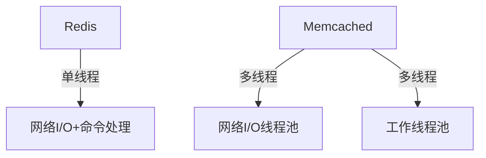
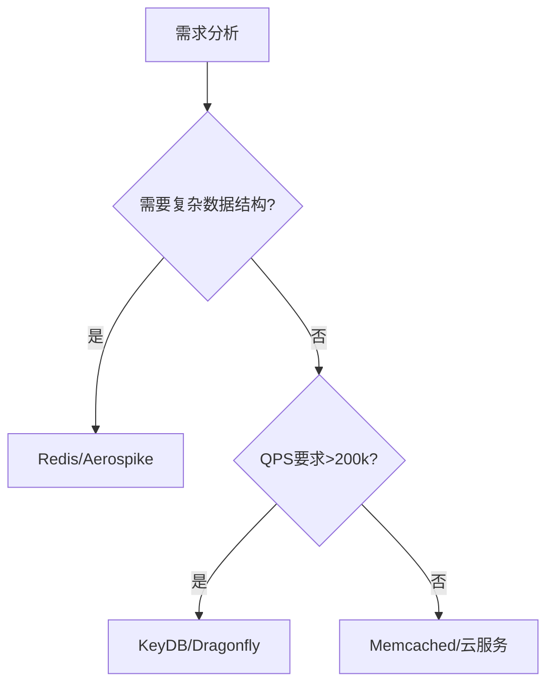

# Redis Lead Engineer 必备知识体系

作为Redis Lead Engineer候选人，您需要掌握从基础到高级的全方位Redis知识，同时具备架构设计、性能优化和团队领导能力。以下是系统化的知识框架：

## 一、核心架构与原理

### 1. Redis核心架构设计
- **单线程模型**：理解React模式和非阻塞I/O
- **持久化机制**：
  - RDB（快照）原理与配置：`save 900 1`
  - AOF（追加日志）策略：`appendfsync everysec`
  - 混合持久化（Redis 4.0+）
- **多线程演进**：6.0后网络I/O多线程化

### 2. 内存管理
- **内存分配器**：jemalloc vs libc
- **淘汰策略**：8种策略及适用场景
  ```sh
  # 配置示例
  maxmemory-policy volatile-lru
  ```
- **内存优化**：
  - 小对象编码优化（ziplist, intset）
  - 内存碎片整理：`activedefrag yes`

## 二、数据结构与高级特性

### 3. 全数据结构深度掌握
| 数据结构 | 内部编码 | 典型应用场景 | 注意事项 |
|---------|---------|-------------|---------|
| String | int/embstr/raw | 缓存、计数器 | 大value拆分 |
| Hash | ziplist/hashtable | 对象存储 | 字段数≤512用ziplist |
| List | quicklist | 消息队列 | LINDEX O(N) |
| Set | intset/hashtable | 标签系统 | SINTER计算成本 |
| ZSet | ziplist/skiplist | 排行榜 | 范围查询复杂度 |
| Stream | rax树 | 消息队列 | 消费者组管理 |

### 4. 高级功能
- **Lua脚本**：
  ```lua
  -- 库存扣减脚本
  local stock = tonumber(redis.call('GET', KEYS[1]))
  if stock > 0 then
    redis.call('DECR', KEYS[1])
    return 1
  end
  return 0
  ```
- **模块系统**：开发自定义数据类型
- **事务**：`MULTI`/`EXEC`与`WATCH`的局限

## 三、高可用与分布式

### 5. 集群方案
- **Redis Sentinel**：
  ```sh
  sentinel monitor mymaster 127.0.0.1 6379 2
  sentinel down-after-milliseconds mymaster 5000
  ```
- **Redis Cluster**：
  - 数据分片（16384 slots）
  - 节点通信（Gossip协议）
  - 迁移与故障转移

### 6. 多数据中心方案
- **CRDT数据结构**（Redis Enterprise）
- **双活架构**：基于WAN的同步延迟处理
- **云上多可用区部署**：
  ```sh
  # AWS ElastiCross Replication Group配置
  aws elasticache create-replication-group \
    --global-replication-group-id my-global-group \
    --primary-region us-west-1 \
    --regions "us-west-1,us-east-1"
  ```

## 四、性能优化

### 7. 关键性能指标
- **延迟分析**：
  ```sh
  redis-cli --latency -h 127.0.0.1 -p 6379
  ```
- **热点Key识别**：
  ```sh
  redis-cli --hotkeys
  # 或使用monitor+分析工具
  ```

### 8. 优化策略
- **Pipeline批处理**：
  ```python
  pipe = r.pipeline()
  for i in range(1000):
      pipe.set(f'key:{i}', i)
  pipe.execute()
  ```
- **连接池配置**：
  ```java
  JedisPoolConfig config = new JedisPoolConfig();
  config.setMaxTotal(100);  // 最大连接数
  config.setMaxIdle(20);    // 最大空闲连接
  ```

## 五、安全与运维

### 9. 安全防护
- **ACL系统**（Redis 6.0+）：
  ```sh
  ACL SETUSER alice on >pass123 ~cached:* +get +set
  ```
- **TLS加密**：
  ```sh
  # 配置示例
  tls-port 6379
  tls-cert-file redis.crt
  tls-key-file redis.key
  ```

### 10. 运维工具链
- **监控方案**：
  - Prometheus + Grafana（redis_exporter）
  - RedisInsight可视化工具
- **自动化运维**：
  ```python
  # 自动故障转移脚本示例
  def failover():
      while not check_master_alive():
          promote_slave()
          reconfigure_sentinels()
  ```

## 六、云原生与扩展

### 11. 云服务集成
- **AWS ElastiCache**：
  - 版本选择策略
  - 参数组定制
- **Azure Cache**：
  - 地理复制配置
  - 缩放操作API

### 12. 扩展方案
- **RedisTimeSeries**：
  ```sh
  TS.CREATE temperature RETENTION 86400000 LABELS sensor_id 1
  ```
- **RedisGraph**：
  ```cypher
  GRAPH.QUERY social "CREATE (:User {name:'Alice'})"
  ```

## 七、架构设计能力

### 13. 典型架构模式
- **缓存策略**：
  ```mermaid
  graph LR
    A[客户端] --> B{Redis有数据?}
    B -->|是| C[直接返回]
    B -->|否| D[查询数据库]
    D --> E[写入Redis]
    E --> C
  ```
- **会话存储设计**：
  - 多级Session缓存（本地+Redis）
  - 跨域Session共享方案

### 14. 容量规划
- **内存估算公式**：
  ```
  总内存 = (键数量 × (key_size + value_size + 64)) × 1.2
  ```
- **分片策略**：
  - 业务分片（不同Redis实例）
  - 数据分片（Cluster模式）

## 八、团队领导能力

### 15. 技术决策
- **技术选型评估表**：

| 方案 | 优点 | 缺点 | 适用场景 |
|------|------|------|---------|
| 单实例 | 简单 | 单点故障 | 开发环境 |
| Sentinel | 自动故障转移 | 需要客户端支持 | 中小规模生产 |
| Cluster | 水平扩展 | 运维复杂 | 大规模数据 |

### 16. 团队管理
- **知识传承机制**：
  - Redis内部原理分享会
  - 故障处理案例库
  - 代码审查清单（Lua脚本安全等）

## 面试问题准备示例

**问题1**：如何设计一个支持千万级用户的Redis点赞系统？

**答案框架**：
1. 数据结构选择：`Hash`类型存储用户-内容点赞关系
   ```sh
   HSET content:1234 likes user1 1 user2 1
   ```
2. 分片策略：按内容ID哈希分片
3. 热点处理：本地缓存+Redis多级缓存
4. 防刷机制：Lua脚本实现频率限制
5. 数据同步：异步持久化到数据库

**问题2**：Redis集群出现数据倾斜如何处理？

**解决方案**：
1. 诊断工具：
   ```sh
   redis-cli --cluster check 127.0.0.1:7001
   ```
2. 平衡策略：
   - 手动迁移slot：`CLUSTER SETSLOT`
   - 使用`--cluster rebalance`
3. 预防措施：
   - 避免大Key（`redis-cli --bigkeys`）
   - 优化哈希标签：`{user123}.profile`

作为Lead Engineer，除了技术深度外，还需展现：
- 架构决策的权衡能力
- 故障排查的系统化思维
- 团队知识传递的有效方法
- 技术路线的前瞻性规划


# Redis替代技术方案对比分析

以下是当前主流的内存数据存储/缓存系统与Redis的详细对比，涵盖性能、功能、适用场景等关键维度。

## 一、内存键值存储系统对比

| 技术方案        | 开发公司      | 数据模型       | 持久化机制               | 集群方案           | 特色功能                      | 适用场景                     |
|----------------|-------------|--------------|------------------------|------------------|----------------------------|---------------------------|
| **Redis**      | Redis Labs  | 键值+多种数据结构 | RDB/AOF/混合            | Cluster/Sentinel | Lua脚本、模块系统、Stream     | 缓存、消息队列、实时分析         |
| **Memcached**  | Danga       | 简单键值        | 无                     | 客户端分片          | 多线程、纯内存                 | 简单缓存场景                  |
| **KeyDB**      | Snap Inc    | 兼容Redis协议 | RDB/AOF                | Active-Replica  | 多线程Redis分支               | 需要更高吞吐的Redis兼容场景      |
| **Dragonfly**  | 独立开发      | 兼容Redis协议 | 即时快照+操作日志         | 共享内存架构        | 高吞吐、自动扩展               | 大规模内存数据库替代方案         |

## 二、新型内存数据库对比

| 技术方案        | 数据模型       | 持久化方式      | 事务支持 | 查询语言      | 性能特点               | 最佳场景               |
|----------------|--------------|--------------|--------|-------------|----------------------|----------------------|
| **Apache Ignite** | 键值+SQL+计算 | 持久化存储      | ACID   | SQL         | 内存优先，支持持久化       | 实时数据分析、事务处理      |
| **Hazelcast**   | 分布式对象      | 可选持久化      | 有限    | 无           | 低延迟数据网格            | 分布式缓存、事件处理        |
| **Aerospike**   | 键值+文档      | 混合内存架构     | 强一致   | 类SQL        | 亚毫秒级延迟             | 实时推荐系统、广告技术       |
| **Tarantool**   | 内存+持久化    | WAL日志       | ACID   | Lua         | 高性能消息+数据库         | 消息总线、实时应用后端       |

## 三、云服务商托管方案对比

| 服务名称          | 提供商       | Redis兼容性 | 扩展方式        | 特色功能                  | SLA保证     | 成本模型          |
|-----------------|------------|-----------|---------------|-------------------------|------------|----------------|
| **Amazon ElastiCache** | AWS        | 完全兼容     | 垂直/水平扩展    | 多AZ部署、自动故障转移        | 99.9%      | 按节点类型和时长计费  |
| **Azure Cache for Redis** | Microsoft  | 完全兼容     | 分片集群        | 地理复制、企业级安全          | 99.95%     | 预留容量可节省40%   |
| **Memorystore** | Google Cloud | 完全兼容     | 自动扩展        | 与GCP服务深度集成           | 99.9%      | 按vCPU和内存计费   |
| **Alibaba Cloud ApsaraDB** | 阿里云       | 完全兼容     | 读写分离        | 全球多活、混合存储           | 99.99%     | 包年包月更优惠     |

## 四、技术深度对比分析

### 1. Redis vs Memcached

**架构差异**：


**性能对比**：
- **Redis**：
  - 单线程：120,000 QPS（GET/SET）
  - 内存效率：较高（支持压缩）
- **Memcached**：
  - 多线程：1,000,000+ QPS
  - 内存效率：较低（无压缩）

**选型建议**：
- 需要丰富数据结构 → Redis
- 纯缓存且需要更高吞吐 → Memcached

### 2. Redis vs KeyDB/Dragonfly

**多线程实现对比**：
```python
# Redis 6.0+线程模型
io_threads = 4  # 仅处理网络I/O
worker_threads = 1  # 单线程命令处理

# KeyDB线程模型
io_threads = 4
worker_threads = 4  # 多线程命令处理

# Dragonfly线程模型
shared_nothing = True  # 每个线程管理独立数据分片
```

**基准测试数据**：
| 方案       | SET QPS   | GET QPS   | 内存占用 |
|-----------|----------|----------|--------|
| Redis     | 120,000  | 150,000  | 1x     |
| KeyDB     | 450,000  | 600,000  | 1.1x   |
| Dragonfly | 1,200,000| 1,500,000| 0.9x   |

### 3. Redis vs Aerospike

**数据分布对比**：
```java
// Redis Cluster分片
CRC16(key) % 16384 → 确定slot → 映射到节点

// Aerospike分片
一致性哈希 → 数据自动均衡 → 副本可配置
```

**功能差异矩阵**：
| 特性               | Redis           | Aerospike       |
|--------------------|----------------|----------------|
| 数据持久化           | 可选            | 默认开启         |
| 强一致性             | 有限(WAIT命令)   | 原生支持         |
| 地理分布             | 需要第三方工具     | 内置支持         |
| 内存使用效率          | 中等            | 更高(自动压缩)    |

## 五、特殊场景解决方案

### 1. 大规模实时分析场景
- **RedisTimeSeries** vs **InfluxDB**
  - RedisTS优势：超低延迟(亚毫秒)
  - InfluxDB优势：更丰富的查询函数

### 2. 事件流处理场景
- **Redis Stream** vs **Kafka**
  - Redis Stream优势：简单部署、低延迟
  - Kafka优势：更高吞吐、更完善的消息保证

### 3. 多模型数据库场景
- **Redis Modules** vs **ArangoDB**
  - Redis优势：极低延迟
  - ArangoDB优势：原生多模型支持

## 六、迁移方案建议

### 从Redis迁移到其他方案的操作路径

1. **评估矩阵**：
   ```sh
   # 使用redis-analyzer分析现有使用模式
   ./redis-analyzer -h 127.0.0.1 -p 6379 --report=output.html
   ```

2. **迁移工具选择**：
   - **完全兼容方案**：使用`redis-cli --cluster import`
   - **非兼容方案**：开发ETL管道
     ```python
     # 示例迁移脚本
     for key in redis_source.scan_iter():
         value = redis_source.dump(key)
         target_db.restore(key, 0, value)
     ```

3. **验证方法**：
   - **数据一致性检查**：
     ```sh
     redis-compare -s redis://old -t aerospike://new -f mismatch.log
     ```
   - **性能基准测试**：
     ```sh
     memtier_benchmark -s new.host -p 6379 --test-time=60
     ```

## 七、新兴技术观察

### 1. **RedisJSON 2.0**
- 支持JSONPath查询
- 性能比MongoDB高5-10倍（简单查询）

### 2. **RedisGraph 2.2**
- 支持Cypher查询语言
- 比Neo4j快100倍（特定遍历场景）

### 3. **EdgeDB**
- 新型关系型内存数据库
- 兼容PostgreSQL协议
- 比Redis+关系数据库方案更简洁

## 总结选型建议

1. **需要丰富数据结构+社区生态** → **Redis**
2. **需要更高吞吐+Redis兼容** → **KeyDB/Dragonfly**
3. **需要强一致性+企业级特性** → **Aerospike**
4. **纯缓存+极致性能** → **Memcached**
5. **云原生部署** → 各云厂商托管Redis服务

附加决策工具：
