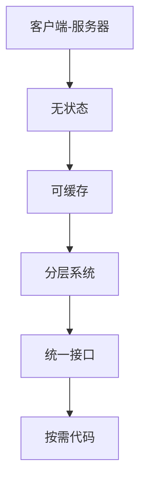
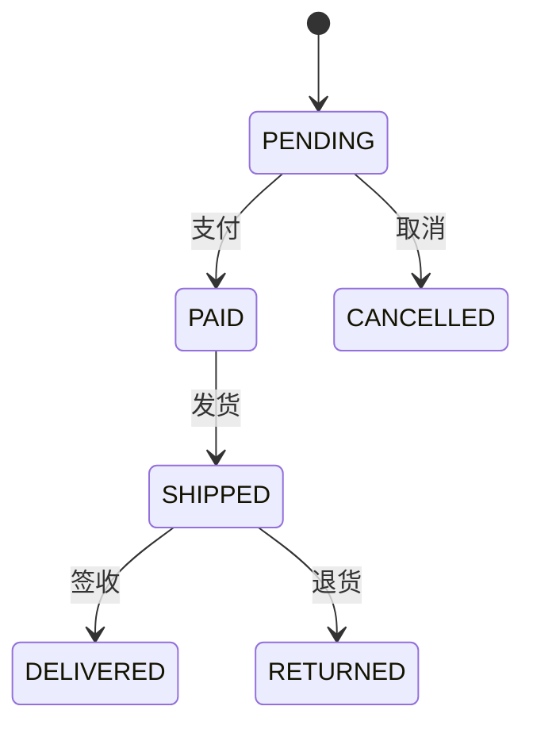
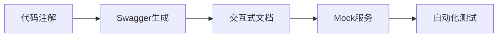
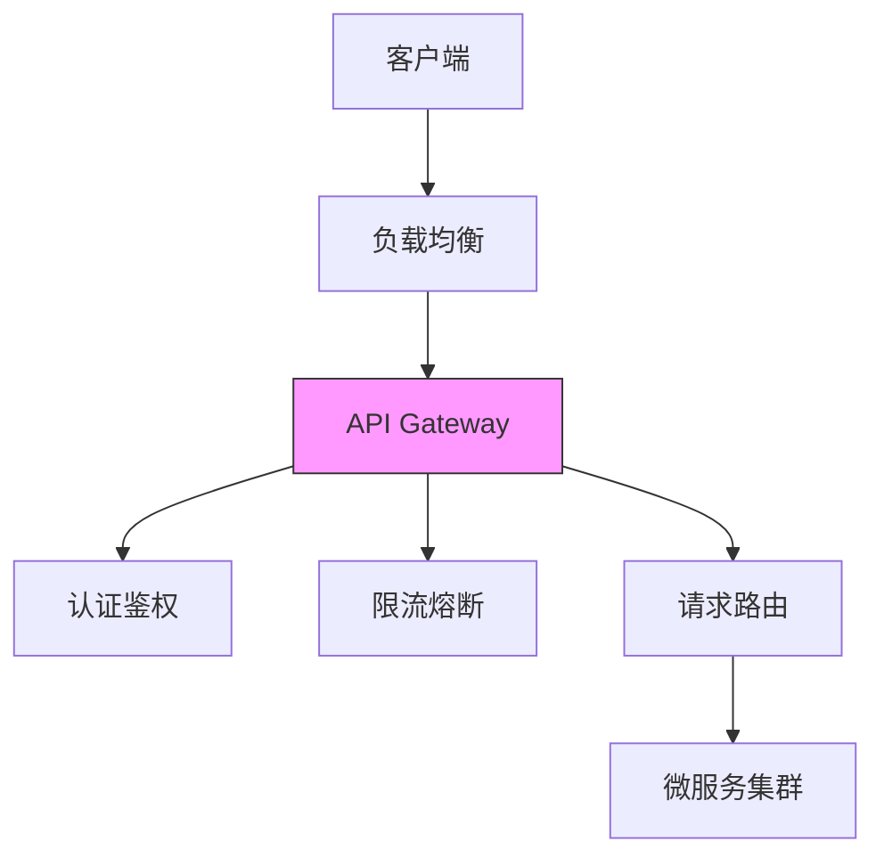

# RESTful API Lead Engineer 必备知识体系

作为RESTful API Lead Engineer候选人，您需要掌握从设计原则到生产部署的全方位知识。以下是系统化的知识框架和面试准备指南。

## 一、核心概念与设计原则

### 1. REST六大架构约束


**详细解释**：
1. **统一接口**：
   - 资源标识（URI）
   - 资源操作（HTTP方法）
   - 自描述消息（Media Types）
   - HATEOAS（超媒体驱动）

2. **无状态性**：
   ```http
   GET /orders/123 HTTP/1.1
   Authorization: Bearer xyz
   ```
   *每个请求必须包含所有必要信息*

### 2. 资源命名规范
**优秀URI设计**：
```
/api/v1/users           # 用户集合
/api/v1/users/{id}      # 特定用户
/api/v1/users/{id}/orders # 用户的订单
```

**反模式**：
```
/getAllUsers            # 动词在URI中
/api/getuser?id=123     # 操作语义不明确
```

## 二、高级设计模式

### 3. 版本控制策略
| 策略            | 示例                     | 优缺点                  |
|----------------|-------------------------|-----------------------|
| URI路径         | `/v1/users`             | 简单但破坏URI纯洁性      |
| 查询参数        | `/users?version=1`      | 灵活但缓存效率低         |
| 请求头          | `Accept: application/vnd.company.v1+json` | 最规范但实现复杂 |

### 4. 分页与过滤设计
**最佳实践**：
```http
GET /api/v1/products?page=2&size=20&sort=price,desc&category=electronics
```

**响应结构**：
```json
{
  "data": [...],
  "pagination": {
    "total": 100,
    "page": 2,
    "size": 20,
    "links": {
      "next": "/products?page=3&size=20",
      "prev": "/products?page=1&size=20"
    }
  }
}
```

### 5. HATEOAS实现
```json
{
  "id": 123,
  "name": "Alice",
  "links": [
    {
      "rel": "self",
      "href": "/api/v1/users/123",
      "method": "GET"
    },
    {
      "rel": "delete",
      "href": "/api/v1/users/123",
      "method": "DELETE"
    }
  ]
}
```

## 三、安全与性能

### 6. 安全防护措施
**多层防护**：
1. **认证**：
   ```http
   POST /oauth/token
   grant_type=password&username=user&password=pass
   ```
2. **授权**：
   - RBAC模型
   - OAuth2 Scope
3. **防护**：
   - CSRF Tokens
   - Rate Limiting
   - CORS策略

### 7. 性能优化
**缓存策略**：
```http
GET /api/v1/products/123
Cache-Control: max-age=3600
ETag: "33a64df5"
```

**压缩传输**：
```http
GET /api/v1/users
Accept-Encoding: gzip, deflate
```

## 四、面试题与答案

### 题目1：解释REST的幂等性
**答案**：
1. **定义**：多次执行相同操作结果一致
2. **HTTP方法幂等性**：
   | 方法    | 幂等性 | 原因                 |
   |--------|--------|---------------------|
   | GET    | 是      | 只读操作             |
   | PUT    | 是      | 全量替换资源          |
   | DELETE | 是      | 删除后资源不存在       |
   | POST   | 否      | 每次创建新资源         |
3. **实际案例**：
   ```http
   PUT /api/v1/users/123
   {"name": "Alice"}  # 多次执行结果相同
   ```

### 题目2：设计电商API的订单状态流转
**解决方案**：


**API设计**：
```http
PATCH /api/v1/orders/456
Content-Type: application/json-patch+json

[
  { "op": "replace", "path": "/status", "value": "shipped" }
]
```

### 题目3：处理API版本兼容问题
**迁移方案**：
1. **并行运行**：
   - 旧版`/v1/users`继续维护
   - 新版`/v2/users`逐步迁移
2. **兼容策略**：
   ```java
   // 使用适配器模式
   public class UserAdapter {
       public UserV2 adapt(UserV1 user) {
           // 转换逻辑
       }
   }
   ```
3. **弃用计划**：
   ```http
   GET /v1/users
   Deprecation: true
   Sunset: Sat, 31 Dec 2023 23:59:59 GMT
   ```

### 题目4：REST与GraphQL对比
**对比分析**：
| 维度          | REST                      | GraphQL                 |
|--------------|--------------------------|-------------------------|
| **数据获取**  | 多端点请求                 | 单端点精确查询            |
| **版本控制**  | 需显式版本管理             | 通过类型系统演进           |
| **缓存**      | HTTP缓存机制完善           | 需要自定义缓存方案         |
| **适用场景**  | 简单稳定的数据模型          | 复杂多变的前端需求         |
| **性能**      | 过度获取/不足获取           | 按需获取但可能N+1问题      |

### 题目5：实现API限流方案
**分布式限流实现**：
```java
// 令牌桶算法示例
public class RateLimiter {
    private final int capacity;
    private final double refillRate;
    private double tokens;
    private long lastRefillTime;

    public synchronized boolean tryAcquire() {
        refill();
        if (tokens < 1) return false;
        tokens--;
        return true;
    }
}
```

**生产级方案**：
1. **Nginx限流**：
   ```nginx
   limit_req_zone $binary_remote_addr zone=api:10m rate=100r/s;
   location /api/ {
       limit_req zone=api burst=50;
   }
   ```
2. **Redis+Lua**：
   ```lua
   local key = KEYS[1]
   local limit = tonumber(ARGV[1])
   local current = tonumber(redis.call('GET', key) or "0")
   if current + 1 > limit then
       return 0
   else
       redis.call("INCR", key)
       redis.call("EXPIRE", key, 1)
       return 1
   end
   ```

## 五、生产环境实践

### 1. 文档生成工具链
**OpenAPI工作流**：


**SpringDoc示例**：
```java
@Operation(summary = "Get user by ID")
@ApiResponses(value = {
    @ApiResponse(responseCode = "200", description = "Found the user"),
    @ApiResponse(responseCode = "404", description = "User not found")
})
@GetMapping("/users/{id}")
public User getUser(@Parameter(description = "ID of user") @PathVariable Long id) {
    // ...
}
```

### 2. 监控指标
**关键Metrics**：
- 请求量：`http.server.requests`
- 错误率：`http.error.rate`
- 延迟分布：`http.request.duration`
- 饱和度：`thread.busy.count`

**Grafana看板配置**：
```json
{
  "panels": [{
    "title": "API成功率",
    "targets": [{
      "expr": "sum(rate(http_server_requests_seconds_count{status!~'5..'}[1m])) / sum(rate(http_server_requests_seconds_count[1m]))",
      "legendFormat": "{{path}}"
    }]
  }]
}
```

## 六、架构设计案例

### 千万级日活API网关


**配置示例**：
```yaml
# Kong网关配置
services:
- name: user-service
  url: http://user-cluster
  routes:
  - paths: ["/api/v1/users"]
  plugins:
  - name: rate-limiting
    config:
      minute: 100
      policy: redis
```

作为RESTful API Lead Engineer，除技术深度外，还需展示：
- API产品化思维（开发者体验设计）
- 性能瓶颈诊断方法论
- 团队协作规范制定能力
- 技术债务管理策略
- 跨团队沟通协调能力


作为 Lead Engineer，掌握 GraphQL 的核心原理和高级实践是必备技能。以下是系统化的知识体系和面试题解析：

---

### **一、核心原理**
#### 1. **设计哲学**
- **声明式数据获取**：客户端精确描述所需数据结构和字段，服务端按需返回（解决REST的Over/Under-fetching问题）。
- **强类型系统**：基于Schema定义的类型系统（Scalar/Object/Interface/Union/Enum），支持编译时校验。
- **单端点**：所有操作通过`POST /graphql`端点处理，由Query/Mutation/Subscription类型区分。

#### 2. **执行机制**
- **解析流程**：
  ```mermaid
  graph LR
  A[请求] --> B[语法解析]
  B --> C[验证]
  C --> D[执行]
  D --> E[解析器函数]
  E --> F[数据组装]
  ```
- **Resolver链**：每个字段对应一个Resolver，父字段返回值作为子字段的`parent`参数。
- **DataLoader模式**：批处理+缓存优化N+1查询问题。

#### 3. **高级特性**
- **分片（Fragments）**：可复用的字段组合。
- **指令（Directives）**：`@include`、`@skip`动态控制字段返回。
- **订阅（Subscriptions）**：基于WebSocket的实时数据推送。

---

### **二、面试题与答案**
#### **1. GraphQL与REST的核心差异？**
- **答案**：
  - **数据获取**：REST多端点固定返回结构，GraphQL单端点按需返回。
  - **版本管理**：REST通过URL版本化，GraphQL通过Schema演进（Deprecation）。
  - **性能**：REST可复用HTTP缓存，GraphQL需自定义缓存策略（如Apollo的Normalized Cache）。

#### **2. 如何解决GraphQL的N+1查询问题？**
- **答案**：
  - **DataLoader**：将多次数据库查询合并为批量查询，并缓存结果。
  - **示例**：
    ```javascript
    const userLoader = new DataLoader(async (ids) => {
      const users = await db.users.find({ id: { $in: ids } });
      return ids.map(id => users.find(u => u.id === id));
    });

    // Resolver中调用
    resolve(parent, args, context) {
      return context.userLoader.load(parent.userId);
    }
    ```

#### **3. GraphQL Schema设计最佳实践？**
- **答案**：
  - **领域驱动设计**：按业务域划分类型（如`User`、`Product`）。
  - **避免深度嵌套**：限制查询深度（如`graphql-depth-limit`）。
  - **输入类型**：Mutation参数使用`input`类型封装。

#### **4. 如何实现权限控制？**
- **答案**：
  - **Resolver层校验**：
    ```javascript
    Mutation: {
      deletePost: (parent, args, context) => {
        if (!context.user.isAdmin) throw new ForbiddenError();
        return deletePost(args.id);
      }
    }
  - **指令扩展**：自定义`@auth`指令。
  - **Schema分割**：按角色拆分Schema（如`internalSchema`和`publicSchema`）。

#### **5. GraphQL Federation vs Stitching？**
- **答案**：
  - **Federation**（Apollo）：服务声明自身能力，网关组合子图。
    ```graphql
    type User @key(fields: "id") {
      id: ID!
      posts: [Post] @external
    }
    ```
  - **Stitching**：中心化网关手动合并Schema，灵活性高但维护成本大。

#### **6. 如何监控和优化GraphQL性能？**
- **答案**：
  - **指标采集**：查询复杂度、解析耗时、错误率（Apollo Studio）。
  - **查询持久化**：将常用查询预编译为ID（减少传输体积）。
  - **CDN缓存**：对高频静态查询使用GET请求+CDN缓存。

#### **7. GraphQL安全风险与防护**
- **答案**：
  - **查询拒绝**：限制深度/复杂度（`graphql-cost-analysis`）。
  - **注入防护**：避免拼接字符串生成查询（使用参数化查询）。
  - **Introspection关闭**：生产环境禁用`schema introspection`。

#### **8. 如何处理文件上传？**
- **答案**：
  - **Base64编码**：简单但低效（适合小文件）。
  - **multipart扩展**：使用`graphql-upload`处理流式上传。
    ```graphql
    mutation {
      uploadFile(file: Upload!): File!
    }
    ```

---

### **三、进阶能力**
1. **Schema演化**：通过`@deprecated`逐步淘汰字段。
2. **自定义标量**：如`Date`类型的序列化/反序列化。
3. **性能剖析**：使用`Apollo Tracing`或`OpenTelemetry`集成。
4. **多语言生态**：了解不同语言的实现（如Python的`graphene`、Java的`graphql-java`）。

---

### **四、实战场景问题**
**问题**：如何设计一个支持实时库存更新的电商GraphQL服务？  
**答案**：
1. **Schema设计**：
   ```graphql
   type Product {
     id: ID!
     stock: Int!
   }
   type Subscription {
     stockUpdated(productId: ID!): Product!
   }
   ```
2. **PubSub系统**：使用Redis或Kafka广播库存变更事件。
3. **订阅实现**：
   ```javascript
   Subscription: {
     stockUpdated: {
       subscribe: (_, { productId }, { pubsub }) => 
         pubsub.asyncIterator(`STOCK_UPDATE_${productId}`)
     }
   }
   ```

---

掌握这些内容后，你不仅能应对技术面试，还能在实际项目中设计高性能、安全的GraphQL架构。建议通过开源项目（如GitHub API v4）分析真实案例。