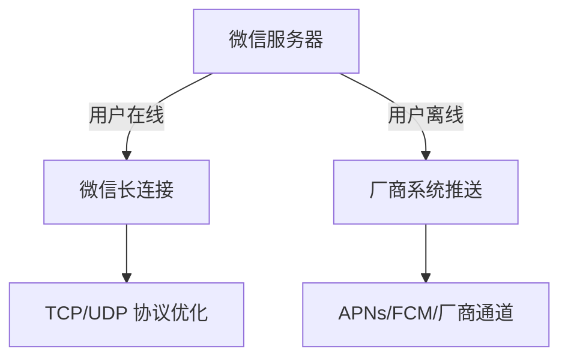

微信消息推送采用了 **多层次、混合型技术方案**，结合了操作系统级推送通道和自有长连接协议，以确保消息的实时性、可靠性和低功耗。以下是其核心技术实现的详细解析：

---

### **📌 一、微信消息推送的整体架构**
微信的消息推送系统分为 **在线推送** 和 **离线推送** 两种场景，根据用户设备状态动态选择：
1. **用户在线（App活跃）**：  
   - 使用微信自有的 **TCP/UDP 长连接**（基于优化协议）实时收发消息。  
2. **用户离线（App被杀死或后台）**：  
   - 依赖手机厂商的 **系统级推送服务**（如苹果 APNs、华为 HMS Push）。  



---

### **📌 二、在线推送：微信自有长连接技术**
#### **1. 协议设计**
- **底层协议**：基于 **TCP 或 UDP 自定义协议**（早期用 UDP，后优化为 TCP + QUIC 混合）。  
- **多路复用**：单个连接承载消息、语音、视频等多种数据类型。  
- **心跳机制**：  
  - 定期发送心跳包（如 4.5 分钟一次）维持连接。  
  - 智能心跳算法：根据网络状态动态调整间隔（Wi-Fi 下间隔更长以省电）。  

#### **2. 数据加密**
- 使用 **TLS 1.3** 加密通信内容。  
- 消息体额外采用微信私有加密协议（防止中间人攻击）。  

#### **3. 优化策略**
- **小包合并**：将多个小消息合并为一个包发送，减少 TCP 头开销。  
- **快速重连**：网络切换时（如 4G→WiFi）秒级重建连接。  

---

### **📌 三、离线推送：厂商系统通道**
当微信进程被系统杀死或处于后台时，依赖手机厂商或操作系统的推送服务：

#### **1. iOS 平台（APNs）**
- **技术方案**：苹果 APNs（Apple Push Notification service）。  
- **流程**：  
  1. 微信服务端将消息发送至 APNs。  
  2. APNs 通过 iOS 系统长连接推送到设备。  
  3. 用户点击通知后唤醒微信拉取完整消息。  
- **特点**：  
  - 严格限制推送频率和内容大小（ payload ≤4KB）。  
  - 支持静默推送（无弹窗，用于后台拉取数据）。  

#### **2. 安卓平台（厂商通道 + FCM）**
- **国内厂商**（华为/小米/OPPO等）：  
  - 使用各自的推送服务（如华为 HMS Push、小米 Mi Push）。  
  - 微信需集成各厂商 SDK，适配不同接口。  
- **海外安卓**：  
  - 优先使用 **Google FCM**（Firebase Cloud Messaging）。  
  - 无 GMS 的设备 fallback 到微信自建长连接（需后台保活）。  

#### **3. 统一控制**
- **推送网关**：微信服务端根据设备类型和厂商动态选择推送通道。  
- **状态同步**：用户打开微信后，自动从服务器同步未读消息。  

---

### **📌 四、关键技术挑战与解决方案**
#### **1. 省电优化**
- **自适应心跳**：在后台时延长心跳间隔（如从 4.5 分钟调整为 15 分钟）。  
- **厂商白名单**：与手机厂商合作，避免微信进程被强制杀后台。  

#### **2. 高并发处理**
- **分布式网关**：全球部署接入节点，就近分配长连接（如上海、法兰克福机房）。  
- **连接复用**：单台服务器支撑百万级并发连接（基于 epoll/NIO）。  

#### **3. 弱网适应性**
- **协议降级**：在极端网络下切换为 UDP 或 HTTP 短连接。  
- **ACK 确认**：重要消息（如支付通知）需客户端确认，否则重推。  

---

### **📌 五、与竞品方案的对比**
| **方案**       | 微信实现                          | 竞品（如钉钉）                    |
|----------------|----------------------------------|----------------------------------|
| **在线推送**   | 自研长连接（TCP/QUIC）           | 类似，但可能依赖更多厂商通道      |
| **离线推送**   | 多厂商通道 + APNs/FCM            | 同厂商通道，但优先级策略不同      |
| **加密强度**   | TLS 1.3 + 私有协议               | 通常仅 TLS                       |
| **心跳策略**   | 动态智能心跳（4.5~30分钟）       | 固定间隔（如 5 分钟）            |

---

### **📌 六、开发者可借鉴的经验**
1. **混合推送架构**：  
   - 在线时用自建长连接（低延迟），离线时 fallback 到系统推送。  
2. **厂商通道适配**：  
   - 安卓端需适配主流厂商 SDK，iOS 严格遵循 APNs 规范。  
3. **心跳优化**：  
   - 根据网络类型（蜂窝/WiFi）和电量状态动态调整心跳间隔。  
4. **数据压缩**：  
   - 使用 Protobuf 或自定义二进制协议减少传输体积。  

---

### **💡 总结**
微信消息推送的核心理念是：  
✅ **分层设计**：在线长连接 + 离线系统推送。  
✅ **厂商合作**：深度适配安卓碎片化生态。  
✅ **协议优化**：平衡实时性、可靠性和功耗。  

对于开发者而言，若需实现类似功能，可参考以下优先级：  
1. **优先集成系统推送**（APNs/FCM/厂商通道）。  
2. **补充自研长连接**（如 MQTT over WebSocket）。  
3. **优化心跳和加密**（避免被系统限制或用户投诉耗电）。


# **基于 epoll/NIO 实现百万级长连接的技术原理与资源消耗分析**

## **📌 一、为什么 epoll/NIO 能支持百万级长连接？**
### **1. 传统阻塞 I/O 的瓶颈**
在传统的 **阻塞 I/O 模型**（如 Java `BIO`）中，每个连接需要一个线程处理：
- **问题**：  
  - 线程切换开销大（上下文切换、内存占用）。  
  - 线程栈默认占用 1~2MB（100万连接需 TB 级内存）。  
- **结论**：无法支撑高并发。

### **2. epoll/NIO 的核心优势**
**epoll（Linux）** 和 **NIO（Java）** 通过以下机制实现高并发：
#### **(1) 非阻塞 I/O**
- 线程不会阻塞在 `read()`/`write()` 调用上，而是立即返回（通过返回值判断状态）。  
- **资源节省**：单线程可轮询多个连接，避免线程空等。

#### **(2) 事件驱动**
- **epoll** 通过 `epoll_ctl` 注册文件描述符（fd），内核通知就绪事件（如可读、可写）。  
- **NIO** 的 `Selector` 类似，监听 `Channel` 的就绪状态。  
- **优势**：  
  - 仅处理活跃连接，避免遍历所有 fd（O(1) 时间复杂度）。  
  - 对比 `select`/`poll` 的 O(n) 遍历，性能显著提升。

#### **(3) 多路复用**
- **单线程处理多连接**：通过一个 epoll 实例管理所有 socket。  
- **示例代码（C + epoll）**：
  ```c
  int epfd = epoll_create1(0);
  struct epoll_event ev, events[MAX_EVENTS];
  
  // 添加 socket 到 epoll
  ev.events = EPOLLIN | EPOLLET; // 边缘触发模式
  ev.data.fd = sockfd;
  epoll_ctl(epfd, EPOLL_CTL_ADD, sockfd, &ev);

  while (1) {
    int n = epoll_wait(epfd, events, MAX_EVENTS, -1);
    for (int i = 0; i < n; i++) {
      if (events[i].events & EPOLLIN) {
        handle_read(events[i].data.fd); // 处理可读事件
      }
    }
  }
  ```

#### **(4) 边缘触发（ET）与水平触发（LT）**
- **边缘触发（ET）**：仅在状态变化时通知一次（需一次性读完数据）。  
  - 减少重复事件，提高性能。  
- **水平触发（LT）**：只要满足条件（如缓冲区有数据）就持续通知。  
  - 编程更简单，但效率略低。  
- **微信/QQ 的选择**：通常使用 ET 模式以最大化性能。

---

## **📌 二、长连接消耗的资源类型**
即使使用 epoll/NIO，长连接仍会消耗以下资源：

### **1. 内存资源**
| **资源项**          | **估算（单连接）**       | **100万连接总消耗**       |
|----------------------|------------------------|--------------------------|
| **Socket 缓冲区**    | 读缓冲 + 写缓冲 ≈ 16KB  | 16GB                     |
| **TCP 控制块**       | 约 1KB（内核维护）      | 1GB                      |
| **应用层数据结构**   | 约 0.5KB（如 Session）  | 0.5GB                    |
| **总计**             | **≈17.5KB/连接**       | **≈17.5TB（理论值）**    |

**优化手段**：  
- 调小 TCP 缓冲区（如 `net.ipv4.tcp_rmem = 4096 16384 4194304`）。  
- 使用对象池复用内存（如 Netty 的 `ByteBuf` 池化）。  

### **2. CPU 资源**
- **事件循环**：epoll_wait 返回后处理就绪事件。  
- **加密计算**：TLS 握手和数据加解密（如微信使用 AES）。  
- **协议解析**：解码二进制协议（如 Protobuf）。  

**优化手段**：  
- 绑定 CPU 亲和性（减少上下文切换）。  
- 使用异步 I/O（如 Linux `io_uring`）。  

### **3. 文件描述符（fd）**
- 每个 socket 占用一个 fd。  
- 系统默认限制（可通过 `ulimit -n` 调整）：  
  ```bash
  # 查看当前限制
  ulimit -n  # 通常默认 1024

  # 临时修改
  ulimit -n 1000000

  # 永久修改（/etc/security/limits.conf）
  * soft nofile 1000000
  * hard nofile 1000000
  ```

### **4. 网络带宽**
- **心跳包**：  
  - 假设每 5 分钟一个 64B 心跳，100万连接每秒消耗：  
    $$
    \frac{1,000,000 \times 64 \text{B}}{300 \text{秒}} \approx 213 \text{KB/s}
    $$
- **业务数据**：取决于消息频率和大小。  

**优化手段**：  
- 动态调整心跳间隔（Wi-Fi 下延长，蜂窝网络缩短）。  
- 压缩心跳包（如二进制编码替代 JSON）。  

---

## **📌 三、实际案例：微信/QQ 的实现优化**
### **1. 多级连接管理**
- **网关分层**：  
  - 接入层（长连接网关）仅维护连接，逻辑层处理业务。  
  - 通过一致性哈希分配连接，避免单点瓶颈。  

### **2. 协议优化**
- **二进制协议**：自定义紧凑格式（如 TLV 结构）。  
- **头部压缩**：类似 HTTP/2 的 HPACK，减少冗余字段。  

### **3. 资源隔离**
- **读写分离**：  
  - 独立线程组处理读/写事件（避免锁竞争）。  
- **优先级队列**：  
  - 高优先级消息（如支付通知）优先调度。  

### **4. 容灾与扩容**
- **优雅降级**：  
  - 在系统负载高时，拒绝低优先级连接（如非好友消息）。  
- **自动扩缩容**：  
  - 基于 Kubernetes 动态调整网关实例数。  

---

## **📌 四、开发者实践建议**
### **1. 框架选择**
- **Java**：Netty（基于 NIO + epoll）。  
- **C/C++**：libevent、libuv。  
- **Go**：原生 `net` 包（goroutine 轻量级）。  

### **2. 关键配置**
```bash
# Linux 内核参数优化
sysctl -w net.ipv4.tcp_tw_reuse=1      # 复用 TIME_WAIT 连接
sysctl -w net.core.somaxconn=65535     # 提高连接队列长度
sysctl -w fs.file-max=1000000          # 增加最大文件描述符
```

### **3. 监控指标**
| **指标**            | **工具**               | **健康阈值**              |
|---------------------|-----------------------|--------------------------|
| 连接数              | `ss -s`               | 低于 fd 限制的 80%       |
| CPU 使用率          | `top`/`htop`          | 单核 ≤70%（避免上下文切换）|
| 内存占用            | `free -m`             | 预留 20% 防 OOM          |
| 网络带宽            | `iftop`               | 不超过总带宽的 50%       |

---

## **💡 总结**
- **epoll/NIO 的高效性**：通过非阻塞 I/O、事件驱动和多路复用，单机可支撑百万级连接。  
- **长连接的主要消耗**：内存（内核缓冲区）、CPU（事件处理）、fd 数量。  
- **优化方向**：  
  ✅ 减少单连接内存占用（调优缓冲区）。  
  ✅ 降低 CPU 开销（异步 I/O、绑核）。  
  ✅ 动态心跳和协议压缩（节省带宽）。  

实际场景中，需结合业务需求（如延迟容忍度）和系统资源（如服务器内存）综合设计。