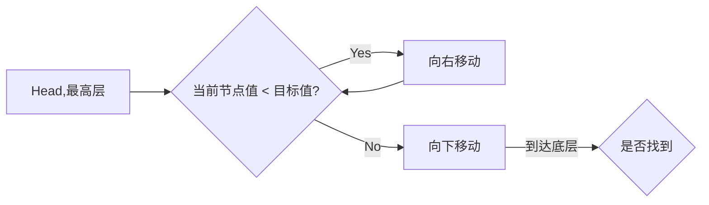
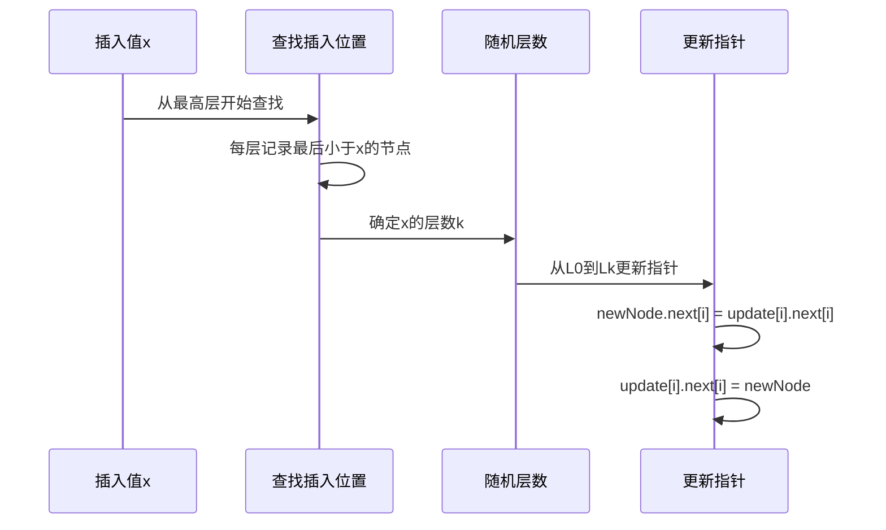

# 跳表（Skip List）详解

跳表是一种概率性的有序数据结构，它通过构建多层索引来实现快速查找，是平衡树的替代方案，由William Pugh在1989年提出。

## 一、基本概念

### 核心特点
- **有序结构**：维护元素的有序性
- **多层链表**：包含多个层次的链表
- **概率平衡**：通过随机算法保持平衡（非严格平衡）
- **O(log n)复杂度**：查找、插入、删除操作的平均时间复杂度

## 二、数据结构

### 节点结构
```java
class SkipListNode {
    int value; // 存储的值
    SkipListNode[] forwards; // 各层的前进指针
    // 如 forwards[0]是最底层链表的后继节点
    // forwards[1]是第二层链表的后继节点，以此类推
}
```

### 示例结构
```
Level 3: Head ----------------------------> 50
Level 2: Head ------------> 30 ------------> 50
Level 1: Head ---> 10 ---> 30 ---> 40 ---> 50
Level 0: Head -> 5 -> 10 -> 20 -> 30 -> 40 -> 50
```

## 三、核心操作原理

### 1. 查找过程


### 2. 插入过程
1. 查找插入位置并记录搜索路径
2. 随机确定新节点层数（抛硬币方式）
3. 逐层更新指针

### 3. 删除过程
1. 查找目标节点并记录搜索路径
2. 逐层更新前驱节点的指针

## 四、复杂度分析

| 操作     | 平均时间复杂度 | 最坏时间复杂度 |
|----------|----------------|----------------|
| 查找     | O(log n)       | O(n)          |
| 插入     | O(log n)       | O(n)          |
| 删除     | O(log n)       | O(n)          |
| 空间     | O(n)           | O(n log n)    |

## 五、优势与应用

### 相比平衡树的优势
1. **实现简单**：代码量约为平衡树的1/4
2. **并发友好**：更易实现无锁并发版本
3. **灵活调整**：通过调整概率因子平衡性能

### 典型应用场景
1. **Redis有序集合**：ZSET的底层实现之一
2. **LevelDB/RocksDB**：MemTable的存储结构
3. **分布式系统**：维护有序节点列表
4. **替代平衡树**：当不需要严格平衡时

## 六、Java实现示例

```java
import java.util.Random;

public class SkipList {
    private static final float P = 0.5f;
    private static final int MAX_LEVEL = 16;
    private int levelCount = 1;
    private final SkipListNode head = new SkipListNode(-1, MAX_LEVEL);
    private final Random r = new Random();

    static class SkipListNode {
        int val;
        SkipListNode[] next;
        
        public SkipListNode(int val, int level) {
            this.val = val;
            this.next = new SkipListNode[level];
        }
    }

    // 随机层数算法
    private int randomLevel() {
        int level = 1;
        while (Math.random() < P && level < MAX_LEVEL) {
            level++;
        }
        return level;
    }

    public void insert(int value) {
        int level = randomLevel();
        SkipListNode newNode = new SkipListNode(value, level);
        SkipListNode[] update = new SkipListNode[level];
        
        // 记录每层的插入位置
        SkipListNode p = head;
        for (int i = level - 1; i >= 0; i--) {
            while (p.next[i] != null && p.next[i].val < value) {
                p = p.next[i];
            }
            update[i] = p;
        }
        
        // 更新各层指针
        for (int i = 0; i < level; i++) {
            newNode.next[i] = update[i].next[i];
            update[i].next[i] = newNode;
        }
        
        if (level > levelCount) {
            levelCount = level;
        }
    }

    public boolean contains(int value) {
        SkipListNode p = head;
        for (int i = levelCount - 1; i >= 0; i--) {
            while (p.next[i] != null && p.next[i].val < value) {
                p = p.next[i];
            }
        }
        return p.next[0] != null && p.next[0].val == value;
    }
}
```

## 七、关键算法细节

### 随机层数生成
```java
private int randomLevel() {
    int level = 1;
    // 有P的概率继续增加层数
    while (Math.random() < P && level < MAX_LEVEL) {
        level++;
    }
    return level;
}
```

### 查找路径记录
```java
SkipListNode[] update = new SkipListNode[level];
SkipListNode p = head;
for (int i = level - 1; i >= 0; i--) {
    while (p.next[i] != null && p.next[i].val < value) {
        p = p.next[i];
    }
    update[i] = p; // 记录每层最后的查找位置
}
```

## 八、性能优化方向

1. **调整概率因子P**：
   - P=1/2：平衡时间与空间
   - 增大P：减少层数，节省空间但增加查找时间
   - 减小P：增加层数，加速查找但消耗更多空间

2. **动态调整最大层数**：
   ```java
   // 根据数据量动态计算
   MAX_LEVEL = (int)(Math.log(n) / Math.log(1/P)) + 1;
   ```

3. **内存池优化**：
   - 预分配节点数组
   - 重用删除的节点

跳表因其简单高效的特性，已成为现代系统编程中重要的数据结构，特别适合需要高并发操作的场景。理解其原理有助于更好地使用Redis等依赖跳表的系统。


# 跳表（Skip List）Java实现详解

下面我将通过完整的Java实现来详细解释跳表的原理和操作过程。我们将实现一个支持插入、查找、删除操作的跳表，并分析其核心逻辑。

## 一、跳表节点定义

```java
class SkipListNode<T extends Comparable<T>> {
    T value; // 节点存储的值
    SkipListNode<T>[] next; // 每层的后继节点指针数组

    @SuppressWarnings("unchecked")
    public SkipListNode(T value, int level) {
        this.value = value;
        this.next = new SkipListNode[level]; // 根据层数创建指针数组
    }
}
```

## 二、跳表完整实现

```java
import java.util.Random;

public class SkipList<T extends Comparable<T>> {
    private static final float P = 0.5f; // 节点晋升概率
    private static final int MAX_LEVEL = 16; // 最大层数
    private int levelCount = 1; // 当前有效层数
    private SkipListNode<T> head = new SkipListNode<>(null, MAX_LEVEL); // 头节点
    private Random random = new Random();

    /**
     * 随机生成节点层数
     */
    private int randomLevel() {
        int level = 1;
        // 随机数小于P且未达到最大层数时，层数+1
        while (random.nextFloat() < P && level < MAX_LEVEL) {
            level++;
        }
        return level;
    }

    /**
     * 插入节点
     */
    public void insert(T value) {
        int level = randomLevel(); // 获取随机层数
        SkipListNode<T> newNode = new SkipListNode<>(value, level);
        SkipListNode<T>[] update = new SkipListNode[level]; // 记录每层的插入位置
        
        // 从最高层开始查找插入位置
        SkipListNode<T> current = head;
        for (int i = level - 1; i >= 0; i--) {
            while (current.next[i] != null && current.next[i].value.compareTo(value) < 0) {
                current = current.next[i]; // 在当前层向右移动
            }
            update[i] = current; // 记录每层最后访问的节点
        }
        
        // 更新各层指针
        for (int i = 0; i < level; i++) {
            newNode.next[i] = update[i].next[i];
            update[i].next[i] = newNode;
        }
        
        // 更新跳表当前层数
        if (level > levelCount) {
            levelCount = level;
        }
    }

    /**
     * 查找节点
     */
    public boolean contains(T value) {
        SkipListNode<T> current = head;
        // 从最高层开始查找
        for (int i = levelCount - 1; i >= 0; i--) {
            while (current.next[i] != null && current.next[i].value.compareTo(value) < 0) {
                current = current.next[i]; // 向右移动
            }
        }
        
        // 检查最底层是否匹配
        if (current.next[0] != null && current.next[0].value.compareTo(value) == 0) {
            return true;
        }
        return false;
    }

    /**
     * 删除节点
     */
    public void delete(T value) {
        SkipListNode<T>[] update = new SkipListNode[levelCount];
        SkipListNode<T> current = head;
        
        // 查找待删除节点并记录路径
        for (int i = levelCount - 1; i >= 0; i--) {
            while (current.next[i] != null && current.next[i].value.compareTo(value) < 0) {
                current = current.next[i];
            }
            update[i] = current;
        }
        
        // 如果找到节点则删除
        if (current.next[0] != null && current.next[0].value.compareTo(value) == 0) {
            for (int i = levelCount - 1; i >= 0; i--) {
                if (update[i].next[i] != null && 
                    update[i].next[i].value.compareTo(value) == 0) {
                    update[i].next[i] = update[i].next[i].next[i]; // 删除指针
                }
            }
        }
        
        // 更新跳表层数
        while (levelCount > 1 && head.next[levelCount - 1] == null) {
            levelCount--;
        }
    }

    /**
     * 打印跳表结构（用于调试）
     */
    public void display() {
        System.out.println("SkipList Levels: " + levelCount);
        for (int i = levelCount - 1; i >= 0; i--) {
            System.out.print("Level " + i + ": ");
            SkipListNode<T> node = head.next[i];
            while (node != null) {
                System.out.print(node.value + " ");
                node = node.next[i];
            }
            System.out.println();
        }
    }
}
```

## 三、核心操作原理详解

### 1. 插入操作流程



### 2. 查找过程示例

查找值30的路径：
```
Level 3: Head ----------------------------> 50
Level 2: Head ------------> 30 ------------> 50
Level 1: Head ---> 10 ---> 30 ---> 40 ---> 50
Level 0: Head -> 5 -> 10 -> 20 -> 30 -> 40 -> 50

查找步骤：
1. L3: Head → 50 > 30 → 降层
2. L2: Head → 30 == 30 → 找到
```

### 3. 删除操作注意事项
- 必须从最高层开始删除指针
- 删除后需要检查并更新跳表当前层数
- 如果删除的是最高层的唯一节点，层数需要减1

## 四、测试示例

```java
public class Main {
    public static void main(String[] args) {
        SkipList<Integer> skipList = new SkipList<>();
        
        // 插入测试
        skipList.insert(10);
        skipList.insert(5);
        skipList.insert(20);
        skipList.insert(30);
        skipList.insert(15);
        skipList.insert(25);
        
        skipList.display();
        /*
        可能的输出：
        SkipList Levels: 3
        Level 2: 15 25 
        Level 1: 5 15 20 25 
        Level 0: 5 10 15 20 25 30 
        */
        
        // 查找测试
        System.out.println("Contains 20: " + skipList.contains(20)); // true
        System.out.println("Contains 18: " + skipList.contains(18)); // false
        
        // 删除测试
        skipList.delete(20);
        System.out.println("After deleting 20:");
        skipList.display();
        /*
        可能的输出：
        SkipList Levels: 3
        Level 2: 15 25 
        Level 1: 5 15 25 
        Level 0: 5 10 15 25 30 
        */
    }
}
```

## 五、关键设计分析

### 1. 层数随机生成算法
```java
private int randomLevel() {
    int level = 1;
    while (random.nextFloat() < P && level < MAX_LEVEL) {
        level++;
    }
    return level;
}
```
- 每个节点有50%概率晋升到上一层
- 保证上层节点数量约为下层的1/2
- 时间复杂度O(1)，空间复杂度O(log n)期望

### 2. 查找优化原理
通过多层索引实现"二分查找"效果：
- 高层索引跳过大量节点
- 每下降一层，搜索范围减半（概率意义上）
- 类似二叉搜索但不需要严格平衡

### 3. 并发安全扩展
可通过CAS实现无锁并发：
```java
// 伪代码示例
for (int i = 0; i < level; i++) {
    do {
        newNode.next[i] = update[i].next[i];
    } while (!CAS(update[i].next[i], newNode.next[i], newNode));
}
```

## 六、性能特点

| 操作     | 平均       | 最坏       |
|----------|------------|------------|
| 空间     | O(n)       | O(n log n) |
| 查找     | O(log n)   | O(n)       |
| 插入     | O(log n)   | O(n)       |
| 删除     | O(log n)   | O(n)       |

跳表通过概率平衡避免了复杂的旋转操作，相比平衡树：
- 实现简单（代码量减少70%）
- 更适合并发环境
- 范围查询更高效

这种数据结构被广泛应用于Redis、LevelDB等系统中，是现代算法设计的经典范例。理解其Java实现有助于掌握高效有序集合的实现原理。


# 跳表（Skip List）原理详解

跳表是一种基于概率平衡的有序数据结构，它通过构建多级索引来加速查找，将有序链表的查找时间复杂度从O(n)提升到O(log n)。下面我将从多个维度深入解析跳表的原理。

## 一、基础结构：从有序链表到跳表

### 1. 有序链表的问题
普通有序链表查找必须逐个遍历节点：
```
Head → 5 → 10 → 20 → 30 → 40 → 50 → NULL
```
查找50需要6次比较，时间复杂度O(n)

### 2. 跳表的解决方案
通过建立"快速通道"（索引层）加速查找：
```
Level 2: Head ---------------------------> 40 -------> NULL
Level 1: Head ------------> 20 ----------> 40 -------> NULL
Level 0: Head → 5 → 10 → 20 → 30 → 40 → 50 → NULL
```
现在查找50：
1. L2: 40 < 50 → 到达NULL
2. L1: 40 < 50 → 到达NULL
3. L0: 40 → 50 (找到)

仅需4次比较

## 二、核心设计原理

### 1. 多层链表结构
跳表由多个层级的有序链表组成：
- **底层（L0）**：包含所有元素的完整链表
- **上层（L1...Ln）**：作为索引层，节点数逐层减少

### 2. 节点晋升机制
每个节点通过"抛硬币"方式决定是否晋升到上一层：
```python
def random_level():
    level = 1
    while random() < P and level < MAX_LEVEL:  # 通常P=0.5
        level += 1
    return level
```
这种随机性保证了索引分布的平衡性

### 3. 查找算法
```pseudocode
function SEARCH(target):
    x = header
    for i = top_level downto 0:
        while x.forward[i].key < target:
            x = x.forward[i]
    x = x.forward[0]
    if x.key == target:
        return x.value
    else:
        return NIL
```

## 三、操作细节解析

### 1. 插入过程
插入值36的示例：
```
初始状态：
L1: Head -> 20 -> NULL
L0: Head -> 5 -> 10 -> 20 -> 30 -> NULL

步骤：
1. 查找插入位置并记录搜索路径：
   - L1: [Head]
   - L0: [20]
2. 随机确定层数（假设得到L1）
3. 创建新节点并更新指针：
   L1: Head -> 20 -> NULL → Head -> 20 -> 36 -> NULL
   L0: Head -> 5 -> 10 -> 20 -> 30 -> NULL → Head -> 5 -> 10 -> 20 -> 30 -> 36 -> NULL
```

### 2. 删除过程
删除值20的示例：
```
1. 查找节点并记录每层的前驱节点：
   - L1: [Head]
   - L0: [10]
2. 逐层更新指针：
   L1: Head -> 20 -> ... → Head -> 36 -> ...
   L0: Head -> ... -> 10 -> 20 -> ... → Head -> ... -> 10 -> 30 -> ...
```

## 四、数学原理分析

### 1. 层数概率分布
节点出现在第k层的概率为：
P(level=k) = p^(k-1) * (1-p)
当p=0.5时：
- 50%节点在L1
- 25%节点在L2
- 12.5%节点在L3
- ...

### 2. 空间复杂度
期望的节点总数为：
E = n + n*p + n*p² + ... = n/(1-p)
当p=0.5时，E≈2n，空间复杂度O(n)

### 3. 时间复杂度分析
查找需要遍历的节点数：
- 每层期望前进1/p个节点
- 层数期望为log₁/p n
因此总比较次数≈(log₁/p n)/p，时间复杂度O(log n)

## 五、与平衡树的对比

| 特性         | 跳表                     | 平衡树（如AVL/红黑树）     |
|--------------|--------------------------|---------------------------|
| 实现复杂度   | 简单（约100行代码）      | 复杂（约500行代码）        |
| 平衡方式     | 概率平衡                 | 严格平衡                  |
| 范围查询     | 天然支持                 | 需要额外操作              |
| 内存局部性   | 较差（指针分散）         | 较好                      |
| 并发控制     | 更容易实现无锁版本       | 较复杂                    |

## 六、实际应用优化

### 1. Redis的有序集合实现
```c
// Redis的跳表结构定义
typedef struct zskiplist {
    struct zskiplistNode *header, *tail;
    unsigned long length;
    int level;
} zskiplist;

typedef struct zskiplistNode {
    robj *obj;
    double score;
    struct zskiplistNode *backward;
    struct zskiplistLevel {
        struct zskiplistNode *forward;
        unsigned int span;
    } level[];
} zskiplistNode;
```

### 2. 工程实践优化
1. **内存预分配**：
   ```cpp
   // 预先分配节点数组
   Node* nodes = new Node[MAX_LEVELS];
   ```
   
2. **自适应层数**：
   ```java
   MAX_LEVEL = Math.max(1, (int)(Math.log(expectedElements) / Math.log(1/P)));
   ```

3. **缓存友好设计**：
   ```cpp
   struct Node {
       K key;
       V value;
       std::vector<Node*> next; // 连续存储指针
   };
   ```

## 七、复杂度证明

### 查找时间复杂度
定义：
- 从Lk层移动到Lk-1层的成本为1
- 从Lk层移动到Lk层的成本为1/p（期望值）

总成本C(k)：
```
C(k) = (1/p) + C(k-1)
     = (1/p)*k 
     = (1/p)*log₁/p n
     = O(log n)
```

### 空间复杂度
期望节点大小：
```
E[size] = 1 + p + p² + ... = 1/(1-p) = O(1)
总空间 = n * E[size] = O(n)
```

跳表通过巧妙的概率设计和多层索引结构，在保证高效查询的同时大幅降低了实现复杂度，使其成为现代系统中平衡树的优秀替代方案。理解其原理有助于更好地设计和优化需要高效查找的有序数据结构。