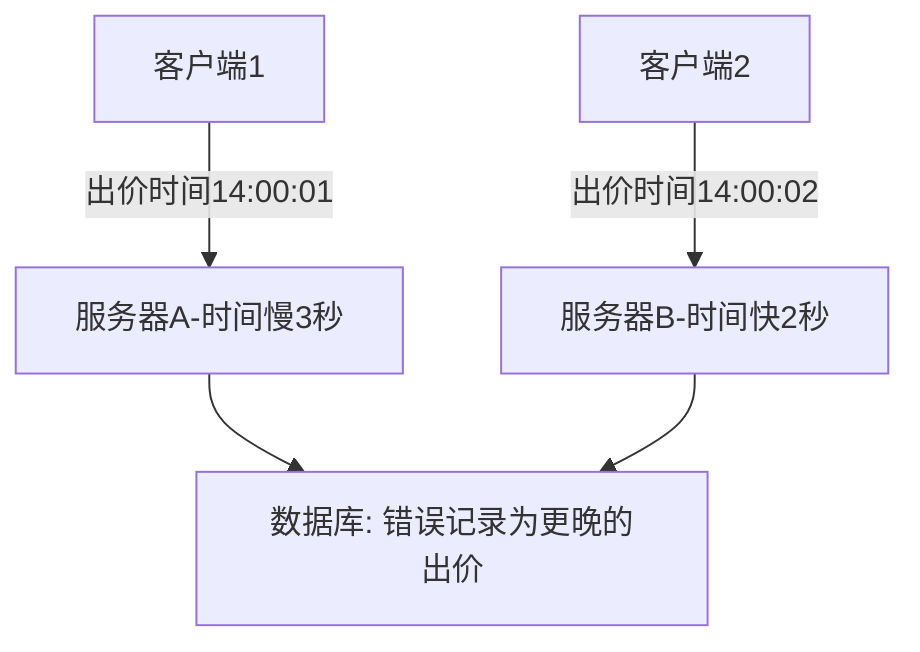

# 拍卖系统中同步服务器时间的必要性

在拍卖系统设计中，时间同步是保证系统正确性和公平性的关键基础。以下是需要严格同步服务器时间的详细原因及解决方案：

## 一、核心原因分析

### 1. 拍卖状态一致性
**问题场景**：
- 服务器A认为拍卖已结束（本地时间12:00:05）
- 服务器B认为拍卖仍在进行（本地时间11:59:58）
- 导致部分用户仍可出价，破坏拍卖公平性

**后果**：同一时刻系统对拍卖状态判断不一致，产生争议交易

### 2. 竞价时间戳验证
**关键需求**：
- 必须准确判断出价是否在拍卖有效期内
- 时间敏感的竞价策略（如最后时刻狙击）

**案例**：
假设允许最后3秒出价：
```
真实时间     服务器A时间    服务器B时间
14:00:02     14:00:00      14:00:04
```
- 服务器A会错误接受本应拒绝的出价
- 服务器B会错误拒绝有效出价

### 3. 分布式系统协调
**典型问题**：
- 集群节点间的定时任务执行漂移
- 分布式锁的过期时间不一致
- 事件顺序判断错误（因果关系混乱）

## 二、时间不同步的具体影响

### 1. 业务逻辑错误
| 场景                | 时间不同步导致的问题          |
|---------------------|-----------------------------|
| 拍卖开始/结束判断   | 不同节点状态不一致           |
| 竞价时效验证        | 接受无效出价或拒绝有效出价   |
| 自动延期机制        | 错误触发或未触发延期         |

### 2. 数据一致性问题


### 3. 监控与故障排查困难
- 日志时间戳无法对齐
- 无法准确重建事件序列
- 性能指标统计失真

## 三、解决方案

### 1. NTP（网络时间协议）同步
**标准方案**：
```bash
# Linux系统配置NTP
sudo apt install chrony
sudo vim /etc/chrony/chrony.conf
# 添加阿里云NTP服务器
server ntp.aliyun.com iburst
sudo systemctl restart chrony

# 验证同步状态
chronyc sources -v
chronyc tracking
```

**关键参数**：
- 同步周期：默认64-1024秒，可调整
- 时间偏差阈值：通常<100ms为良好
- 备用时间源：配置多个NTP服务器

### 2. 混合逻辑时钟（HLC）
**分布式系统方案**：
```java
public class HybridLogicalClock {
    private long physicalTime; // 最近已知物理时间
    private long logicalTime; // 逻辑计数器
    
    public synchronized Timestamp now() {
        long current = System.currentTimeMillis();
        if (current > physicalTime) {
            physicalTime = current;
            logicalTime = 0;
        } else {
            logicalTime++;
        }
        return new Timestamp(physicalTime, logicalTime);
    }
    
    public static class Timestamp implements Comparable<Timestamp> {
        final long physical;
        final long logical;
        
        // 实现比较逻辑：先比较物理时间，再比较逻辑时间
    }
}
```

### 3. 业务层时间校验
**拍卖结束判断逻辑**：
```java
public boolean isAuctionValid(Auction auction) {
    // 获取集群统一时间（可从专门的时间服务获取）
    long clusterTime = TimeService.getClusterTime();
    
    // 使用显式传入的时间参数而非本地时间
    return clusterTime >= auction.getStartTime() && 
           clusterTime <= auction.getEndTime();
}
```

### 4. 时钟漂移检测与告警
**监控实现**：
```python
# 定期检查各节点时间差
def check_clock_drift():
    master_time = get_master_time()
    for node in cluster_nodes:
        delta = abs(node.time() - master_time)
        if delta > 50:  # 50ms阈值
            alert(f"时钟漂移过大: {node.id} 偏差{delta}ms")

# 使用PTP协议获取更精确的时间
def get_precise_time():
    return ptp_client.get_time()
```

## 四、特殊场景处理

### 1. 最后时刻竞价（狙击保护）
**时间同步依赖**：
```java
public void handleLastMinuteBid(Auction auction, Bid bid) {
    // 必须使用统一时间源判断
    long remaining = auction.getEndTime() - TimeService.getGlobalTime();
    
    if (remaining < 5000) { // 最后5秒
        // 自动延长拍卖时间
        auction.extend(30000); // 延长30秒
        log.info("拍卖延长，原因：最后时刻出价");
    }
}
```

### 2. 跨时区拍卖
**解决方案**：
- 所有时间存储为UTC时间戳
- 前端根据用户时区显示本地时间
- 业务逻辑始终使用UTC时间判断

```sql
-- 数据库存储UTC时间
CREATE TABLE auctions (
    id BIGINT,
    start_time TIMESTAMP WITH TIME ZONE,
    end_time TIMESTAMP WITH TIME ZONE
);
```

## 五、架构建议

1. **分层时间服务**：
   ```
   原子钟/GPS → 一级时间服务器 → 二级时间服务器 → 应用服务器
   ```

2. **多协议支持**：
   - 基础同步：NTP（精度1-50ms）
   - 金融级需求：PTP（精度<1μs）

3. **容错设计**：
   - 本地时钟漂移检测
   - 多时间源冗余
   - 时钟异常时的降级策略

## 六、监控指标

| 指标名称               | 预警阈值    | 监控手段         |
|-----------------------|------------|------------------|
| 节点时间偏差          | >50ms      | Prometheus+Alertmanager |
| NTP同步状态           | 状态异常    | chronyc tracking |
| 时钟源层级            | stratum>4  | NTP监控          |
| 时间跳变次数          | >1次/小时  | 日志分析         |

在拍卖系统等对时间敏感的场景中，毫秒级的时间误差都可能导致严重的业务问题。通过NTP同步结合业务层的时间统一判断，才能确保系统在所有节点上表现一致，维护拍卖的公平性和可靠性。