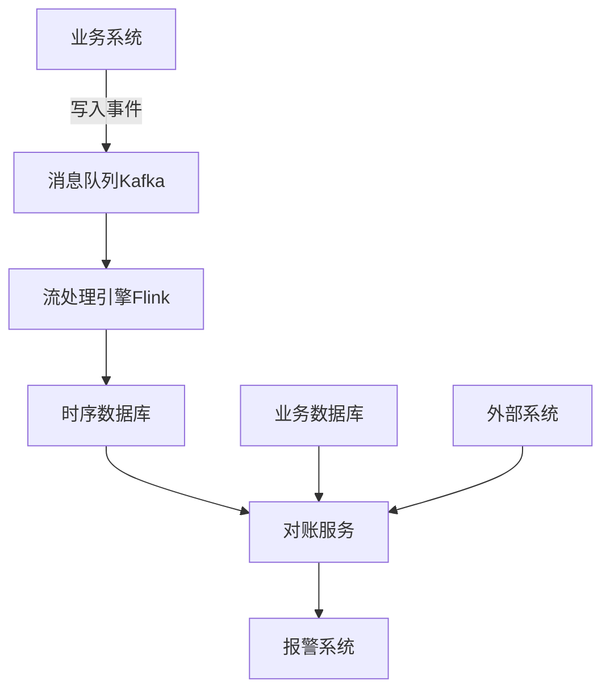
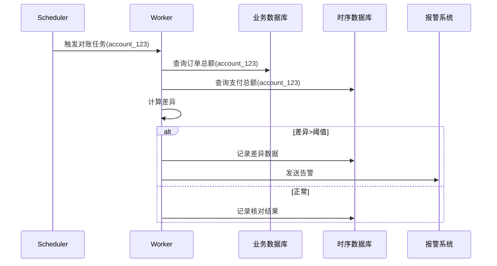
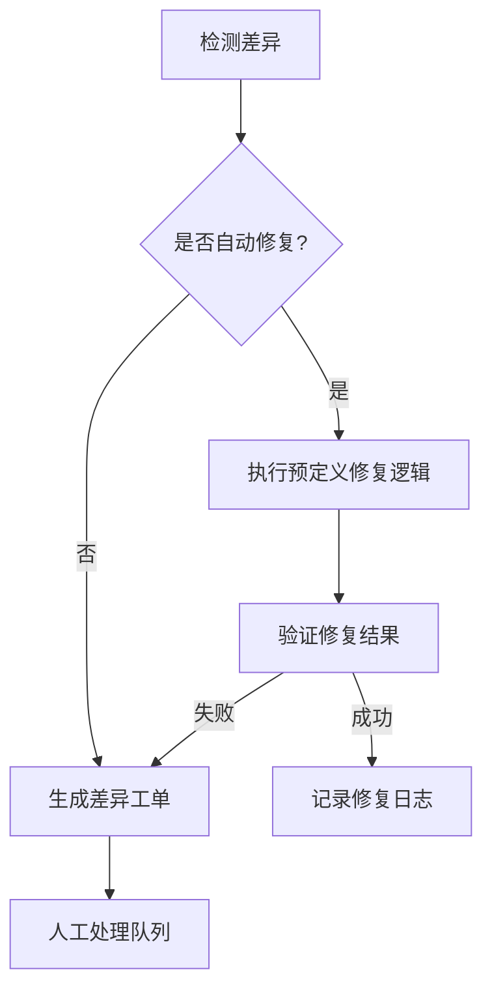
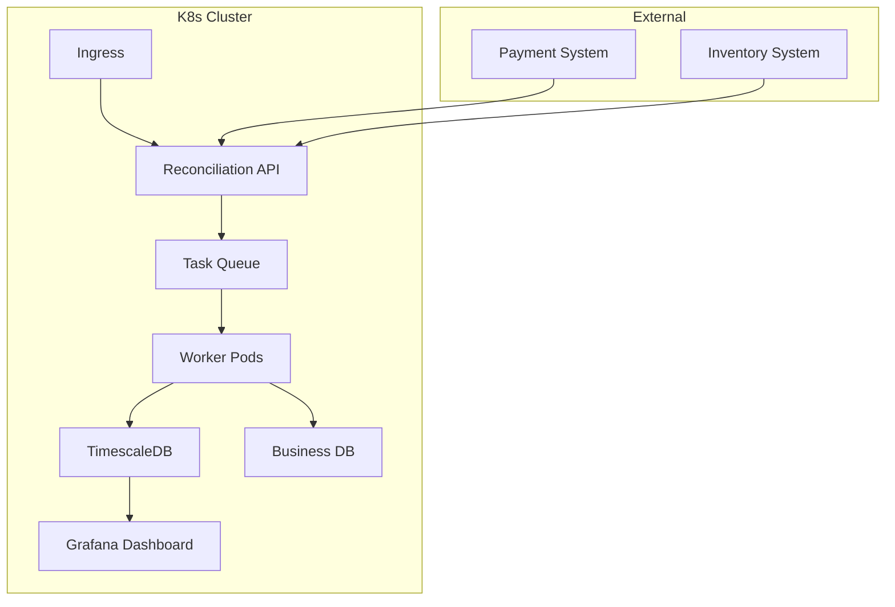

# 监控对账系统设计：时序数据库与定时任务的实现方案

在拍卖系统等金融级应用中，监控对账是保障数据一致性的关键环节。下面详细介绍基于时序数据库和定时任务的对账系统设计。

## 一、整体架构设计



## 二、时序数据库选型与设计

### 1. 主流时序数据库对比

| 数据库       | 写入性能 | 查询性能 | 压缩比 | 适合场景              |
|--------------|----------|----------|--------|-----------------------|
| InfluxDB     | 极高     | 高       | 中等   | 监控指标              |
| TimescaleDB  | 高       | 极高     | 高     | 业务时序数据          |
| Prometheus   | 高       | 中等     | 极高   | K8s监控               |
| TDengine     | 极高     | 高       | 极高   | IoT场景               |

### 2. 数据模型设计（TimescaleDB示例）

```sql
-- 创建超表(hypertable)
CREATE TABLE reconciliation_metrics (
    time TIMESTAMPTZ NOT NULL,
    account_id VARCHAR NOT NULL,
    metric_type VARCHAR NOT NULL, -- 如 'order_amount'/'inventory_count'
    expected DOUBLE PRECISION,
    actual DOUBLE PRECISION,
    discrepancy DOUBLE PRECISION GENERATED ALWAYS AS (actual - expected) STORED
);

-- 转换为超表（按天分片）
SELECT create_hypertable(
    'reconciliation_metrics',
    'time',
    chunk_time_interval => INTERVAL '1 day',
    partitioning_column => 'account_id',
    number_partitions => 16
);

-- 创建聚合物化视图
CREATE MATERIALIZED VIEW reconciliation_daily
WITH (timescaledb.continuous) AS
SELECT
    account_id,
    metric_type,
    time_bucket('1 day', time) AS day,
    SUM(abs(discrepancy)) AS total_diff
FROM reconciliation_metrics
GROUP BY account_id, metric_type, day;
```

## 三、定时任务系统设计

### 1. 任务调度架构



### 2. 分布式任务实现（Java+Spring）

```java
// 对账任务模板
public abstract class ReconciliationTask implements Runnable {
    protected final String accountId;
    protected final Instant checkTime;
    
    public ReconciliationTask(String accountId) {
        this.accountId = accountId;
        this.checkTime = Instant.now();
    }
    
    @Override
    public void run() {
        try {
            ReconciliationResult result = executeReconciliation();
            saveResult(result);
            if (result.hasDiscrepancy()) {
                triggerAlert(result);
            }
        } catch (Exception e) {
            log.error("对账任务失败: {}", accountId, e);
        }
    }
    
    protected abstract ReconciliationResult executeReconciliation();
}

// 具体对账任务示例
@Component
@RequiredArgsConstructor
public class OrderPaymentReconciliation extends ReconciliationTask {
    private final OrderRepository orderRepo;
    private final PaymentServiceClient paymentClient;
    
    @Override
    protected ReconciliationResult executeReconciliation() {
        // 查询业务库订单总额
        BigDecimal orderTotal = orderRepo.sumAmountByAccount(accountId);
        
        // 查询支付系统总额
        BigDecimal paymentTotal = paymentClient.getTotalPaid(accountId);
        
        return new ReconciliationResult(
            accountId,
            "order_payment",
            checkTime,
            orderTotal,
            paymentTotal
        );
    }
}

// 任务调度配置
@Configuration
@EnableScheduling
public class ReconciliationScheduler {
    @Autowired
    private List<ReconciliationTask> tasks;
    
    @Scheduled(cron = "0 0 2 * * ?") // 每天凌晨2点
    public void dailyReconciliation() {
        List<String> accountIds = getActiveAccounts();
        accountIds.parallelStream()
            .forEach(account -> {
                tasks.forEach(task -> 
                    taskExecutor.execute(task.createForAccount(account))
            });
    }
}
```

## 四、对账逻辑实现细节

### 1. 多维度对账策略

| 对账维度       | 频率     | 阈值规则                | 处理方式               |
|----------------|----------|-------------------------|-----------------------|
| 订单-支付      | 每小时   | 差异>100元或0.1%        | 即时告警              |
| 库存-物流      | 每天     | 任何差异                | 生成调账工单          |
| 用户余额       | 实时     | 差异>0                  | 冻结账户并人工核查    |

### 2. 差异处理流程



### 3. 智能对账优化

```java
// 自适应阈值算法示例
public class DynamicThreshold {
    private final TimeSeriesDBClient tsClient;
    
    public boolean isAnomaly(String metricType, double currentDiff) {
        // 查询历史7天数据
        Stats stats = tsClient.queryStats(
            "SELECT mean(value), stddev(value) " +
            "FROM discrepancies " +
            "WHERE metric = ? AND time > now() - 7d",
            metricType);
            
        // 动态阈值 = 均值 + 3倍标准差
        double threshold = stats.mean + 3 * stats.stddev;
        return Math.abs(currentDiff) > threshold;
    }
}

// 对账结果处理增强
public class EnhancedReconciler {
    public void handleDiscrepancy(ReconciliationResult result) {
        if (dynamicThreshold.isAnomaly(result.getMetricType(), result.getDiff())) {
            alertService.sendUrgentAlert(result);
        } else {
            ticketSystem.createNormalTicket(result);
        }
        
        if (isRepeatIssue(result)) {
            rootCauseAnalysis(result);
        }
    }
}
```

## 五、性能优化方案

### 1. 数据查询优化

**时序数据库侧**：
```sql
-- 创建查询优化索引
CREATE INDEX idx_metrics_account ON reconciliation_metrics (account_id, time DESC);

-- 使用连续聚合
CREATE MATERIALIZED VIEW hourly_metrics
WITH (timescaledb.continuous) AS
SELECT
    account_id,
    metric_type,
    time_bucket('1 hour', time) AS bucket,
    avg(discrepancy) AS avg_diff,
    max(discrepancy) AS max_diff
FROM reconciliation_metrics
GROUP BY account_id, metric_type, bucket;
```

**业务数据库侧**：
```java
// 使用读写分离
@Bean
public RoutingDataSource dataSource() {
    // 写操作走主库
    // 对账查询走从库
}

// 添加对账专用索引
@Entity
@Table(indexes = @Index(
    name = "idx_recon_account",
    columnList = "accountId,updateTime"))
public class Order {
    // ...
}
```

### 2. 任务执行优化

**分片策略**：
```java
// 按账户分片并行处理
public void executeReconciliation() {
    List<String> accounts = accountService.getActiveAccounts();
    
    // 分片大小动态调整（基于历史执行时间）
    int shardSize = calculateOptimalShardSize(); 
    
    Lists.partition(accounts, shardSize).parallelStream()
        .forEach(shard -> {
            shard.forEach(account -> {
                reconciliationTasks.forEach(task -> 
                    taskExecutor.execute(task.forAccount(account)));
            });
        });
}
```

**资源隔离**：
```yaml
# Kubernetes部署配置示例
apiVersion: apps/v1
kind: Deployment
metadata:
  name: reconciliation-worker
spec:
  template:
    spec:
      containers:
      - name: worker
        resources:
          limits:
            cpu: "2"
            memory: 4Gi
          requests:
            cpu: "1"
            memory: 2Gi
      nodeSelector:
        dedicated: "reconciliation"
```

## 六、监控与灾备

### 1. 对账系统自监控

**监控指标**：
- 任务执行延迟
- 数据差异趋势
- 资源使用率
- 自动修复成功率

**Prometheus配置示例**：
```yaml
scrape_configs:
  - job_name: 'reconciliation'
    metrics_path: '/actuator/prometheus'
    static_configs:
      - targets: ['recon-service:8080']
        
alerting_rules:
  - alert: HighReconciliationDelay
    expr: job:reconciliation_latency_seconds:mean5m > 300
    for: 10m
```

### 2. 灾难恢复方案

**数据备份**：
```bash
# TimescaleDB备份
pg_dump -h tsdb-prod -U recon -Fc -f recon_backup.dump

# 业务数据快照
mysqldump --single-transaction recon_db > recon_snapshot.sql
```

**故障转移**：
```python
def check_system_health():
    if not tsdb_available():
        switch_to_backup_tsdb()
    if not primary_db_available():
        enable_readonly_mode()
        alert_team("DB_FAILOVER_TRIGGERED")
```

## 七、典型部署方案



**组件说明**：
1. **Reconciliation API**：接收手动触发请求
2. **Task Queue**：RabbitMQ/Kafka存储待处理任务
3. **Worker Pods**：动态扩展的对账工作节点
4. **TimescaleDB**：存储所有对账结果和历史趋势
5. **Grafana**：提供可视化监控界面

这种设计可以支持每天处理千万级对账任务，平均延迟控制在5分钟以内，关键业务对账可达准实时水平（<1分钟）。根据业务重要性，可以配置不同优先级的对账队列，确保核心业务数据优先核对。